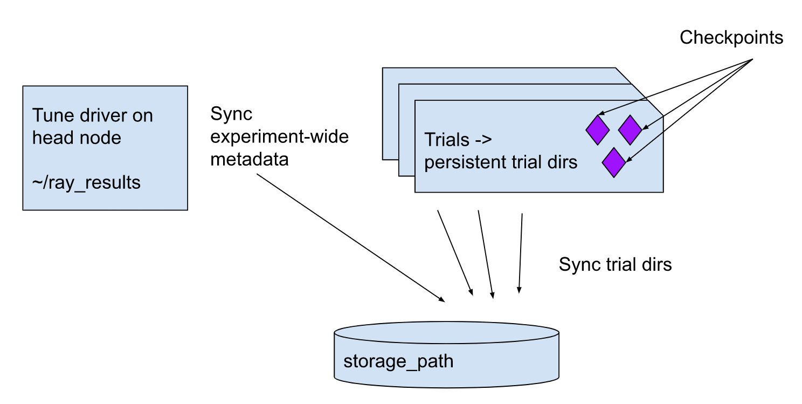

# Consolidated persistence API for Ray Train/Tune

## Summary

Standardize on the `storage_path` option as the sole implementation of distributed sync in Ray Train(/Tune). Deprecate the legacy head node syncer code, and add a `storage_filesystem` option for users to customize the underlying pyarrow filesystem used for `storage_path` sync.

Relatedly, simplify the Train `Checkpoint` API to also standardize on `pyarrow.fs` as its backing implementation.

### General Motivation

The motivation for this change is three-fold.

First, it cuts down on the number of alternative options and implementations users have for persistent storage in Ray Train and Tune. This materially reduces the docs and examples (i.e., going from multiple pages of persistence-related docs to one page).

Second, it reduces the implementation and API surface that the ML team has to maintain. Many of these storage abstractions were introduced in the initial years when Ray was created. At the time, filesystem abstractions for Python were less prevalent. Today, `pyarrow.fs` (in conjunction with fsspec) are industry standards for accessing remote storage, and Ray already has a hard dependency on pyarrow in Ray Data.

Third, with the growth of LLMs and other large models, we are seeing larger and larger checkpoints being used. This motivates spending more effort in cleaning up and hardening this critical path, and it may cause more pain for LLM users than for users for smaller models. Simplifying the design here also enables us to extend support for more advanced features such as multi-rank checkpointing withour incurring excessive technical debt.

These three pain points have grown significantly over the past year, based both on user and internal feedback. This shouldn't be too surprising, as the persistent storage APIs have never been significantly revised before, beyond introduction of the new `storage_path` option, and similarly the Checkpoint API is in beta.

### Should this change be within `ray` or outside?

main `ray` project. Changes are made to Ray Train and Tune.

## Stewardship

### Required Reviewers
The proposal will be open to the public, but please suggest a few experienced Ray contributors in this technical domain whose comments will help this proposal. Ideally, the list should include Ray committers.

@matthewdeng, @krfricke

### Shepherd of the Proposal (should be a senior committer)
To make the review process more productive, the owner of each proposal should identify a **shepherd** (should be a senior Ray committer). The shepherd is responsible for working with the owner and making sure the proposal is in good shape (with necessary information) before marking it as ready for broader review.

@pcmoritz

## User Story

Persistence will center around the recently introduced `storage_path` option.

### Persistent trial directory

Ray Train provides the abstraction of a persistent trial directory. Each trial has its current working directory set to a trial specific directory (e.g., `~/ray_results/experiment_1/trial_1`). Train will synchronize this trial directory with persistent storage specified via the `storage_path` option.

This directory is persistent since Train is syncing it to persistent storage for the user. The experiment driver will record experiment results and other metadata to a similar directory on the head node, which will also synchronize to persistent storage.



### Checkpoints

While trials can write arbitrary data to the persistent trial directory, they cannot be guaranteed they can read it back on checkpoint/restore. Data that is needed for resume must be recorded via the `train.report(checkpoint)` API.

For example, this is how you could record a Torch checkpoint:

```python
   torch.save(model, "path/to/dir")
   train.report(checkpoint=Checkpoint.from_directory("path/to/dir"))
```


Train will take ownership of the specified checkpoint data, deleting the directory after the checkpoint upload finishes. The checkpoint data will then be managed by Train (e.g., Train may restore only the latest checkpoint or delete previous checkpoints to save space according to checkpoint policy).

The files of the recorded checkpoint can be accessed via `result.checkpoint`. The `Checkpoint` object itself is a logical tuple of `(path, pyarrow.fs.FileSystem)`, and this tuple is immutable. Users can also get and set arbitrary metadata to these checkpoints (e.g., preprocessor configs, model settings, etc), which will be recorded in a `metadata.json` file.

The high level API of the Checkpoint class is as follows:

```python
class Checkpoint:
    def __init__(self, path: str, filesystem: Optional[pyarrow.fs.FileSystem]):

        # Public attributes.
        self.path = path
        self.filesystem = filesystem

        # For de-dup optimization.
        self.uuid = uuid.uuid4()

        # Auto-resolve.
        if not filesystem:
            self.filesystem, self.path = pyarrow.fs.FileSystem.from_uri(path)

    def get_metadata(self) -> Dict[str, Any]:
        """Return the metadata dict stored with the checkpoint.

        If no metadata is stored, an empty dict is returned."""
        pass

    def set_metadata(self, metadata: Dict[str, Any]) -> None:
        """Overwrite the metadata stored with this checkpoint.

        This will overwrite any existing metadata stored with this checkpoint.
        """
        pass

    @staticmethod
    def from_directory(path: Union[str, os.PathLike]) -> "Checkpoint":
        """Create checkpoint object from a local directory.

        This is a shorthand for constructing a checkpoint manually via
        `Checkpoint(path, pyarrow.fs.LocalFileSystem())`.

        Args:
            path: Directory containing checkpoint data. The caller promises to
                not delete the directory (gifts ownership of the directory to this
                Checkpoint).

        Returns:
            Checkpoint: checkpoint object.
        """
        pass

    def to_directory(self, path: Optional[str] = None) -> str:
        """Write checkpoint data to directory.

        Note: When this method is called concurrently by multiple processes on
        the same original Checkpoint object, we deduplicate the data fetches by
        the checkpoint uuid.

        Args:
            path: Target directory to restore data in. If not specified,
                will create a temporary directory.

        Returns:
            str: Directory containing checkpoint data.
        """
        pass
```

We may introduce additional convenience APIs such as `as_directory()` or `update_metadata()`, which just wrap these high level APIs.

Note that the Checkpoint object is pretty simple and is a thin wrapper around a `(path, filesystem)` tuple. We explicitly do not want any framework-specific features in Checkpoint (e.g., framework-specific accessors or framework-specific subclasses). This should make it lightweight to understand and maintain.

### Multi-rank checkpoints

Checkpoints can be recorded from multiple ranks. By default, only checkpoint data from rank zero is preserved. Data from all ranks can be retained via a `keep_all_ranks` option. Train will merge checkpoint data from all ranks into a single directory for the checkpoint number. The reason is this: users can always namespace their files/dirs by rank by the `train.context.world_rank` manually, so there isn't any reason why Train should do it for them. In fact, certain frameworks such as Lightning assume merged directories and could break if we enforced per-rank subdirectories.

Similarly, for restoration the new Checkpoint API allows users to customize restoration strategy. For example, if they wanted to implement per-rank restore, they could call `pyarrow.fs.copy_files()` on selected files within the checkpoint path, rather than using the naive `Checkpoint.to_directory()` call.

### FAQ

- What's in this persistent trial directory?

    This directory contains metric files written by Train loggers, such as JSON metrics, checkpoint data managed by Train, as well as arbitrary artifacts created by a trial.

- Can I exclude files written in the trial dir from sync? (e.g., core dumps)

    Yes, the SyncConfig will allow you to exclude files by pattern.

- What guarantees does Train make about persistence?

    Train will sync this directory to persistent storage according to the SyncConfig settings for the run (e.g., once every 10 min or on checkpoint).

- What can `storage_path` be set to?

	Storage path can be set to a NFS mount in a cluster, a local path on a single-node cluster, or a cloud storage URI supported by pyarrow. In these cases, Train will use the `pyarrow.fs.sync_files` API to copy data to the specified storage path.

    If storage path is not set, sync is disabled, and an error is raised if a remote trial tries to persist a checkpoint.

- What if I do not have NFS or cloud storage?

	Train no longer supports persistence for distributed experiments unless you specify a `storage_path`. You can provide a custom Arrow filesystem to support custom storage solutions.

## Implementation

You can find the prototype PR here: https://github.com/ray-project/ray/pull/36969

While this REP is not covering how exactly we implement the new persistence path, I make a few recommendations based on the prototype:

- We should logically consolidate the logic for syncing into a `StorageContext` class that is propagated everywhere. The idea should be the `StorageContext` is created on the driver, and passed to experiments, trials, and workers. We can fill out additional information as it is passed further (e.g., trial log dir, current checkpoint number). Centralizing our storage logic into one class makes it easier to unit test, and easier to make global changes without needing to update dozens of different files / various args scattered around the codebase, as we have today.

- We shouldn't try to "detect" whether a path is NFS. Rather, we can verify the sync succeeded, e.g., by performing a test write to a `_valid` file on the driver, and raising an error on workers if this file is not seen. This is more robust and also handles edge cases around single node and autoscaling use cases.

- It was easier to route around the legacy code and implement the new storage logic around `StorageContext`, rather than try to refactor the legacy code. I recommend we follow this pattern, guarding old vs new sync paths via a feature flag, trying as much as possible to not touch legacy code paths until we are ready to fully remove it.

## Rollout Plan

### Impact of Changes

This is a breaking change for users that do not already use NFS or cloud storage. For other users, the changes are for the most part limited to beta APIs (i.e., Checkpoint).

We are evaluating the impact of deprecating head node storage, by rolling the breaking change out early in Ray 2.6. This is to inform whether we should provide extended backwards compatibility.

### Timeline

- Ray 2.6: Head node sync is disabled and will raise an exception. It is possible to re-enable by setting a flag.
- Ray 2.7: New checkpoint path is rolled out; legacy code path removed (tentative).

## Examples:

Please refer to the prototype PR: https://github.com/ray-project/ray/pull/36969

## Test Plan and Acceptance Criteria

The new persistence behavior will be fully covered by integration tests. We plan to remove the old tests in Ray 2.7 that cover legacy behavior.
