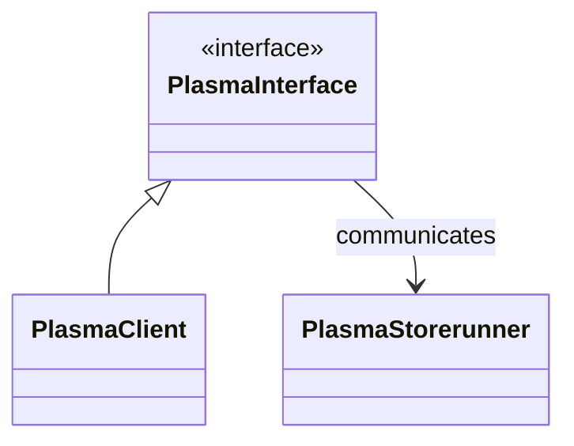
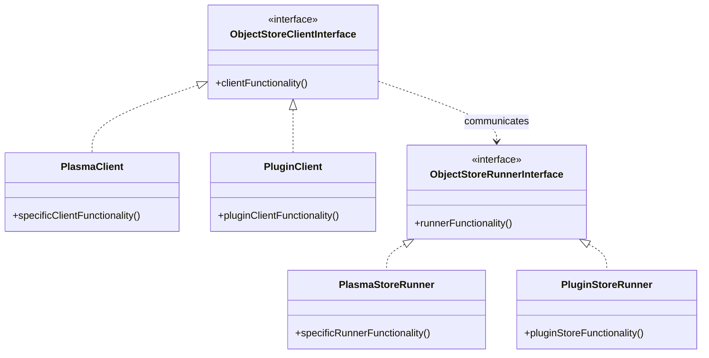

# Object Store Plugin Manager

## Summary
### General Motivation
Ray stores large objects in the Plasma distributed object store. The object store is implemented with shared memory, and multiple workers on the same node can reference the same copy of an object. On the other hand, if the worker’s local shared memory store does not yet contain a copy of the object, the object has to be replicated over with RPCs.  We propose object store plugin interfaces to allow ray to support other object stores that may provide additional features without disruption of the overall ray object management. For example, a CXL memory sharing based object store may avoid object replication entirely.

### Should this change be within `ray` or outside?
Yes. The change should be within `ray`.

## Stewardship
### Required Reviewers
@ericl, @scv119

### Shepherd of the Proposal (should be a senior committer)
stephanie-wang

## Design and Architecture
The design consists of the object store plugin interface and the plugin manager.

For instance, GISMO, which is a shared memory object store designed for use with CXL, can be integrated into Ray as a plugin. This integration is facilitated through the specification of the GISMO shared library within Ray's configuration settings. Upon initialization, Ray employs GISMO as an alternative to its default per-node shared memory object store.

During application runtime, when an object instantiation is required, the GISMO-provided function is invoked to allocate a memory object within the CXL shared memory space. This allocation is managed by the GISMO server, which then supplies the object reference back to the application.

Subsequently, this setup allows direct access to the memory object across all nodes in the Ray cluster via CXL. In scenarios where a node requests to retrieve an object using its reference, the GISMO shared library responds by returning the address of the shared memory on the local node.
Such direct access eliminates the necessity for data transmission over the network, irrespective of the original node of object creation. Consequently, Ray cluster is able to fully exploit the advantages of CXL's memory-sharing capabilities. The additional cost introduced by remote memory object is eliminated. The problem of Memory usage spike on a node caused by unbalanced data partition can also be addressed.

For demostration purpose, there may be an example Redis plugin for Ray to use Redis to store the objects.

### Plugin Interface

The plugin provides the functionalities of an object store responsible for storing and retrieving logic. It can be implemented as source code within the Ray repository or a shared library to be loaded dynamically.

It shall implement classes inherited from `ObjectStoreClientInterface` and `ObjectStoreRunnerInterface`.
`ObjectStoreClientInterface` replaces the current `PlasmaClientInterface`. It keeps all the functions from the current `PlasmaClientInterface` to retain full compatibility along with some extensions. Current `PlasmaClient` shall implement `ObjectStoreClientInterface`.

New virtual functions of `ObjectStoreClientInterface` :
```c++
// Since the object store is intended for access by trusted clients inside trusted environment, authentication will be considered in the future.

// For optimized memory copy. The C standard function memcpy() is used for data copy to object data buffer in writing object chunks.
// This function is to provide possible more optimization around memcpy().
//  For example, additional steps may be needed to guarantee cache coherence of CXL memory shared between hosts.
virtual void MemoryCopy(void* dest, const void* src, size_t len) = 0;
```

`ObjectStoreRunnerInterface` base class has all the functions from the current `PlasmaStoreRunner` to retain full compatibility along with some extensions. Current `PlasmaStoreRunner` shall implement `ObjectStoreRunnerInterface`.

Updated virtual function of `ObjectStoreRunnerInterface` with additional parameters:
```c++
// Pass additional startup parameters   
virtual void Start(const std::map<std::string, std::string>& params,
                   ray::SpillObjectsCallback spill_objects_callback,
                   std::function<void()> object_store_full_callback,
                   ray::AddObjectCallback add_object_callback,
                   ray::DeleteObjectCallback delete_object_callback) = 0;
```

New virtual functions of  `ObjectStoreRunnerInterface`:
```c++
/// The Current total allocated available memory size.
virtual int64_t GetTotalMemorySize() const = 0;

/// Maximal available memory size. It can be different from the Total memory size if the memory is dynamically expandable.
virtual int64_t GetMaxMemorySize() const = 0;
```

The diagram for current plasma object store classes:




The diagram for proposed object store plugin classes:



If the plugin is implemented as a shared library, the implementation should implement an API to create the object store client instance and the runner instance.
```c++
extern "C" {
    ObjectStoreRunnerInterface CreateRunner(void);
    ObjectStoreClientInterface CreateClient(void);
}
```
### Plugin Manager

The plugin manager shall create the instances that implement `ObjectStoreClientInterface` and `ObjectStoreRunnerInterface` based on specified plugin name if the plugin is implemented within the Ray repository.  If a plugin object store is implemented as a POSIX dynamic linking library, the library shall be opened with its full path using `dlopen()`, `dlsym()` shall be used to look up symbols  for `CreateRunner()` and `CreateClient()` and to lazy create the instances when actually needed. 

The plugin manager shall provide the following APIs:
```c++
// Get an instance of the singleton PluginManager
Static PluginManager& GetInstance()

// Create the object store runner interface with the plugin object store name and configurations
std::unique_ptr<ObjectStoreRunnerInterface>
     CreateObjectorStoreRunnerInstance(const std::string& plugin_name,
   const std::string& plugin_path,
   const std::string& plugin_config)

// Create the object store client interface with the plugin object store name and configurations
std::shared_ptr<ObjectStoreClientInterface>
     CreateObjectorStoreClientInstance(const std::string& plugin_name,
                                       const std::string& plugin_path,
                                       const std::string& plugin_config)
```

The object store plugin can be specified in Ray environment variables in ray_config_def.h
```c++
Ray_object_store_plugin_name:     RAY_CONFIG(std::string, object_store_plugin_name, "")
  The name of the plugin object store.
Ray_object_store_plugin_path:     RAY_CONFIG(std::string, object_store_plugin_path, "")
  The full path of the library if the plugin is a shared library.
Ray_object_store_plugin_config:   RAY_CONFIG(std::vector<std::string>, object_store_plugin_config, {})
  The objectstore startup configurations as a series of key-value pairs.
```

The modified plasma plugin also would change the data path of how `CoreWorkerPlasmaStoreProvider` accesses the plasma storage. If global shared memory is used, it would retrieve from global shared memory, which appears as local memory.
```c++
CoreWorkerPlasmaStoreProvider::Get(&object_ids, …,results, ...) {
  /* check whether global shared Plasma object store is in use. */
  if (store_client_.IsGlobal()) {
    std::vector<ObjectID> obj_list;
    for (const auto& id : object_ids) {
      obj_list.emplace_back(id);
    }
    /*retrieve objects from global shared Plasma object store*/
    return GetIfLocal(obj_list, results);
  }
  ...
}
```

## Compatibility, Deprecation, and Migration Plan
Currently this plugin manager doesn’t support native Windows platform, as Windows platform doesn’t have POSIX dlfcn support, which is used for loading shared libraries.

## Test Plan and Acceptance Criteria
The plugin manager will be fully unit tested.

## (Optional) Follow-on Work
Optionally, the proposal should discuss necessary follow-on work after the change is accepted.

