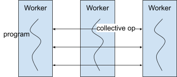
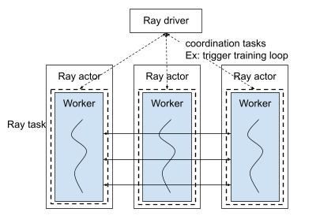
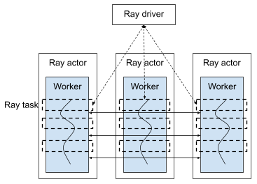
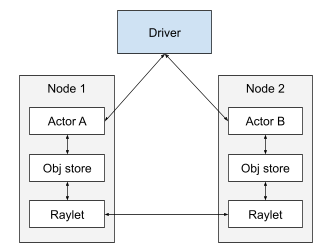
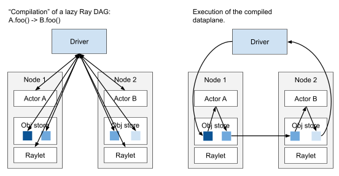

# Accelerated DAGs

Tl;dr: We propose changes needed to make Ray Core into an
accelerator-native execution substrate.

The two major goals are:

-   Task overheads in the tens of microseconds, compared to 1ms or more
    today
-   Support GPU-native communication, compared to CPU-only object store
    today

Either of these alone also has benefits:

-   Lower task overheads can be applied to other application use cases
    such as web serving, as long as the task control flow is
    relatively static and predictable.
-   GPU-native communication can make it easier to develop distributed
    ML applications

But together, we believe they can make Ray Core into an
accelerator-native execution substrate, allowing Ray Core to execute as
fast as SPMD programs but with much more flexibility.

## Required Reviewers
@ericl, @pcmoritz, @scv119

## Shepherd
@ericl


Background
==========

All popular execution frameworks (Distributed TensorFlow,
torch.distributed, etc.) for distributed ML today are based on a
"multi-controller" setup, aka
[SPMD](https://en.wikipedia.org/wiki/Single_program,_multiple_data).
In this setup, all worker processes run the same program. This has been
the status quo because: (a) it **minimizes system overhead** and (b) ML
apps often contain **all-to-all communication** steps for which SPMD is
well-suited.



*SPMD execution*


On the other hand, there has been recent evidence of the two major
downsides of SPMD:

-   **Flexibility:** It is difficult to express more complex
    applications that might involve multiple models, parallelism
    strategies, and/or dynamic control flow. See the [Pathways
    paper](https://arxiv.org/pdf/2203.12533.pdf) for more
    information.

-   **Fault tolerance:** The SPMD model requires all processes to run
    the same program. If one process goes down, everyone must restart
    leading to significant downtime. This is a pain point in
    large-scale training.

Ray uses a single-controller model, where a "driver" coordinates the
execution. It can also wrap multi-controller frameworks, as Ray Train
does, but its interface is primarily based on a single-controller model.



*Ray Train example: Ray Train is built on Ray's single-controller model, but the execution is still SPMD.*

Ray has the exact opposite properties as SPMD systems, prioritizing
flexibility and fault tolerance at the cost of:

-   **High control plane overheads:** Because tasks are dynamic (they
    can be spawned at any time on any process), Ray has to perform
    some bookkeeping for each individual task execution. This
    bookkeeping sometimes requires distributed protocols, such as for
    scheduling and garbage collection. This means that Ray developers
    need to make sure that each task has at least 10s of ms of
    computation, to reduce system overheads.

    -   Ray Train example: Coordination tasks need to be either
        relatively coarse-grained (e.g., contain many training steps)
        or asynchronous with training (e.g., metrics reporting).

-   **Generic CPU-based communication transport**: Ray's flexibility
    requires it to be highly general, so it implements a generic
    TCP-based communication transport. Adding native support for
    specialized communication transports such as GPU collective
    communication would be thorny.

    -   Ray Train example: Ray only provides generic communication, so
        GPU communication takes place out-of-band from Ray's
        perspective. This is not necessarily a problem; actually it's
        the recommended approach for accelerators. But the issue is
        that Ray doesn\'t really have any control over the
        communication then, so optimizations that Ray can do for CPU
        memory are not possible for GPU memory, like recovering
        quickly from communication failure or overlapping with
        compute.



*Vision for Ray Train in Ray 3.0: Ray Train is built on Ray's single-controller model, but with much finer-grained tasks and more control over the execution. The physical execution is as fast as SPMD.*

The "accelerated DAGs" effort aims to keep Ray's flexibility and fault
tolerance, but: (a) reduce control plane overheads, and (b) support
specialized communication transports. The basic ideas are to: (a) reuse
control plane decisions from past executions, (b) support
application-defined transports such as
[NCCL](https://developer.nvidia.com/nccl), [libfabric](https://ofiwg.github.io/libfabric/) and
[UCX](https://openucx.org/). Ultimately, the goal is to
make Ray into a native execution substrate for distributed ML
applications.

Architecture
============

## Compiled DAGs

***Goal:** Reduce control plane overhead in Ray Core task execution.*

Ray's control plane overheads come from the dynamic nature of the API.
Tasks can be spawned dynamically and they execute eagerly. Each time a
task is spawned, we cannot be sure what size outputs it will have, who
will depend on it, etc. This produces a number of overheads, including:

-   Allocating and ref-counting an ObjectRef
-   Putting, getting, and transferring a shared-memory object
-   Scheduling, dispatching, and finishing a task



*Diagram showing (some) of the synchronous steps that happen in today's Ray Core to execute a program like B.foo.remote(A.bar.remote()). Most of these communication edges take place over RPC/IPC. Control plane (driver, raylet) and data plane (actors, object store) operations are all interleaved with each other because of the dynamic execution model.*

Although some operations can be overlapped with other tasks (e.g.,
transferring arguments for one task while executing another),
fundamentally most of these operations need to be done *synchronously
with the task execution.* Overall these overheads add up to \~1ms of
execution overhead per task and potentially significant CPU processing overhead, even when execution is on the same node.

Essentially, the current model is "interpreted". But this isn't
necessary for cases where a similar DAG will get executed again. For a
given task, we can avoid most of the above steps and protocols as long
as we have information such as the dependent tasks and the max size of
the task's outputs.

***Key idea:*** *If we know that a certain DAG pattern will be repeated
in the future, we can "compile" a* *dataplane path for that DAG, thus
avoiding control plane overheads during execution. *

Because we no longer need to make control plane decisions in the
dataplane path, synchronization on a local node can be done via
shared-memory. Here is an overview of the per-task execution overheads
(note that there will be more overhead if significant serialization is
involved):

| **Before**                        | **After**                         |
|-----------------------------------|-----------------------------------|
| Many (\~10+) RPCs/IPCs, even more if inputs/outputs are remote | Shared-memory mutex for synchronization + ½ RPC if inputs/outputs are remote         |
| → **500us-1ms** for local + several RPCs/IPCs for remote | → **10s-100 of us** for local + ½ RPC for remote                    |




*Left: Instantiation. "Compile" a DAG before the first execution, by allocating buffers for task inputs/outputs and sending the task descriptions to the actor executors. Right: Execute the compiled dataplane. Communication edges can take place over shared memory when local.*

To accomplish this, we will extend the current [lazy DAG
API](https://docs.ray.io/en/latest/ray-core/ray-dag.html)
with a special "compiled" option. This API already allows DAG reuse but
currently carries the same execution overheads described above. The main
Ray Core APIs based on individual task and actor calls will not be
affected, but will be compatible with compiled DAGs, i.e. compiled DAGs'
outputs can be passed as arguments to normal tasks, and vice versa.

In the future, we may consider "just-in-time" compiling normal Ray tasks.  Concretely, on the first execution of a Ray program fragment, we may trace the Ray remote functions that are called, compile the traced DAG, then reuse the DAG for future remote function calls. This has quite a few technical challenges so is unlikely to be supported soon.

To support compiled DAGs, we need to make a few assumptions:

-   The application can be expressed as a handful of
    [DAGs](https://docs.ray.io/en/latest/ray-core/ray-dag.html).

-   Tasks may dynamically call Ray tasks as usual, but the execution of
    these nested tasks will not be accelerated.

-   A DAG must be declared before it can be executed. The initial
    declaration may be higher latency than a single DAG execution.

    -   The max size of task outputs must be declared. Larger outputs can also be supported, at some performance cost.

    -   A task output can only be read by the downstream DAG nodes,
        unless it is one of the final outputs of the DAG. (i.e. one
        cannot access intermediate outputs through the usual ObjectRef
        API).
    
    -   For now, only actor tasks are supported, and the actors must already be
        instantiated. In the future, we can consider relaxing this, e.g., by
        supporting a "virtual actor"-like interface.

### Non-requirements

**Dynamic control/data flow:** For now, dynamic control/data flow within one DAG
 will not be
allowed. These could eventually be supported by splitting a DAG into sub-DAGs,
and using the driver to coordinate the control/data flow between sub-DAGs.

**Dynamic routing:** Dynamic routing is useful for load balancing in general-purpose online serving. We do not consider it here because we focus on high-performance settings where it is practical to have a centralized controller that can route all DAGs and synchronize workers as needed. The former is likely to be a bottleneck and the latter is unnecessary for most serving use cases. It is possible to use accelerated DAGs for dynamic load-balancing, by instantiating a different DAG for each route that a data item can take, but we do not yet plan to support it automatically.

**Autoscaling:** Autoscaling is decoupled from the accelerated DAG design. The Ray cluster can continue to be autoscaled via the existing autoscaler SDK and/or resource requests. The main requirement from the DAG system to support autoscaling is that the driver can dynamically create, destroy, and invoke compiled DAGs.

### Fault tolerance

We will provide failure detection at the DAG level. In
particular, if any task in the DAG fails due to application exception or
worker death, we will propagate the error to the DAG outputs.
If a worker dies, we will teardown any DAGs that the worker participated in.
Remaining workers may be reused to create additional DAGs.
New workers may also be created (as usual).

Currently, Ray Core also provides automatic task-level re-execution. At
the moment, we do not plan to support this, as it would likely require
extra overhead from tracking intermediate task outputs.
Thus, currently the caller must retry failed DAGs manually.

Ray Core also provides automatic actor restart.
Automatic DAG-level re-execution may be supported in the future via actor restart and automatically re-invoking the DAG with the original inputs.

## Pluggable transports

***Goal:** Give the application greater control over the communication
method, but allow Ray Core to schedule the communication.* This could
allow us to keep current Ray Core system optimizations such as:

1.  Overlapping communication with task execution.
2.  Handle communication failures gracefully through retries.
3.  Control communication concurrency / resource usage.

Accelerated DAGs will ship with a default transport for objects passed
along the DAG's edges. This will use shared memory if the
sender/receiver are colocated, and shared memory/Ray Core for
cross-node.

To support specialized transports, we will extend the DAG API to allow
pluggable transports that can be called from either Python or
C++ and include a default transport for direct GPU-GPU communication.
Future transports may support interconnects such as RDMA.

Here is an initial API proposal for transports based on a Channel concept:

```python
class Channel:
    def __init__(self,
        max_message_bytes: int,
        writer_actor_handle: Optional["ray.actor.ActorHandle"] = None,
        reader_actor_handles: Optional[List["ray.actor.ActorHandle"]] = None):
        """Allocate a single-writer channel that can be read by multiple actors
        (or the current process).

        Args:
            max_message_bytes: The maximum size per message in the channel.
                Writing a larger value than this will error. In the future, this
                can support larger values, at the cost of lower performance
                (because memory must be allocated dynamically).
            writer_actor_handle: The writer's actor handle. If None, then the
                current process (the driver) is the writer. The writer will
                block until all readers have read the previously written value.
            reader_actor_handles: The readers' actor handles. None indicates the
                current process (the driver). The writer will block on writing
                until exactly these readers have read the previously written
                value.
        """
        pass

    def write(self, value: Any) -> None:
        """
        Write a value to the channel.

        Blocks if there are still pending readers for the previous value. The
        writer may not write again until the specified number of readers have
        called ``end_read_channel``.
        """
        pass

    def _begin_write(self) -> None:
        """
        Begin sending a stream of values.
        """
        pass

    def _end_write(self) -> None:
        """
        End sending a stream of values.
        """
        pass

    def read(self) -> Any:
        """
        Read the latest value from the channel. This call will block until a
        value is available to read.

        Once the client's copy of the read value goes out of scope, the channel
        will be ready to write again.

        If multiple values were written using _begin_write and _end_write, then
        this blocks until all values that were written to the stream have been
        received.
        """
        pass

    def read_stream(self) -> Generator[Any]:
        """
        Return a generator of values that were written using _begin_write and
        _end_write.
        """
        pass


class GPUChannel(Channel):

    def write(self, value: cp.ndarray) -> None:
        pass

    def read(self) -> Union[cp.ndarray, Generator[cp.ndarray]]:
        pass
```

Transports may be used in two ways:

1. Standalone: The application code manually instantiates the Channel with the
   correct reader and writer handles and is responsible for deciding when to
   read/write.
2. Implicitly, through the DAG API: The DAG backend instantiates the correct
   Channels on behalf of the application. The DAG backend handles scheduling of
   reads/writes, pipelining transfers with DAG tasks, etc.

Some pluggable transports that rely on message-passing may require
synchronization to ensure that senders and receivers do not deadlock. For these,
we can use the default transport to synchronize the sender and receiver.
In low-latency cases like RDMA, this synchronization overhead may be significant; future implementations may instead allow a transport plug-in to signal directly to the caller when data is available to read, e.g., using a semaphore or other condition.

Default transports have strict requirements because we may use them to
synchronize individual tasks:
- Latency overhead <100us per read/write
- Can be used across nodes without presence of an accelerated interconnect like
    NVLink
- Fault-tolerant: individual messages should be able to fail without interfering
    with other messages

We are exploring options for implementing the default transport, including:
1. A custom implementation based on shared memory for intra-node messages.
2. a ``gloo`` backend.

For the default GPU transport, we are exploring the following options:
1. A custom implementation based on [NVSHMEM](https://developer.nvidia.com/nvshmem).
2. Third-party implementation based on
    [NCCL](https://developer.nvidia.com/nccl),
    [libfabric](https://ofiwg.github.io/libfabric/), or [UCX](https://openucx.org/).
3. A fallback transport, i.e. when a specialized GPU-GPU transport is not
    available, the fallback transport copies the GPU object to the Ray object
    store, then uses the default transport to transfer the object.

The other potential complexity in this work is supporting collective
communication, which can deadlock if not properly scheduled. During the
initial prototyping, as long as processes do not participate in multiple collectives, we can continue to execute collective communication
out-of-band, as part of the application code. However, to realize the
long-term goals, we may introduce an API that captures collective
communication ops as part of the DAG. An example API:

```python
workers = [Worker.remote() for worker in workers]
# A task called on the CollectiveGroup will be gang-scheduled on each worker.
# Gang-scheduled tasks are guaranteed to execute in a consistent order across
# different workers.
pool = CollectiveGroup(workers)
outputs = pool.allreduce.bind(inputs)
```

API examples
============

These examples will use Ray actors, and extend the existing Ray API for [lazy DAGs](https://docs.ray.io/en/latest/ray-core/ray-dag.html):

```python
import ray
# DAG placeholders for the input and output values.
from ray.dag import InputNode, MultiOutputNode

a = Actor.remote()

with InputNode() as inp:
    dag = a.echo.bind(inp)

# Produce a "compiled" DAG.
dag = dag.experimental_compile()
# Execute asynchronously. Return an ObjectRef, which can be `ray.get` and
# `ray.wait` like normal ObjectRefs.
ray.get(dag.execute(b"hello"))
```

## Tensor-parallel inference and training

```python
@ray.remote
class ModelWorker:
    def forward(self, inp):
        # Internally, performs collective ops with other ModelWorkers.
        return self.model.forward(inp)

with InputNode() as inp:
    dag = MultiOutputNode([worker.forward.bind(inp) for worker in workers])
```

## Pipeline-parallel inference

Example applications:
- Inter-node model parallelism
- Pipelined inference between different models, e.g., target vs. draft models in speculative decoding

```python
@ray.remote
class ModelWorker:
    def forward(self, inp):
        # Internally, performs collective ops with other ModelWorkers.
        return self.model.forward(inp)


with InputNode() as inp:
    dag = inp
    for worker in workers:
        dag = worker.forward.bind(dag)
```

## Pipeline-parallel training

Using [GPipe](https://arxiv.org/pdf/1811.06965.pdf)-style pipeline parallelism:

```python
T = 4  # Pipeline parallelism degree.
workers = [ModelWorker.bind() for _ in range(T)]

with InputNode() as inp:
    microbatches_done = []
    for microbatch in inp.microbatches:
        for worker in workers:
            microbatch = worker.forward.bind(microbatch)
        for worker in reversed(workers):
            microbatch = worker.backward.bind(microbatch)
        # Empty objects signaling that the backwards pass is done.
        microbatches_done.append(microbatch)
    dag = MultiOutputNode([
        worker.apply_gradient.bind(*microbatches_done)
        for worker in workers])
```

## Transferring data with GPU channels

Let's take an example where we want to overlap some execution on a producer/consumer with direct GPU-GPU transfer between them. One example of this is in [prefill disaggregation](https://arxiv.org/abs/2311.18677), where the prefill and decode forward passes for different layers may be overlapped with transfer of the KV cache for that layer.

Although this appears simple, it is actually a relatively advanced use case if:
1. GPU transfer should be pipelined with execution at fine granularity.
2. The consumer has dynamic control flow; it needs to dynamically execute between different tasks based on whether there is data ready to receive from a remote GPU.

There are a few options for expressing this:

1. With the DAG API, synchronously send data with the producer and consumer tasks. Simple, but GPUs will idle during the transfer.

```python
@ray.remote
class Producer:
    def produce_all_sync(self, inp):
        gpu_tensors = []
        for layer in model:
            inp, gpu_tensor_shard = layer.forward(inp)
            gpu_tensors.append(gpu_tensor_shard)

        return inp, gpu_tensors

@ray.remote
class Consumer:
    def consume_all_sync(self, gpu_tensors):
        pass

with InputNode() as inp:
    with InputGPUChannel() as gpu_channel:
        _, gpu_tensors = producer.produce_all_sync.bind(inp.input)
        gpu_tensors.set_channel_impl(GPUChannel)
        dag = consumer.consume_all_sync.bind(gpu_tensors)

```

2. Without DAG API. Pass data through the GPU channel out-of-band and execute asynchronously using two different loops, one for receiving data and one for execution.

```python
@ray.remote
class Producer:
    def produce_pipelined_loop(self, gpu_channel):
        while True:
            # ...Receive inp from somewhere..

            for layer_idx, layer in enumerate(model):
                inp, gpu_tensor_shard = layer.forward(inp)
                # With async write, the send can be pipelined with layer.forward.
                gpu_channel.write(layer_idx, gpu_tensor_shard) 

@ray.remote(max_concurrency=2)
class Consumer:
    def recv_loop(tag, gpu_channel):
        while True:
            for layer_idx, gpu_tensor_shard in gpu_channel.read():
                self.buffer[tag][layer_idx] = gpu_tensor_shard

    def consume_buffer_loop(self):
        while True:
            # Pop newly received data from buffer and execute.
            pass

# Run the actual `consume` task in a background loop to pipeline with recv.
gpu_channel = GPUChannel(TENSOR_SIZE, producer, consumer)
producer.produce_pipelined_loop.remote(gpu_channel)
consumer.recv_loop.remote(gpu_channel)
consumer.consume_buffer_loop.remote()
```

3. With the DAG API, plus GPU channel. The task definitions are the same as above, but no longer run in a loop because they are triggered by the DAG backend.

```python
@ray.remote
class Producer:
    def produce_pipelined(self, inp, gpu_channel):
        gpu_channel._begin_write()
        for layer in model:
            inp, gpu_tensor_shard = layer.forward(inp)
            # With async write, the send can be pipelined with layer.forward.
            gpu_channel.write(gpu_tensor_shard) 
        gpu_channel._end_write()

        return inp

@ray.remote(max_concurrency=2)
class Consumer:
    def recv(tag, gpu_channel):
        # read_stream() only returns values that were written between the last
        # _begin_write() and _end_write().
        for layer_idx, gpu_tensor_shard in enumerate(gpu_channel.read_stream()):
            self.buffer[tag][layer_idx] = gpu_tensor_shard

    def consume_buffer(self, tag):
        # Pop received data from buffer and execute.
        pass

# We execute two different DAGs concurrently, one to receive the data on the
# consumer and the other to execute over the data.

with InputNode() as inp_seq:
    gpu_channel = GPUChannel(producer, consumer)
    producer.produce_pipelined.bind(inp.input, gpu_channel)
    transfer_dag = consumer.recv.bind(inp.tag, gpu_channel)

# Run the actual `consume` task in a second thread to pipeline with recv.
with InputNode() as inp_tag:
    consume_dag = consumer.consume_buffer.bind(tag)
```

4. DAG backend schedules the GPU sends/recvs and automatically pipelines with producer/consumer tasks.

```python
@ray.remote
class Producer:
    def produce_single_layer(self, layer_idx, inp):
        inp, gpu_tensor_shard = model[layer_idx].forward(inp)
        return inp, gpu_tensor_shard

@ray.remote
class Consumer:
    def consume_single_layer(self, layer_idx, gpu_tensor_shard):
        # GPU transfer happens in the background before this task begins.
        pass

with InputNode() as inp_seq:
    for layer_idx in range(num_layers):
        inp, gpu_tensor_shard = producer.produce_single_layer.bind(layer_idx, inp)
        gpu_tensor_shard.set_channel_impl(GPUChannel)
        dag = consumer.consume_single_layer.bind(layer_idx, gpu_tensor_shard)
```

Workloads
=========

Possible validation workloads fall under two different categories:

**Common patterns in distributed inference and training:** These are
workloads that may be distributed but only use one type of parallelism
(e.g., tensor- vs pipeline-parallel) and only one model. They are
typically already supported by other multi-controller frameworks such as
DeepSpeed, Distributed TF/PyTorch, etc.

Goals:

-   Performance parity to validate system overheads
-   Validate API expressivity - we want to show that it is much simpler
    to implement these patterns with a single-controller interface
-   Increase the flexibility of (some) patterns. For example, pipeline
    parallelism is a well-known technique provided by Deepspeed, but
    Deepspeed only supports it for sequential
    modules
    ([link](https://www.deepspeed.ai/tutorials/pipeline/#getting-starting-with-pipeline-parallelism)),
    meaning that it can't be used for DAGs of modules.

**Advanced patterns:** These workloads may use multiple types of
parallelism, multiple models, and/or are more "dynamic" in some sense
(e.g., providing low down time after cluster size changes). In many
cases, there may be no existing popular implementation.

Goals:

-   Validate API expressivity
-   Validate integration with higher-level ML frameworks
-   Enable new workloads via Ray's superior flexibility.


For prototype validation, we plan to implement:
- vLLM tensor parallelism: a basic scatter-gather DAG
- prefill disaggregation: an advanced pattern that includes direct GPU-GPU execution and pipeline parallelism

Feedback on workload selection is welcome! The following categories are in rough
order of technical complexity:

### Common patterns: Microbenchmarks (simple distributed inference)

|                                                                 | Key properties / requirements                                        | Goals                                                            |
|-----------------------------------------------------------------|----------------------------------------------------------------------|------------------------------------------------------------------|
| vLLM tensor parallelism                                         |                                                                      | Reduce Ray overheads                                             |
| vLLM pipeline parallelism                                       | P2P/cross-node GPU communication                                     | Reduce (expected) Ray overheads; Validate cross-node performance  |


### Common patterns: Training workloads
|                                                                 | Key properties / requirements                                        | Goals                                                            |
|-----------------------------------------------------------------|----------------------------------------------------------------------|------------------------------------------------------------------|
| Tensor-parallel distributed training (TP)                       | Iterative                                                            | Performance parity                                               |
| Distributed data-parallel (DDP)                                 | Iterative; Collective ops that must be overlapped with backwards pass | Performance parity                                               |
| [GPipe](https://arxiv.org/abs/1811.06965) style pipeline-parallel distributed training (PP)         | Iterative P2P GPU communication                                      | Performance parity; Increase flexibility of partitioning scheme   |


### Advanced patterns
|                                                                 | Key properties / requirements                                        | Goals                                                            |
|-----------------------------------------------------------------|----------------------------------------------------------------------|------------------------------------------------------------------|
| [Prefill disaggregation](https://arxiv.org/abs/2311.18677) | P2P GPU communication; Pipelined execution | Performance parity; Increase flexibility of scheduling and pipelining |
| [Pipedream](https://arxiv.org/pdf/1806.03377.pdf) style pipeline-parallel distributed training (PP)     | Iterative P2P GPU communication                                      | Performance parity; Increase flexibility of partitioning scheme   |
| vLLM pipeline parallelism on heterogeneous GPUs                 | Asymmetric compute                                                   | Reduce implementation burden                                     |
| Fault-tolerant distributed serving                              | Resume execution w/o restarting everyone                             | Reduce downtime via greater recovery flexibility                 |
| Fault-tolerant distributed training                             | Resume execution w/o restarting everyone and recover state           | Reduce downtime via greater recovery flexibility                 |
| Alpa                                                            | TP, DDP and PP training                                              | Reduce implementation burden                                     |
| Fully sharded data parallel (FSDP)                              | Overlap forwards pass with backwards pass                            | Performance parity; Increase flexibility of partitioning scheme   |
| Activation offloading to CPU                                    | Overlap GPU-CPU communication with other computation                 | Performance parity                                               |
| Speculative decoding for LLM inference                          | Model composition                                                    | Reduce Ray overheads; Increase flexibility of partitioning scheme |
| Disaggregated prefill for LLM inference                          | Dynamic scheduling | Reduce Ray overheads; Increase flexibility of scheduling |

### A note on fault tolerance

When ML workers fail, there may be a number of sources of overhead,
including:

-   Python/process initialization
-   Collective group initialization
-   Reloading model weights

Inference vs training also affects recovery time, e.g., reloading
weights for training might require everyone to roll back.

The proposed architecture is not a cure-all for these recovery
overheads. However, we do believe that it will improve flexibility and
reduce implementation burden. In particular:

-   Single-controller model allows the controller to coordinate
    operations such as failure detection and reconfiguration of layers
    across workers
-   Ability to reuse worker processes
-   Ability to pipeline various steps in recovery, by breaking recovery
    into smaller tasks that can be scheduled as a DAG
