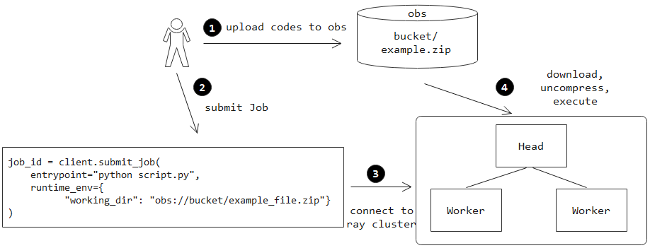
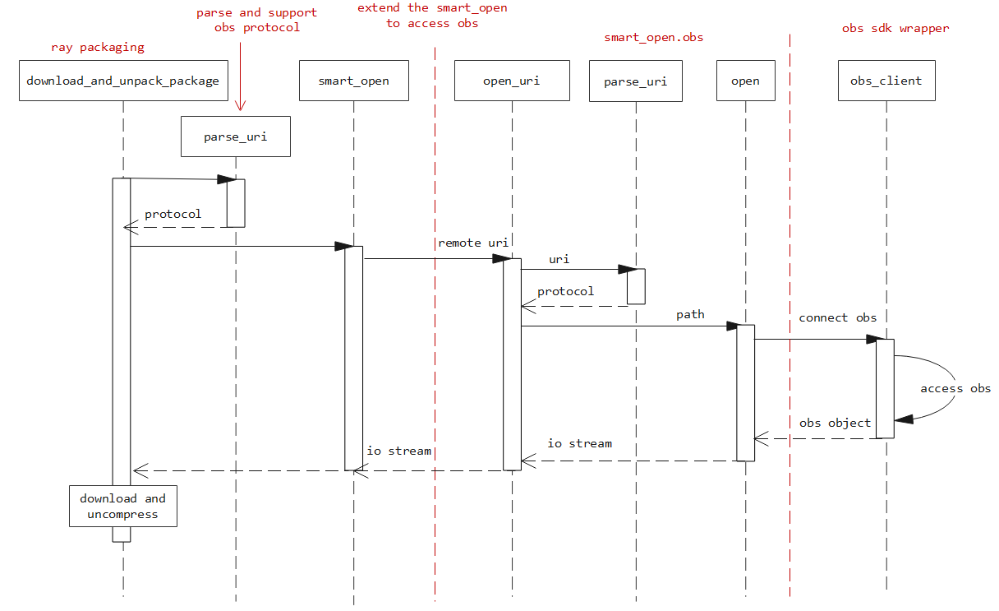

## Summary

### General Motivation

Ray users can use the submit_job Api to send jobs to the ray cluster.

At the same time, they can specify the location of the project's working directory in a remote file system, for example s3.

This document suggests expanding the list of supported file systems and adding support for OBS [(Object Storage Service)](https://support.huaweicloud.com/intl/en-us/productdesc-obs/en-us_topic_0045853681.html).

After the implementation of this improvement, the user will be able to run submit tasks specifying the location of the working directory in OBS.


The use case of submitting ray job via obs is shown in Figure 1:

- First, the user starts the remote ray cluster, and then uploads the codes to the  obs;

- Second, the user submits ray job to the ray cluster using the submit_job APIs, as well as setting the obs path in the submit_job API

- Third, after submitting the ray job, the ray cluster automatically downloads, uncompresses, and executes the codes from the OBS




### Should this change be within `ray` or outside?

main `ray` project. Changes are made to Ray core components.

## Stewardship

### Required Reviewers

- @jjyao
- @ericl


### Shepherd of the Proposal (should be a senior committer)

- @ericl


### Design and Architecture

To submit a Ray job through OBS, perform the following steps:

1. Compress the code into a zip or jar package and put it in OBS

2. You can use environment variables or configuration files to access the AK, SK, and Endpoint of OBS

3. When you submit a ray job, specify the path of the OBS service

```python
job_id = client.submit_job(
    entrypoint="python script.py",
    runtime_env={"working_dir": "obs://example_bucket/example_file.zip"}
)
```

4. The ray cluster automatically downloads the example_file.zip from the specified OBS bucket, decompresses it, and then runs the entry file script.py in the working dir path


## Design Insights

Modify the source code of Ray so that it can download and run the OBS code as follows:

1. Parse the OBS path, for example, "obs://example_bucket/example_file.zip";

2. Read the AK, SK, and endpoint of OBS through environment variables and configuration files to access the remote OBS path.

3. Download the example_file.zip from the specified OBS bucket, decompress it, and execute the user's code


## Implementation Analysis

To extend the ray project for obs, we first need to figure out the workflow of parsing and accessing remote URIs, which is shown in Figure 2.



After the user submitting remote ray jobs, the ray cluster calls download_and_unpack_package function to download and uncrompress the remote files, as shown in Figure 2. To extend the ray project for OBS, we should extend the download_and_unpack_package function to support the OBS scheme, which is implemented via the following two steps.

**Step 1**: Extend the **parse_uri** function to parse the OBS URIs, which is implemented in the file [ray/_private/runtime_env/packaging](https://github.com/ray-project/ray/blob/master/python/ray/_private/runtime_env/packaging.py).

**Step 2**: Extend the third-party library [smart_open](https://github.com/piskvorky/smart_open) to read OBS objects, which is suggested to implement 3 interfaces, i.e., parse uri, open_uri, and open, as shown in Extending smart_open.


The 3 interfaces in smart_open have their own intents:

**parse_uri** : parse the remote URI "obs://bucketId/keyId" to obtain the following info: obs (scheme), bucketId, keyId.

**open_uri** : using the parsed URI info to open the remote objects and call the open API to return an IO stream

**open** : access the remote object and open it as an IO stream


It is worth noting that we can extend the open API to access the OBS objects, which can be implemented to call the wrapper functions based on [obs SDK](https://pypi.org/project/esdk-obs-python/). 