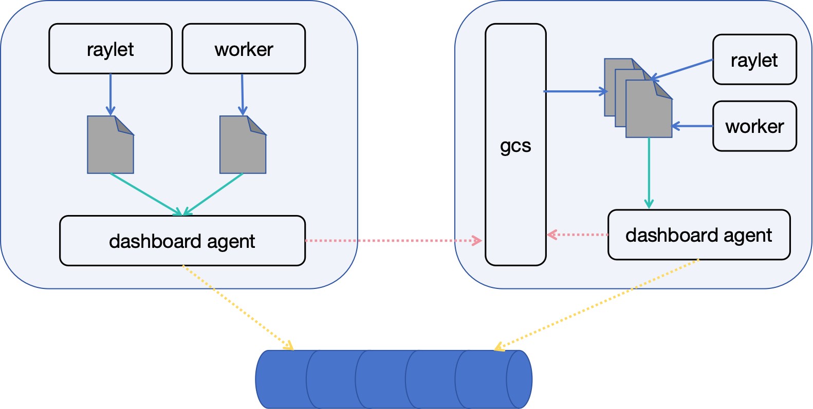
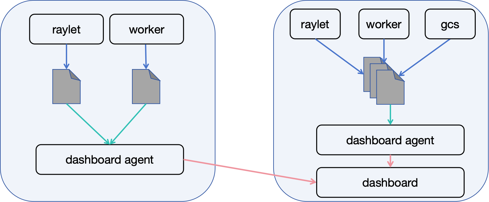

## Summary
### General Motivation

In the current design of Ray, the way to export various states in the Ray cluster are inconsistent.
For example, the state of the Actor is broadcast through GCS pubsub, and to obtain the state change of the node,
it is necessary to query rpc service (NodeInfoGcsService). For the jobs submitted through job submission,
there is no way to expose the state. The high-level libraries on top of Ray also don't have a unified exposure method.
E.g. RayServe and RayData respectively collect the states through their own StateActor and report to the Dashboard.

It is very difficult to obtain these basic states outside the Ray cluster. If a unified export API can be defined,
we can achieve the observable ability independent of the Ray cluster. The most typical scenario is to implement the Ray history server.

#### Key requirements:
- Need to expose all necessary Ray states for basic observability, tasks/actor/jobs/nodes.
- The states export should not increase the load on the Ray cluster.
- Export states streamingly rather than fetch it from ray cluster. To obtain the current status of the ray cluster at one time,
  you need to use [the state observability api](https://github.com/ray-project/enhancements/blob/main/reps/2022-04-21-state-observability-apis.md "the state observability api") . 
- Certain states can be exported selectively.
- Friendly to all types of users (especially cloud vendors), easy to deploy and use, without modifying Ray.

### Should this change be within ray or outside?

Yes, the states we want to export belong to Ray's internal components.

## Stewardship
### Required Reviewers


### Shepherd of the Proposal (should be a senior committer)

## Design and Architecture
### Events
`Event` represents the state change in the Ray cluster, which indicates that
the state of a certain resource in the Ray Cluster has changed, such as the start
and end of a job, the constuction and destruction of an Actor, etc. Event is structured data,
and each resource corresponds to a specified event type. All types of events follow a generally consistent format,
but the event fields of different types can be customized. E.g.:

```json
{"event_type": "JOB", "job": {"submission_id": "raysubmit_WBMEB9nTaMKmrKrN", "job_info": {"status": "RUNNING", "entrypoint": "python3 my_script.py", "message": null, "error_type": null, "start_time": 1692004435106, "end_time": null, "metadata": null, "entrypoint_num_cpus": null, "entrypoint_num_gpus": null, "entrypoint_resources": null, "driver_agent_http_address": null, "driver_node_id": null}}}

{"event_type": "ACTOR", "actor": {"actor_id": "efc87749b2e337d7872dcf3802000000", "actor_info": {"actorId": "efc87749b2e337d7872dcf3802000000", "jobId": "02000000", "address": {"rayletId": "ffffffffffffffffffffffffffffffffffffffffffffffffffffffff", "workerId": "ffffffffffffffffffffffffffffffffffffffffffffffffffffffff", "ipAddress": "", "port": 0}, "name": "_ray_internal_job_actor_raysubmit_WBMEB9nTaMKmrKrN", "className": "JobSupervisor", "state": "PENDING_CREATION", "numRestarts": "0", "timestamp": 0.0, "pid": 0, "startTime": 0, "endTime": 0, "actorClass": "JobSupervisor", "exitDetail": "-", "requiredResources": {}}}}

```

Aggregating all the Events by time dimension, we can obtain the historical state of the ray cluster,
and the consumers of the events can aggregate the final state from a series of events.
The loss of certain events will not cause the final state to be incorrect. For example,
if the event of an actor's creation is lost, but the consumer can read the event of this actor's
successful exit, then the consumer known that the actor finally ran successfully.

Various components of Ray (such as GCS/Dashboard/raylet/worker) can all act as event sources to generate events,
but the event sources do not need to care about about how events are stored, transmitted, and published.

### Events to Export and How
#### Events to Export
- Core
Tasks/Actors/Objects/Jobs/Nodes/Placement groups, including its meta data and current status when events emit.

|  Event            | Event Source          | When to export                                                                    | Format example(maybe a file link)|
|  ----             | ----                  | ----                                                                              | ----                             |
| Tasks             | CoreWorker and raylet | When coreworker adds task event to<br>ray::core::worker::TaskEventBuffer          |          |
| Actors            | GCS                   | GcsPublisher::PublishActor<br>publish actor status through<br>GCS_ACTOR_CHANNEL   |          |
| Objects           | CoreWorker and raylet | None                                                                              |          |
| Jobs              | JobManager            | When JobInfoStorageClient.put_status called                                       |          |
| Nodes             | GCS                   | GcsNodeManager::HandleXXXNode                                                     |          |
| Placement groups  | GCS                   | GcsPlacementGroupManager::HandleXXXPlacementGroup                                 |          |


- RayServe
State change events for replicas, deployments, applications.

|  Event            | Event Source          | When to export | Format example(maybe a file link)|
|  ----             | ----                  | ----           | ----                               |
| Serve App         | ServeController Actor | None           | None         |

- RayData
All datasets, the dag, and execution progress.

|  Event            | Event Source          | When to export | Format example(maybe a file link)|
|  ----             | ----                  | ----           | ----                               |
| Datasets         | ray.data.internal.stats._StatsActor | _StatsActor's update function called.           | None         |


#### How to export
- Event generation
We propose to use the filesystem based export interface. The event source can just write the
event into the file of this node and then return. The export of the event can be the responsibility of the agent on the node.


- Event export
In general, the pubsub mode is used and it has the ability to be pluggable.
Various components that support pubsub can be used, such as GCS in the cluster, and external systems such as Kafka, etc.
The agent monitors the event file generated on this node and publishes events to the backend.


Advantages are:
1. For the event sources (gcs/worker/raylet), the export interface is very lightweight and stable,
   and will not encounter abnormal errors such as network timeouts.
2. It decouples the process of the event source generating events and the actual export (publishing to gcs or kafka).
3. It is easy to control and configure. By configuring the agent to control whether to export,
   control the event types that need to be exported, and control the export speed.
4. Using the pubsub mechanism, the event export is streamingly, the publisher and subscriber
   can handle events at their own speed or ignore the events.
5. The mainstream pubsub system (kafka) supports repeated subscription and consumption, which is friendly to subscribers.

<br>



<br>

The above exported solution is very flexible. Users with different needs can choose the most suitable deployment.
1. For ordinary users, the ray cluster scale and job scale are limited, it's fine to use the default GCS pubsub.
2. For users who have the ability and need for customized development, such as companies with a certain scale,
   there will often be a relatively large Ray cluster scale and quantity, have their own infra infrastructure.
   When deploying Ray, it is necessary to adapt to the internal publish/subscribe system.
   By using the exported solution we proposed, only a small amount of modification to the agent is required.
3. For cloud vendors,  it is very important to use open-source components, and then Kafka is a very good choice.
   

### Status quo
At present, there is already an events mechanism implementation in Ray: components like gcs/raylet/workers
print structured logs (JSON) to the tmp_dir/log/events/ directory, and the event agent on each node
monitors these files and reports the file content to the event head. 
This is also the source of the Events on the Overview page of the dashboard.

<br>



<br>

We propose to reuse the existing Ray event mechanism and build on it.