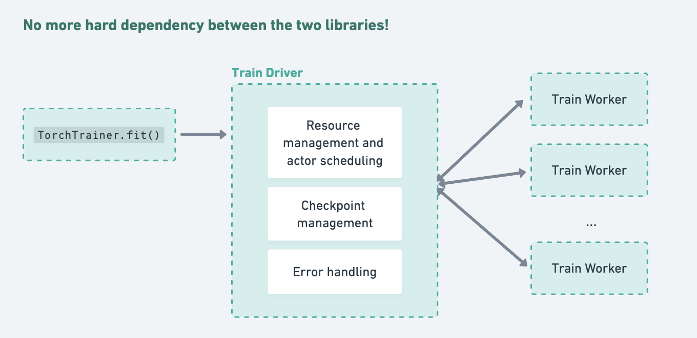

# Train Tune API Revamp REP

# Summary

We introduce a slimmed, more extensible version of Ray Train that is fully decoupled from the Ray Tune library.

For a TL;DR of the change list, see [this section](#api-changes).

# Background and Motivation

Ray Tune and Ray Train have been tightly coupled since Ray 2.0, when Ray Tune became the common execution engine for both libraries.

Ray Train execution invokes Tune’s execution logic under the hood, which leads to this layered system:


The original intention behind this was to increase the interoperability of the two libraries, but the dependency of Ray Train on Ray Tune has led to many usability and stability issues, and it has stalled feature development.

We’ll briefly cover 4 problem areas to show that untangling the two libraries will bring many **usability and stability improvements, while also enabling feature development**.

**1️⃣ Coupled interfaces between Train and Tune:**

* Common code pieces such as `Callback`, `ProgressReporter`, `RunConfig(trainer_resources)`, `FailureConfig(fail_fast)`, and all “trial” related references (`ray.train.get_context().get_trial_id`) are actually leaky Tune implementation details that *surface to Ray Train users*.
* **Recommendation:** A clear separation between these two libraries with a slim integration layer is a better long term solution. Decoupling benefits both Ray Train and Ray Tune users, since it enables the independent development of each library.
* <details><summary>Some more internal developer-facing motivation:</summary>

    * The goal of unifying the code implementation was actually only fully realized in the [simplified persistence](https://github.com/ray-project/enhancements/blob/main/reps/2023-06-06-simplify-sync.md) [project](https://github.com/ray-project/ray/issues/38294), where many interfaces were de-duplicated, including the CheckpointManager, session, etc.
      * Although this project greatly improved Ray Train’s stability and cleared a significant amount of tech debt for Ray 2.7+, one takeaway since then is that the tight implementation coupling hinders feature development.
      * If we want to develop a feature for Ray Train, we also need to consider if it needs to be implemented or explicitly disabled for vanilla Ray Tune usage. The feature set of these two libraries is *expected to be different.*
    * A consequence of diverging feature-sets while having coupled implementations is a lot of nasty code branching within Ray Tune. \[[1](https://github.com/ray-project/ray/blob/85eaffd43fc0e8e8ec0bf66d6f10b8c7709d4ff5/python/ray/tune/trainable/function_trainable.py#L57), [2](https://github.com/ray-project/ray/blob/85eaffd43fc0e8e8ec0bf66d6f10b8c7709d4ff5/python/ray/tune/tune.py#L502), [3](https://github.com/ray-project/ray/blob/85eaffd43fc0e8e8ec0bf66d6f10b8c7709d4ff5/python/ray/tune/execution/tune_controller.py#L170), [4](https://github.com/ray-project/ray/blob/85eaffd43fc0e8e8ec0bf66d6f10b8c7709d4ff5/python/ray/tune/experimental/output.py#L820)\]

    </details>

**2️⃣ Error handling, fault tolerance, and observability of training failures:**

* Unified error handling \+ fault tolerance limits possibilities for Ray Train to manage its own errors.
* Ray Train just raises worker errors back to Ray Tune for handling, leading to the following limitations:
  * The granularity of fault tolerance is coarse: Tune’s fault tolerance strategy is to kill the Ray Train driver and respawn it. Ray Train can’t start providing useful logging messages until Ray Tune is ready with enough resources to start it.
  * Ray Train can only re-raise the first worker’s error, even though multiple workers may have meaningful error messages. Ray Train cannot pass back a system error that captures all worker errors and is specially handled, without a leaky abstraction between the two libraries.
* **Recommendation:** The Ray Train controller should handle its own worker errors, which enables better observability, more advanced fault tolerance such as elastic training, and simpler error semantics with a clear distinction between worker and driver errors.
  * One example of a possible observability improvement is the Ray Train driver periodically emitting its current status when recovering a run from a worker failure.
* <details><summary>Some more internal developer-facing motivation:</summary>

    * *Case study:* spot instance preemption error handling.
      * In Ray Train, a preemption could kill any of the N training workers.
      * If the node where the Ray Train driver (which runs within the Ray Tune Trainable) dies, then a RayActorError will be raised to the Ray Tune driver.
      * Otherwise, the Ray Train driver is able to propagate the worker error up to the Ray Tune driver as a RayTaskError(RayActorError).
      * In Ray Tune, this 2nd case never happens, since there are usually no sub-workers. The difference in these semantics is confusing and is an example of Ray Train details leaking back into Ray Tune.

  </details>

**3️⃣ Checkpointing:**

* Unified checkpointing implementation limits potential features for Ray Train’s multi-worker distributed checkpointing.
* Checkpoints need to be passed through 2 layers (from workers to the Train driver to the Tune driver).
  * The first step from `N` workers to a single Ray Train driver has different requirements compared to the second step from Train to Tune, but the shared implementation requires that they be handled the same. We cannot easily add Train-specific functionality, such as broadcasting a checkpoint folder name across all workers, worker barriers, and any special distributed checkpointing features we may want to add in the future.
* **Recommendation:** Let the checkpointing implementations diverge, which will allow Ray Train’s checkpointing feature set to grow.
  * For example, distributed checkpoint uploading of a large model across `N` workers is a different problem setting compared to Tune’s problem setting with small, single-worker checkpointing.
* <details><summary>Some more internal developer-facing motivation:</summary>

    * *Case study:* checkpoint folder name customization.
      * This has been a long-standing issue \[[1](https://github.com/ray-project/ray/issues/41817), [2](https://github.com/ray-project/ray/issues/40531)\] that is a significant usability issue. Checkpoints reported in Ray Train cannot be easily accessed after training due to having non-deterministic path names that cannot be configured.
      * For example, a checkpoint path today looks like this: `/path/to/storage_path/exp_name/TorchTrainer_{random_uuid}/checkpoint_00000`. Due to this random UUID, users cannot easily reference a checkpoint path without adding extra logic to search through the filetree.
    * *Case study*: Tune’s controller snapshot is only committed to storage *periodically*, but it is used as the source of truth upon restoration. This can lead to [consistency problems](https://github.com/ray-project/ray/pull/30187) and even lead to errors upon restoration, especially if users are deleting low-performing checkpoints to free up space.
      * The periodic snapshot commit is due to the many-trial use case that Tune needs to account for. Train can upload more often if it’s keeping track of checkpoints by itself, so there’s no need for Ray Train’s fault tolerance to suffer due to Tune’s assumptions.

  </details>

4️⃣ **Train and Tune interoperability:**

* The current usage of Train in combination with Tune is unintuitive and is susceptible to incorrect usage. Often, [users](https://ray.slack.com/archives/CSX7HVB5L/p1721169473392809) will try to run Train with Tune in a similar way to the proposal in this REP.
* **Recommendation:** See the new Tune integration design below, which is more intuitive and interoperable than [the current solution](https://docs.ray.io/en/releases-2.34.0/train/user-guides/hyperparameter-optimization.html).
*  <details><summary>Some more internal developer-facing motivation:</summary>

    * From an architectural standpoint, Tune and Train do not need to be so entangled to achieve this goal. It’s possible to achieve interoperability without the downside of the layered libraries.
      * Ray Train depends on Ray Tune even though a single distributed training run has nothing to do with a hyperparameter sweep.
      * Ray Tune depends on Ray Train by having special logic to detect a Ray Train `Trainer` and convert it into a Tune-compatible interface, which is an abstraction leak.

  </details>

# Stewardship

### Required Reviewers

@matthewdeng, @hongpeng-guo

### Shepherd of the Proposal (should be a senior committer)

@raulchen

### Should this change be within ray or outside?

This change is part of the main ray project, touching the Ray Train and Ray Tune libraries.

# Design and Architecture

This proposal contains two main changes:

1. Decouple the public Ray Train and Ray Tune interfaces. See the [full list of API changes.](#api-changes)
2. Introduce a new Ray Train execution engine that is independent of Ray Tune. See the [architecture overview.](#ray-train-architecture-overview)

| Before | After |
| ----- | :---- |
|  |  |


The goal of these changes is to improve:

* **Usability** by mostly keeping feature parity, while introducing more intuitive APIs in place of inherited Ray Tune APIs that do not fit in the context of Ray Train.
* **Extensibility** by introducing more modular execution components that can be more easily customized.
* **Interoperability** between Ray Tune and Ray Train so that using both together is more natural and still provides separation between the two libraries.

## API Changes

| Change Type | Description |
| :---- | :---- |
| 🚧 | **Reworked API.** Migration involves slight user code refactoring, but feature parity is generally maintained. |
| 🔀 | **Module copy/change.** Migration just involves a find and replace. |
| ❌ | **API deprecation.** Migration involves removing API usage and finding a workaround within a deprecation period. |
| ➕ | **New API.** No migration needed since the new API should be optional. |

### Ray Train API Change Summary

From the perspective of a **Train user**, here is the full list of API changes.

<table>
<!-- Table Headers -->
  <tr>
    <th>Change Type</th>
    <th>Diff</th>
    <th>Notes</th>
  </tr>
  <tr>
<td>🚧</td>
<td>

```diff
-<Framework>Trainer.restore(path_or_uri)
-<Framework>Trainer.can_restore(path_or_uri)
+<Framework>Trainer(
+    ...,
+    run_config=RunConfig(
+        name=<existing_run_name>, storage_path=...
+    )
+ )
```

</td>
<td>

See [here](#job-level-restoration) for information on Ray Train v2 job-level restoration.

</td>
  </tr>
  <tr>
<td>🚧</td>
<td>

```diff
-ray.train.RunConfig(callbacks: List[ray.tune.Callback])
+ray.train.RunConfig(callbacks: List[ray.train.Callback])
```
</td>
<td>

Ray Tune callbacks used to be passed into Trainers, which was awkward to use, since all of the callback hooks were based on Tune events such as the “beginning of the tuning loop step.” The hooks also didn’t expose very relevant parameters. All of the callback hooks passed the Tune `Trial` object to the user, which is a developer API which doesn’t contain any Train specific information.

Take a look at [the architecture overview](#ray-train-architecture-overview) for a preview of the new Ray Train callbacks, which have more fitting hooks and improved flexibility. Note that these are still `DeveloperAPI`s subject to change between releases.

If you heavily depend on Ray Tune callbacks, you can still access them by using running Train as a single Tune trial. See [this section](#tune-callbacks) for an example.

</td>
  </tr>

  <tr>
<td>❌</td>
<td>

```diff
-ray.train.RunConfig(sync_config)
-ray.train.SyncConfig
```
</td>
<td>

The `SyncConfig` primarily configured Ray Tune’s artifact syncing behavior, which will no longer be supported in Ray Train. See [this section](#persisting-training-artifacts) for an alternative you can migrate to. A MLFlow or Wandb artifact registry is the recommended alternative.

</td>
  </tr>

  <tr>
<td>❌</td>
<td>

```diff
ray.train.RunConfig(
    name: Optional[str],
    storage_path: Optional[str],
    storage_filesystem: Optional[pyarrow.fs.FileSystem],
    failure_config: Optional[ray.train.FailureConfig],
    checkpoint_config: Optional[ray.train.CheckpointConfig],
-   verbose: Optional[
-       Union[int, "AirVerbosity", "Verbosity"]
-   ],  # 1
-   progress_reporter: Optional[
-       ray.tune.progress_reporter.ProgressReporter
-   ],  # 2
-   stop: Optional[
-       Union[Mapping, ray.tune.Stopper]
-   ],  # 3
-   log_to_file: Union[bool, str, Tuple[str, str]],  # 4
-   sync_config: Optional[ray.train.SyncConfig],
-   callbacks: Optional[List[ray.tune.Callback]],
+   callbacks: Optional[List[ray.train.Callback]],
)
```

</td>
<td>

1. See [here](#persistent-storage-and-run-outputs) for information on Ray Train console output.
2. Same as 1.
3. Early stopping can be configured within your own training loop easily, and it is already provided out of the box by many libraries (ex: [Lightning](https://lightning.ai/docs/pytorch/stable/common/early_stopping.html)).
4. Logs from workers are already dumped via Ray worker logs and can be viewed in the Ray Dashboard.

If you heavily depend on any of these features, you can still access them by using running Train as a single Tune trial. See [this section](#tune-callbacks) for an example.

</td>
  </tr>

  <tr>
<td>❌</td>
<td>

```diff
ray.train.FailureConfig(
    max_failures: int,
-   fail_fast: Union[bool, str],
)
```

</td>
<td>

This config only made sense in the context of multiple trials when running with Tune.
In that case, it's enables failing the entire job when one of many trials errors.

</td>
  </tr>

  <tr>
<td>❌</td>
<td>

```diff
ray.train.CheckpointConfig(
    num_to_keep: int,
    checkpoint_score_attribute: Optional[str],
    checkpoint_score_order: Optional[str],
-   checkpoint_frequency: Optional[int],
-   checkpoint_at_end: Optional[bool],
)
```

</td>
<td>

These configs are already not supported for most Trainers, and the upcoming `XGBoostTrainer` and `LightGBMTrainer` API updates will make these parameters fully unused.

</td>
  </tr>

  <tr>
<td>❌</td>
<td>

```diff
-<Framework>Trainer(resume_from_checkpoint)
```

</td>
<td>

See [here](#resume_from_checkpoint) for why this is being removed, with a simple example of achieving the same behavior.

</td>
  </tr>

  <tr>
<td>🔀</td>
<td>

```diff
context: TrainContext = ray.train.get_context()

context.get_world_size()
context.get_local_world_size()
context.get_world_rank()
context.get_local_rank()
context.get_node_rank()
-context.get_trial_dir()
-context.get_trial_id()
-context.get_trial_name()
-context.get_trial_resources()
context.get_experiment_name()
context.get_storage()
```

</td>
<td>

Same as above. All of the Tune "trial" related context will be removed.

</td>
  </tr>

  <tr>
<td>➕</td>
<td>

```diff
ray.train.report(
    ...,
+   checkpoint_dir_name=f"{epoch=}",
)
```

</td>
<td>

See [this section](#saving-and-loading-checkpoints) for more information.

</td>
  </tr>

</table>

### Ray Tune API Change Summary

From the perspective of a **Tune user**, here is the full list of API changes.

<table>
<!-- Table Headers -->
  <tr>
    <th>Change Type</th>
    <th>Diff</th>
    <th>Notes</th>
  </tr>
  <tr>
<td>🚧</td>
<td>

```diff
-Tuner(
-   trainable: Union[
-       ray.tune.Trainable, ray.train.BaseTrainer
-   ] = TorchTrainer(...)
-)
+Tuner(trainable: ray.tune.Trainable = train_driver_fn)
```

</td>
<td>

The input to the Tuner is now restricted to Trainable types, instead of allowing the `Trainer` type as a special case. See [here](#hyperparameter-optimization) for an example.

</td>
  </tr>

  <tr>
<td>🔀</td>
<td>

```diff
ray.tune.Tuner(
-   run_config: ray.train.RunConfig(
-       checkpoint_config: ray.train.RunConfig,
-       sync_config: ray.train.RunConfig,
-       failure_config: ray.train.RunConfig,
-   )
+   run_config: ray.tune.RunConfig(
+       checkpoint_config: ray.tune.RunConfig,
+       sync_config: ray.tune.RunConfig,
+       failure_config: ray.tune.RunConfig,
+   )
)
```

</td>
<td>

These API imports will be moved in order to decouple the libraries.

</td>
  </tr>

  <tr>
<td>🔀</td>
<td>

```diff
-ray.train.report(...)
+ray.tune.report(...)
```

</td>
<td>

Same as above.

</td>
  </tr>

  <tr>
<td>🔀</td>
<td>

```diff
-ray.train.get_checkpoint(...)
+ray.tune.get_checkpoint(...)
```

</td>
<td>

Same as above.

</td>
  </tr>

  <tr>
<td>🔀</td>
<td>

```diff
-ray.train.Checkpoint
+ray.tune.Checkpoint
```

</td>
<td>

Same as above.

</td>
  </tr>

  <tr>
<td>🔀</td>
<td>

```diff
-context: TrainContext = ray.train.get_context()
+context: TuneContext = ray.tune.get_context()

-context.get_world_size()
-context.get_local_world_size()
-context.get_world_rank()
-context.get_local_rank()
-context.get_node_rank()
context.get_trial_dir()
context.get_trial_id()
context.get_trial_name()
context.get_trial_resources()
context.get_experiment_name()
context.get_storage()
```

</td>
<td>

Same as above. All of the multi-worker distributed training context information
do not apply to Tune trials and will be removed.

</td>
  </tr>

  <tr>
<td>🔀</td>
<td>

```diff
result_grid = tuner.fit()
-result: ray.train.Result = result_grid[0]
+result: ray.tune.Result = result_grid[0]
```

</td>
<td>

Same as above.

</td>
  </tr>

</table>

## Ray Train Architecture Overview

### Controller

The **Controller** is the central orchestrator that manages the distributed execution of training jobs. Its main responsibilities include:

* **Execution Control**:
  * It triggers the distributed training function across the workers in the `WorkerGroup` and shuts down the workers when training has either finished or failed.
* **Polling & Health Checking**:
  * The Controller regularly polls the workers to assess their health and training progress. Based on the worker statuses, it can handle errors and make scaling decisions.
  * This also enables bidirectional communication between the controller and the workers. Global worker group information can be used to make decisions.
* **Scaling and Failure Management**:
  * The controller delegates to `ScalingPolicy` and `FailurePolicy` for decisions on how many workers to start and what to do in the event of a worker failure. The controller simply executes the decisions.

The controller operates in different states, including **RUNNING**, **INITIALIZING**, **RECOVERING**, **ERRORED**, and **FINISHED**, which reflect the lifecycle of a distributed training job.

### WorkerGroup

The **WorkerGroup** is responsible for managing a set of worker processes that execute the distributed training tasks. Key functions include:

* **Worker Management**: It creates and initializes workers using Ray actors, manages their lifecycle, and orchestrates task execution.
* **Status Polling**: The WorkerGroup continually polls each worker for their execution status. It checks for errors, preemptions, or task completions.
* **Task Execution**: Tasks (such as training functions) can be executed synchronously or asynchronously across the worker group. The results or errors are propagated back to the controller.
* **Resilience**: It handles worker shutdowns and ensures resources are properly freed upon failures or task completions.

### ScalingPolicy

The **ScalingPolicy** dictates how the system should respond to the changing resource availability of the distributed training job. It makes decisions in two contexts:

* **Initializing or Recovering Worker Group**: When the worker group is initializing or recovering from failures, the `ScalingPolicy` can decide to resize the group (upscale or downscale).
* **Running Worker Group**: When the workers are actively training, the `ScalingPolicy` decides whether additional resources are needed based on system performance, worker health, or job requirements.

The scaling policy can generate different decisions like `NoopDecision` (no changes) or `ResizeDecision` (change in the number of workers and allocated resources). The scaling policy is in charge of requesting resources in an auto scaling cluster to launch nodes.

### FailurePolicy

The **FailurePolicy** governs how the system reacts to failures that occur during training. It supports different failure-handling decisions:

* **RESTART**: Restart the failed workers or the entire worker group.
* **RAISE**: Raise an error and terminate the training process.
* **NOOP**: No action is taken; the system continues running despite the failure.

The failure policy is crucial for ensuring fault tolerance, especially in long-running distributed tasks, where worker or system failures are inevitable.

### Callback

**Callbacks** provide customizable hooks that can be triggered at various points during training. There are multiple types of callbacks:

* **WorkerGroupCallback**: Hooks into worker lifecycle events, such as before and after worker group startup, shutdown, and polling for status.
* **ControllerCallback**: Hooks into the controller’s lifecycle, such as after starting the control loop, before shutting down, or after state transitions.
* **WorkerCallback**: These callbacks allow the injection of logic within the remote worker, such as initializing training environments or handling worker shutdowns.

Callbacks enable users to extend the framework with custom logic without modifying the core system, allowing for flexible execution behavior.

### Checkpointing Utilities

Users can optionally report checkpoints in their training function.

On the training worker side, checkpoint reporting is implemented similarly as before:

1. User reports a local checkpoint directory, which will be uploaded to `storage_path` using pyarrow.
2. After uploading, a reference to the checkpoint is passed from the user code thread to a listener thread that pushes the checkpoint reference to the controller for handling.

On the controller side, checkpoint management (tracking the latest and best checkpoints) in this implementation is handled as a default `Callback`.

## Feature Parity Summary

### Ray Data Integration

Ray Data is still the recommended way of doing distributed data loading and preprocessing with Ray Train – see [this user guide](https://docs.ray.io/en/latest/train/user-guides/data-loading-preprocessing.html) for more details.

**Ray Dataset ingestion does not require any code changes.**

### Persistent Storage and Run Outputs

Ray Train continues to rely on external persistent storage such as cloud storage or a shared file system for fault tolerance and writing outputs from multiple distributed workers.

**Persistent storage configuration does not require any code changes.**

* `RunConfig(storage_path: str, storage_filesystem: pyarrow.fs.FileSystem, name: str)` configures the Ray Train output directory, same as before.
* `train.report(metrics, checkpoint=..., checkpoint_dir_name=...)` will upload the checkpoint to `{RunConfig.storage_path}/{RunConfig.name}/{checkpoint_dir_name}`

✅ **The Ray Train output directory structure is simplified:**

* There is no longer an intermediate “trial directory” with a randomized path. This, combined with the checkpoint directory name customization, will allow all checkpoint paths to be configurable and deterministic.
* The irrelevant `.pkl` and `.json` files from Tune are no longer saved.

The checkpoints can still be accessed with the `Result` object returned by the trainer:

```python
result = trainer.fit()

result.path
# "<storage_path>/<name>"

result.checkpoint
# Checkpoint(path="<storage_path>/<name>/checkpoint_epoch=x")

result.best_checkpoints
```

<table>
<!-- Table Headers -->
  <tr>
    <th>Before</th>
    <th>After</th>
  </tr>
  <tr>
<td>

```text
{RunConfig.storage_path}/{RunConfig.name}   ex: `s3://bucket/UNIQUE_JOB_ID`
├── experiment_state-2023-07-28_10-00-38.json
├── basic-variant-state-2023-07-28_10-00-38.json
├── trainer.pkl
├── tuner.pkl
└── TorchTrainer_46367_00000_0_...
├── events.out.tfevents...
├── params.json
├── params.pkl
├── progress.csv
├── result.json
├── checkpoint_000000
│   ├── checkpoint.pkl
│   ├── checkpoint_shard-rank=0.pkl
│   └── checkpoint_shard-rank=1.pkl
├── checkpoint_000001
└── ...
```

</td>
<td>

```text
{RunConfig.storage_path}/{RunConfig.name}   # ex: `s3://bucket/UNIQUE_JOB_ID`
├── checkpoint_epoch=0
├── checkpoint_epoch=1
└── ...
```

</td>
  </tr>

</table>

#### Persisting Training Artifacts

❌ [Artifact syncing](https://docs.ray.io/en/latest/train/user-guides/persistent-storage.html#persisting-training-artifacts) will be deprecated. For some context, Ray Train inherited Ray Tune’s “working directory” abstraction, which tries to maintain consistency between the local working directory of a trial with the corresponding directory in remote storage.

It is fairly straightforward to achieve the same functionality without this feature. Here is an example migration option:

```py
import pyarrow.fs

def train_fn_per_worker(config):
    storage = ray.train.get_context().get_storage()

    fs: pyarrow.fs.FileSystem = storage.storage_filesystem
    path = storage.experiment_fs_path

    # Write some artifacts, then upload it to storage:
    with tempfile.TemporaryDirectory() as tempdir:
        # img.save(f"{tempdir}/asdf.png")
        pyarrow.fs.copy_files(tempdir, path, destination_filesystem=fs)

```

Note that this feature was already disabled by default.

### Saving and Loading Checkpoints

**Checkpoint saving and loading does not require any code changes.**

✅ One new feature that is already available is `checkpoint_dir_name` configuration:

```py
def train_fn_per_worker(config):
    ...

    for epoch in range(10):
        with tempfile.TemporaryDirectory() as checkpoint_dir:
            # torch.save(...)
            checkpoint = (
                ray.train.Checkpoint.from_directory(...)
                if ray.train.get_context().get_world_rank() == 0
                else None
            )

            # Checkpoints will be reported in directories:
            # `{RunConfig.storage_path}/{RunConfig.name}/checkpoint_epoch=0/`, ...
            ray.train.report(
                metrics={...},
                checkpoint=checkpoint,
                checkpoint_dir_name=f"checkpoint_{epoch=}",
            )
```

### Console Output

✅ When using Train by itself, there will now be fewer spammy, irrelevant logs coming from Tune. Here are a few common spam logs from Tune that will no longer clutter your console output:

* “Experiment state snapshotting has been triggered multiple times in the last … seconds”
* The `process_trial_result` operation took … s, which may be a performance bottleneck.”

❌ One feature inherited from Tune was periodic logging of trial progress. These tables logged by Ray Tune will no longer be printed in Ray Train. These logs included any hyperparameters set on the trial as well as metrics reported via `train.report`. Printing out formatted logs from training workers can be reimplemented in user code by using a library such as `tabulate`.

`ray.train.RunConfig(verbose)` was the config that controlled this printing behavior, which will be removed as the new Ray Train does not have any special logging behavior yet. This `verbose` config may be reintroduced in the future if Train-specific logging functionality is added.

### Metric Logging and Inspecting Results

Ray Tune implements some experiment tracking functionality like custom metric reporting. This new design of Ray Train aims to remove The recommendation for metric tracking is to report metrics directly from the workers to experiment tracking tools such as MLFlow or WandB. See this [user guide](https://docs.ray.io/en/latest/train/user-guides/experiment-tracking.html) for examples.

❌ Default metrics such as `time_this_iter_s` and `training_iteration` will no longer be automatically reported.

* The definition of an “iteration” is often subject to the user code, so reporting these default values is confusing in most cases. For example, an iteration usually corresponds to a single batch of training, but if the user calls `train.report` once per epoch, then the default `training_iteration` tracks the epoch index instead.

❌ Free-floating metrics are no longer automatically saved. Free floating metrics were previously saved when each worker calls `train.report(metrics, checkpoint=None)` without an attached checkpoint.

* Users can fetch these metrics themselves via a callback:

```py
class MetricAggregationCallback(WorkerGroupCallback):
    def after_worker_group_poll_status(self, worker_group_status: "WorkerGroupStatus"):
        rank_0_result = worker_group_status.worker_statuses.get(0)
        if rank_0_result:
            # Fetch the reported metrics:
            print(rank_0_result.metrics)
```

### Job-level Restoration

Today, job-level restoration is supported via the `<FrameworkTrainer>.restore(path_or_uri)` API. In V2, job-level restoration will still be possible with a slightly modified driver script, which solves a few pain points encountered by users:

1. Stateful object pickling issues:
   * Objects such as the user’s training code and configurations (`RunConfig` including callbacks and the `ScalingConfig`) are pickled and saved as a file in the run output directory, to be deserialized and used upon restoration.
   * Pickling user code leads to unexpected corner cases, such as a run being unrestorable if any pickled module references got moved around.
2. Confusing state loading and overriding:
   * While most configurations can be loaded from the pickle files, there are certain arguments that are required to be respecified such as Ray Datasets, and even more arguments that can be optionally respecified. This confuses users about which parameters are actually being used in the restored run \[[1](https://ray.slack.com/archives/CSX7HVB5L/p1718210214132329)\].
3. UX friction:
   * There is significant overlap in functionality with the `resume_from_checkpoint` API, and distinguishing the two is a common user question \[[1](https://ray.slack.com/archives/CSX7HVB5L/p1707241076911069), [2](https://ray.slack.com/archives/CSX7HVB5L/p1715627477633579), [3](https://github.com/ray-project/ray/issues/40626)\].
   * Users need to concatenate the `storage_path` and `name` together to pass into the `restore` API, rather than keeping them separate like they are in `RunConfig`. This is especially unwieldy when cloud storage is used, and users need to resort to manual string joins.

The new design avoids pickling any configurations, and uses the `RunConfig(storage_path, name)` as the unique identifier for a restorable run. If a previous run has written outputs and checkpoints to `{storage_path}/{name}`, then a new run started with the same configuration will “restore” from the state found at that directory. At the moment, the only stateful component is Ray Train’s checkpoint manager, which tracks the latest checkpoint.

Here’s an example of what job-level restoration looks like before and after, where the job is submitted with this `python main.py <UNIQUE_JOB_ID>` as the entrypoint:

<table>
<!-- Table Headers -->
  <tr>
    <th>Before</th>
    <th>After</th>
  </tr>
  <tr>
<td>

```python
# main.py

def train_fn_per_worker(config):
    checkpoint = ray.train.get_checkpoint()

    ...

if __name__ == "__main__":
    import argparse

    parser = argparse.ArgumentParser()
    parser.add_argument("run_id", type=str)
    args = parser.parse_args()

    unique_run_name = args.run_id  # some UNIQUE job id
    storage_path = "s3://my/bucket"

    run_path = f"{storage_path}/{unique_run_name}"

    if TorchTrainer.can_restore(run_path):
        # Certain configs get loaded from a pkl file,
        # and other parameters need to be re-specified.
        trainer = TorchTrainer.restore(
            run_path,
            train_loop_per_worker=train_fn_per_worker,
            datasets={...},
        )
    else:

        trainer = TorchTrainer(
            train_fn_per_worker,
            ...,
            run_config=ray.train.RunConfig(
                storage_path=storage_path,
                name=unique_run_name,
            ),
        )

    trainer.fit()
```

</td>
<td>

```python
# main.py

def train_fn_per_worker(config):
    checkpoint = ray.train.get_checkpoint()

    ...


if __name__ == "__main__":
    import argparse

    parser = argparse.ArgumentParser()
    parser.add_argument("run_id", type=str)
    args = parser.parse_args()

    unique_run_name = args.run_id  # some UNIQUE job id
    storage_path = "s3://my/bucket"

    trainer = TorchTrainer(
        train_fn_per_worker,
        ...,
        run_config=ray.train.RunConfig(
            storage_path=storage_path,
            name=unique_run_name,
        ),
    )
    # If `{storage_path}/{unique_run_name}` already contains a previous run's output,
    # populate the latest checkpoint, which can be retrieved via `ray.train.get_checkpoint`.
    trainer.fit()

```

</td>
  </tr>

</table>

⚠️ New training runs should be assigned a unique `name`. We recommend generating this unique name as a uuid before submitting the job. Then, upon any driver failures, a job retry would re-initialize the run with the same `name`, which will load the latest checkpoint information from persistent storage.

#### `resume_from_checkpoint`

❌ `Trainer(resume_from_checkpoint)` was a common source of confusion and will be deprecated. `resume_from_checkpoint` is meant to provide a starting checkpoint for a new run, rather than restore all state from the previous run. See the following example for a more intuitive way to accomplish the same thing:

```py
def train_fn_per_worker(config: dict):
    # Equivalent behavior that is explicit and more flexible.
    checkpoint = (
        ray.train.get_checkpoint()
        or config.get("resume_from_checkpoint")
    )

trainer = TorchTrainer(
    train_fn_per_worker,
    train_loop_config={"resume_from_checkpoint": ray.train.Checkpoint(...)},
)
```

### Hyperparameter Optimization

Ray Tune for hyperparameter search over distributed training runs is still supported in a slightly modified but more intuitive way.

The Tune \+ Train integration in today's Ray Train looks like this:

```py
trainer = TorchTrainer(train_fn_per_worker, scaling_config=..., run_config=...)

tuner = Tuner(
    trainer,
    # Bad UX 1: mix of dicts and dataclasses in the param space.
    # Bad UX 2: the param space keys are semantically different with the vanilla Tune
    # `config` dict. Only things inside `train_loop_config` get piped
    # through to the `train_fn_per_worker`.
    # The param space instead searches over the args of the `TorchTrainer`,
    # which may overwrite existing values such as the scaling config defined above.
    param_space={
        "train_loop_config": {"lr": tune.grid_search([1e-3, 3e-4])},
        "scaling_config": ray.train.ScalingConfig(num_workers=tune.choice([2, 4])),
    },
    # Bad UX 3: There are 2 run-configs, where one will overwrite the other.
    run_config=ray.train.RunConfig(
        checkpoint_config=ray.train.CheckpointConfig(...),
        failure_config=ray.train.FailureConfig(...),
    )
)
result_grid = tuner.fit()

result: ray.train.Result = result_grid[0]
```

After this proposal, instead of passing in the Trainer instance into the Tuner, launch the Ray Train driver in a regular Tune function Trainable.

* This improves the hyperparameter tuning user experience \[[1](https://github.com/ray-project/ray/issues/47439), [2](https://ray.slack.com/archives/CSX7HVB5L/p1721169473392809)\] and eliminates the awkward config overriding logic that happens in the current integration \[[1](https://github.com/ray-project/ray/issues/33539), [2](https://github.com/ray-project/ray/issues/36082), [3](https://github.com/ray-project/ray/pull/33454)\].

```py
def train_fn_per_worker(worker_config):
    # training code here...

def tune_fn(config):
    # Train driver setup goes here...
    num_workers = config["num_workers"]   # job-level hyperparams

    context = ray.tune.get_context()
    storage_path = context.get_experiment_path()
    name = context.get_trial_name()

    # Ray Train can handle its own fault tolerance.
    trainer = TorchTrainer(
        train_fn_per_worker,
        train_loop_config=config["train_loop_config"],   # training hyperparams
        scaling_config=ScalingConfig(num_workers=num_workers),
        run_config=RunConfig(
            # (optional) set up the nested directory structure
            storage_path=storage_path, name=name,
            # (optional) set up more frequent metrics reporting for early stopping
            callbacks=[TuneReportCallback()],
        ),
    )
    result = trainer.fit()

# Launch with Tune
tuner = Tuner(
    tune_fn,
    param_space={
        "num_workers": tune.choice([2, 4]),
        "train_loop_config": {"lr": tune.grid_search([1e-3, 3e-4])},
    },
    run_config=ray.tune.RunConfig(...),
)
results = tuner.fit()
```

Here’s a diagram of what running Train and Tune together looks like before and after:

| Before | After |
| ----- | :---- |
|  |  |

# Deprecation and Migration Plan

We acknowledge that these kinds of API changes are very taxing on our users and we paid special attention that most of the migration can be done easily as a simple text substitution without needing large changes for existing code bases. Features that require larger amounts of code change are intended to move toward being simpler and more transparent for the user. Clear API migration error messages will also be raised to assist in this process.

We will follow [Ray's API policy](https://docs.ray.io/en/latest/ray-contribute/api-policy.html).
Note that this REP mostly makes changes to APIs that are `Beta` and below, but there are some
APIs marked as `Stable` that are also modified. The scope of the `Stable` API modifications
mostly include features from Ray Tune that do not map well to Ray Train usage.

Due to the modification of `Stable` APIs, we will have a longer migration period of **6 months** for all changes listed in this REP.

| Target Date | Migration Description |
| ----------- | --------------------- |
| XX/XX/XXXX | New version of Ray Train with the proposed changes will be available by setting an environment variable `RAY_TRAIN_V2_ENABLED=1`. API deprecation messages that aid in upgrading will be added to the old versions of the APIs. Note that feature development on the old version will be stopped. |
| XX/XX/XXXX + 6 months | Feature flag will be enabled by default, which forces users to migrate, but falling back is still an option with `RAY_TRAIN_V2_ENABLED=0`. |
| TBD | Old code path is deleted. |

## Migration examples

### Tune only usage

```diff
def trainable(config):
-   ray.train.report(..., checkpoint=ray.train.Checkpoint(...))
+   ray.tune.report(..., checkpoint=ray.tune.Checkpoint(...))


tuner = Tuner(
    trainable,
    run_config=ray.train.RunConfig(
-       checkpoint_config=ray.train.CheckpointConfig(...),
+       checkpoint_config=ray.tune.CheckpointConfig(...),
-       failure_config=ray.train.FailureConfig(...),
+       failure_config=ray.tune.FailureConfig(...),
    )
)
result_grid = tuner.fit()

-result: ray.train.Result = result_grid[0]
+result: ray.tune.Result = result_grid[0]
```

### Train only usage

```diff
def train_fn_per_worker(config):
    ray.train.report(..., checkpoint=ray.train.Checkpoint(...))

trainer = TorchTrainer(
    train_fn_per_worker,
    run_config=ray.train.RunConfig(
        checkpoint_config=ray.train.CheckpointConfig(...),
        failure_config=ray.train.FailureConfig(...),
-       log_to_file=True,
-       callbacks=[JsonLoggerCallback()],
    ),
)
result_grid = tuner.fit()

result: ray.train.Result = result_grid[0]
```

### Tune \+ Train usage

```diff
def train_fn_per_worker(config: dict):
    lr = config["lr"]


+def tune_fn(config: dict):
    trainer = TorchTrainer(
        train_fn_per_worker,
+       train_loop_config=config["train_loop_config"],
        scaling_config=ray.train.ScalingConfig(
            num_workers=config["num_workers"], use_gpu=True,
        )
+       run_config=ray.train.RunConfig(...),
    )
+   result = trainer.fit()


NUM_WORKERS = 4
TOTAL_GPUS = 8

tuner = Tuner(
-   trainer,
+   tune_fn,
    param_space={
-       "scaling_config": ray.train.ScalingConfig(num_workers=NUM_WORKERS),
+       "num_workers": NUM_WORKERS,
        "train_loop_config": {"lr": ray.tune.grid_search([1e-3, 5e-5])},
    },
-   run_config=ray.train.RunConfig(
+   run_config=ray.tune.RunConfig(
+       # These configs are now at the level of the Train driver script fault tolerance.
+       # Ray Train's worker level fault tolerance handles recoveries at the layer
+       # of the `tune_fn`.
-       failure_config=ray.train.FailureConfig(...),
-       # There's no need to handle checkpoints in Tune -- leave it to Train.
-       checkpoint_config=ray.train.CheckpointConfig(...),
    ),
+   # Throttle the number of concurrent Train runs to prevent resource contention.
+   tune_config=ray.tune.TuneConfig(
+       max_concurrent_trials=TOTAL_GPUS // NUM_WORKERS_PER_TRIAL
+   ),
)
tuner.fit()
```

### Tune Callbacks

This example shows the usage of Tune callbacks with single Ray Train trial.

```python
from ray.tune.logger import TBXLoggerCallback
from ray.train import TuneReportCallback

def tune_fn(config: dict):
    trainer = TorchTrainer(
        train_fn_per_worker,
        scaling_config=ray.train.ScalingConfig(num_workers=4),
        # Propagate `ray.train.report` from Train workers to Tune.
        run_config=ray.train.RunConfig(callbacks=[TuneReportCallback()]),
    )
    result = trainer.fit()

tuner = Tuner(
    tune_fn,
    run_config=ray.tune.RunConfig(
        # Enable Tune callbacks here.
        callbacks=[TBXLoggerCallback()],
    ),
)
tuner.fit()
```

# Test Plan and Acceptance Criteria

- [ ] All Ray Tune CI and release tests need to be updated with a find and replace.
- [ ] Tune \+ Train integration tests need to be updated with the new API (see migration examples above).
- [ ] Relevant Ray Train tests ported over to the v2 implementation.
