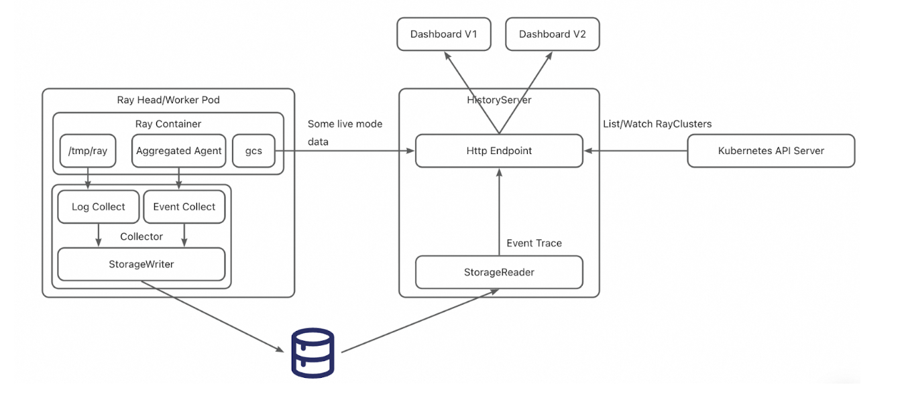
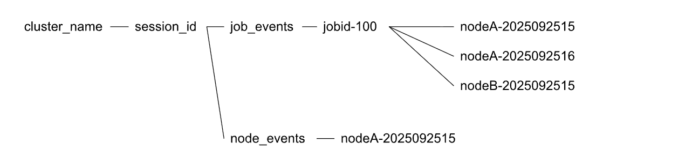

## Ray History Server

### General Motivation

It is becoming increasingly common for Ray users to treat Ray clusters as ephemeral units of compute
that only run for the duration of a single (or multiple) Ray jobs. This pattern results in significant improvements in
cost efficiency and resource sharing, especially in capacity-constrained environments where hardware accelerators are scarce.

However, a fundamental trade-off of this approach, compared to long-lived interactive Ray clusters, is that users
lose access to the Ray Dashboard, which is often treated as the entry point for most observability signals
in a Ray cluster. While it’s possible to export the relevant signals to external sources, users prefer the experience
of using the Ray Dashboard as a single source of truth to debug job failures.

This enhancement proposal introduces the concept of a Ray History Server, which can orchestrate the reconstruction of the
Ray Dashboard even for terminated Ray clusters. This will be accomplished by leveraging Ray’s Event Export API to persist
task/actor/job state, and native components in KubeRay for pushing logs and events to a blob store (GCS, S3, etc).

### Should this change be within `ray` or outside?

Some components/libraries, such as the event exporter, will be in Ray. Everything else will be hosted in the KubeRay project.

## Stewardship

### Owners

- @KunWuLuan (Alibaba)
- @MengjinYan, @Future-Outlier, @rueian (Anyscale)
- @andrewsykim, @Chia-ya (Google)

### Shepherd of the Proposal (should be a senior committer)

@edoakes

## Design and Architecture

### Components and Libraries

The Ray History Server project will introduce the following components and libraries across Ray and KubeRay:

* Ray:
    * Updated Ray Dashboard frontend that can dynamically adjust request paths to fetch task/actor/job state from a history server.
    * Ray Event Export API, available starting in Ray 2.49, which supports task/actor/job/node events.
      The events can be used to generate the state of the Ray cluster at any given timestamp.
* KubeRay:
    * An events collector sidecar that receives push events from Ray (via RAY_enable_core_worker_ray_event_to_aggregator)
      and persists events to the blob store.
    * A logging collector sidecar that uploads Ray logs to the blob store.
    * A history server (standalone Deployment) that can process events for historical Ray clusters and
      serve Ray API endpoints requested by Ray Dashboards.
    * A storage reader/writer library providing a pluggable interface for different storage implementations.

#### Events Collector

The Events Collector is a sidecar container deployed alongside every Ray node. It operates as an
HTTP server ingesting events from Ray’s Event Export API (enabled via `RAY_enable_core_worker_ray_event_to_aggregator`).
The server exposes a single POST /events endpoint which receives event data as JSON objects.
Ray is configured to push these events to a localhost endpoint (configured with `RAY_DASHBOARD_AGGREGATOR_AGENT_EVENTS_EXPORT_ADDR`).
The Events Collector is strictly responsible for persisting raw events to blob storage; it does not perform any pre-processing or deduplication.

#### Logging Collector

The Logging Collector is responsible for persisting logs in `/tmp/ray/session_latest/logs` to blob store.
While the Ray cluster is active, the Logging Collector will periodically upload snapshot of logs to storage.
Upon receiving a termination signal, it will attempt to upload a final snapshot of logs before exiting.

#### History Server

The History Server component is a stateless Kubernetes Deployment that serves API endpoints that are compatible with the Ray Dashboard.
To serve endpoints like `/api/v0/tasks`, the History Server will be responsible for server-side processing of events
in blob store that were uploaded by the Events Collector. In alpha / beta milestones, the history server will store
final task / actor / job states in-memory. For GA, we may reconsider this approoach if we identify scalability limitations.
More details on event processing below.

#### Event Processor

The Event Processor runs as a process within the History Server container. It is responsible for downloading the
complete event history of terminated clusters and aggregating that data into final states. These processed states
are then used to serve API requests from Ray Dashboard clients.

### File structure for persisted events & logs

Users rarely filter events by node name; instead, they typically filter by job ID and time range.
Therefore, building an index based on job ID and timestamps is critical. Unlike the Spark History Server,
Ray events are emitted by an aggregation agent residing on each node; therefore, the collector on each specific node
is responsible for grouping the events.

All events will initially be partitioned by Job ID. Specifically, task events associated with the same Job ID will be stored in the same directory.
* Node-level events will be stored in: cluster_name_cluster_uid/session_id/node_events/<nodeName>-<time>
* Job-level events will be stored in: cluster_name/session_id/job_events/<jobID>/<nodeName>-<time>

## Implementation Plan

### Phase 1 - KubeRay v1.6 (alpha)

In Phase 1, we will target an alpha release of the history server with KubeRay v1.6.

Alpha release scope:
* Log collector - sidecar container hosted in KubeRay
* Events collector - sidecar container hosted in KubeRay
* Storage reader/writer libraries in KubeRay, initially supporting S3-compatible blob store and Aliyun storage
* History Server container hosted in KubeRay, responsible for:
    * event processing in-memory
    * Supported endpoints:
      * /cluster
      * /events
      * Ray API endpoints
      * /api/cluster_status
      * /api/grafana_health
      * /api/prometheus_health
      * /api/data/datasets/{job_id}
      * /api/serve/applications/
      * /api/v0/placement_groups/
      * /api/v0/tasks
      * /api/v0/tasks/summarize
      * /nodes
      * /nodes/{node_id}
      * /logical/actors
      * /logical/actors/{single_actor}
      * /api/jobs
      * /api/jobs/{job_id}
* No dashboard orchestration; testing will be done using a local Ray dashboard that talks to the history server backend.
* All components must be manually configured via RayCluster.

### Phase 2 - KubeRay v1.7 (beta)

In Phase 2, we will target a Beta release of the history server. With this release, we will ask early adopters for feedback. No public documentation.

Beta release scope:
* KubeRay can manage instances of the Ray Dashboard frontend
* APIs in RayCluster to automate history server installation
* All History Server components hosted in public quay.io KubeRay registry
* Support for metrics
* History server supports data retention policies for persisted logs and events in blob store.

### Phase 3 - KubeRay v1.8 (GA)

GA release scope:
* Public documentation
* History server production readiness
* E2E tests in KubeRay
* At least 5 users have successfully used history server in production.

## Compatibility, Deprecation, and Migration Plan

* History Server will only be compatible with versions of Ray that support the events export API (Ray >= 2.49)

## Test Plan and Acceptance Criteria

For Alpha:
* A user can manually configure RayCluster to include all necessary components for History Server.
* A local Ray dashboard can use the history server as an API backend to view a terminated Ray cluster.

For Beta:
* A user can specify a top-level API in RayCluster to enable the history server.
* A local Ray dashboard can use the history server as an API backend to view the state of a terminated Ray cluster.
* A remote Ray dashboard running on Kubernetes (managed by KubeRay) can be used to view the state of a terminated Ray cluster.

For GA:
* E2E tests cover all test criteria from Alpha / Beta.
* A user can follow public documentation to enable all workflows related to the history server.

## (Optional) Follow-on Work

We will start with a naive approach to event processing on the history server. However, we may need to explore
more optimal strategies if processing events introduces significant latency overhead or memory usage.

See [this doc](https://docs.google.com/document/d/15Y2bW4uzeUJe84FxRNUnHozoQPqYdLB2yLmgrdF2ZmI/edit?usp=sharing) for more
details on follow-on work.
