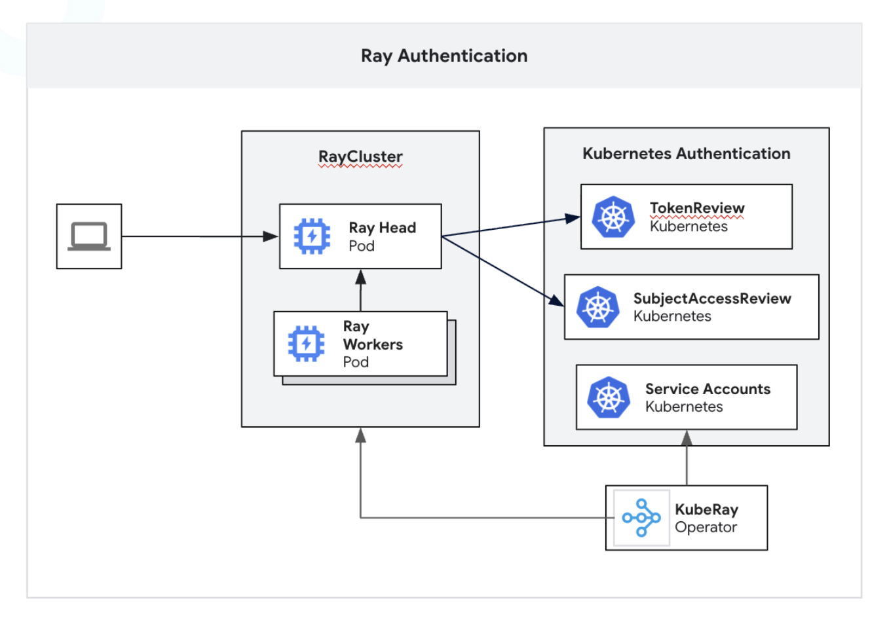
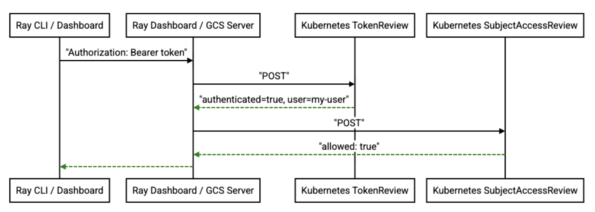

# Ray Token Authentication

## General Motivation

Ray v2.52.0 introduced support for token authentication, enabling Ray to enforce the use of a single, statically generated token in the authorization header for all requests to the Ray Dashboard, GCS server, and other control-plane services.

This document outlines the design and architecture of token authentication in Ray, focusing on how configuration, token loading, propagation, and verification work across C++, Python, and the dashboard.

We also provide an overview of the integration with Kubernetes native authentication and related enhancements.

## Should this change be within `ray` or outside?

This change will affect both `ray` and `KubeRay`.

## Stewardship

### Owners

- @sampan-s-nayak
- @andrewsykim

### Reviewers

- @richo-anyscale
- @rueian
- @Future-Outlier

### Shepherd of the Proposal (should be a senior committer)

@edoakes

# Design and Architecture

### Authentication Modes

Ray’s authentication behavior is controlled by a configuration option surfaced via the **RAY_AUTH_MODE** environment variable. Ray supports two modes:

* `disabled` – default; no authentication
* `token`
    * static bearer token authentication
    * Kubernetes token authentication (if **RAY_ENABLE_K8S_TOKEN_AUTH** is also set)

**RAY_AUTH_MODE** must be set via the environment and should be configured consistently on every node in the Ray cluster. When `RAY_AUTH_MODE=token`, token authentication is considered enabled, and all supported RPC and HTTP entry points enforce an authentication token. Token authentication can be delegated to Kubernetes by setting the **RAY_ENABLE_K8S_TOKEN_AUTH** environment variable along with `RAY_AUTH_MODE=token`.

### Token Sources and Precedence

Once token auth is enabled, Ray looks for the token in the following order (highest to lowest precedence):

1.  **RAY_AUTH_TOKEN** (env)
    If set and non-empty, the value of **RAY_AUTH_TOKEN** is used directly as the token string.
2.  **RAY_AUTH_TOKEN_PATH** (env pointing to file)
    If **RAY_AUTH_TOKEN_PATH** is set, Ray reads the token from that file. If the file cannot be read or is empty, Ray treats this as a fatal misconfiguration and aborts rather than silently falling back.
3.  Default token file path
    If neither of the above are set, Ray falls back to a default path, typically:
    * `~/.ray/auth_token` on POSIX systems
    * `%USERPROFILE%\.ray\auth_token` on Windows
    * `/var/run/kubernetes.io/serviceaccount/token` (only when **RAY_ENABLE_K8S_TOKEN_AUTH** is set)

For local clusters started with `ray.init()` and auth enabled, Ray will automatically generate a new token and persist it at this default path if no token exists.

Whitespace is stripped when reading the token from files to avoid issues from trailing newlines.

## Token propagation and verification

### Common Expectations (gRPC and HTTP)

Across both C++ and Python, gRPC servers expect the token to be present in the authorization metadata key as:

`Authorization: Bearer <token_value>`

HTTP servers similarly expect one of:

1.  `Authorization: Bearer <token>` – used by Ray CLI and other internal HTTP clients.
2.  Cookie `ray-authentication-token=<token>` – used by the browser-based dashboard.
3.  `X-Ray-Authorization: Bearer <token>` – used by KubeRay and other environments where the standard `Authorization` header cannot be used because it may be stripped automatically by a proxy in front of the cluster.

#### C++ Clients and Servers

On the C++ side, token attachment to outgoing RPCs is automated using gRPC’s interceptor API. The client interceptor is defined in:

* [src/ray/rpc/authentication/token_auth_client_interceptor.h](https://github.com/ray-project/ray/blob/15393edbe72f5079279d3a0e46b72adc7496cdfc/src/ray/rpc/authentication/token_auth_client_interceptor.h#L27-L28)

All production C++ gRPC channels are expected to be created through the `BuildChannel()` helper, which wires in the interceptor when token auth is enabled. Ray developers must not create channels directly with `grpc::CreateCustomChannel`; doing so would bypass token attachment. `BuildChannel()` is the central enforcement point that ensures all C++ clients automatically add the correct `Authorization: Bearer <token>` metadata.

Server-side token validation compares the token presented by the client with the token the cluster was started with. This check is performed in `server_call.h` inside the generic request handling path:

* [src/ray/rpc/server_call.h](https://github.com/ray-project/ray/blob/eb2803726d0a985db9bbb3f0e48526384f0f7f07/src/ray/rpc/server_call.h#L216-L219)

Because all gRPC services inherit from the same base call implementation, the validation applies uniformly to all C++ gRPC servers when token auth is enabled.

#### Python Clients and Servers

Most Python components use Cython bindings over the C++ clients, so they automatically inherit the same token behavior as described above without additional Python-level code.

For components that still construct gRPC clients or servers directly in Python, We introduced explicit interceptors (both sync and async) that add and validate authentication metadata:

* Client interceptors: https://github.com/ray-project/ray/blob/5e71d58badbfdcfc002826398c3e02469065cc71/python/ray/_private/authentication/grpc_authentication_client_interceptor.py
* Server interceptors: https://github.com/ray-project/ray/blob/5e71d58badbfdcfc002826398c3e02469065cc71/python/ray/_private/authentication/grpc_authentication_server_interceptor.py

All Python gRPC clients and servers are expected to be created using helper utilities from:

* [python/ray/_private/grpc_utils.py](https://github.com/ray-project/ray/blob/5e71d58badbfdcfc002826398c3e02469065cc71/python/ray/_private/grpc_utils.py)

These helpers automatically attach the correct client/server interceptors when token auth is enabled. The convention is to always go through the shared utilities so that auth is consistently enforced, never constructing raw gRPC channels or servers directly.

#### HTTP Clients and Servers

For HTTP services, token authentication is implemented using aiohttp middleware:

* `python/ray/_private/authentication/http_token_authentication.py` (middleware + helpers)

The middleware must be explicitly added to each server’s middleware list (e.g., `dashboard_head` service and `runtime_env_agent` service). Once configured, it:

* Extracts the token from `Authorization` header or `X-Ray-Authorization` header, or `ray-authentication-token` cookie.
* Validates the token and:
    * Returns **401 Unauthorized** for missing token.
    * Returns **403 Forbidden** for invalid token.

Client-side, HTTP callers can use a common helper to attach headers:

* `get_auth_headers_if_auth_enabled()` [https://github.com/ray-project/ray/blob/5afe5cb93d7b29a9e6b0e2c766190fc58a85bf72/python/ray/_private/authentication/http_token_authentication.py](https://github.com/ray-project/ray/blob/master/python/ray/_private/authentication/http_token_authentication.py#L85)

This helper computes `Authorization: Bearer <token>` if token auth is enabled and merges it with any user-supplied headers. For HTTP, middleware and header injection are not automatically wired up for new services; they must be added manually.

## Ray Dashboard Flow

When a Ray cluster is started with `RAY_AUTH_MODE=token`, accessing the dashboard triggers an authentication flow in the UI:

1.  The user first sees a dialog prompting them to enter the authentication token.
2.  Once the user submits the token, the frontend sends a `POST` request to the dashboard head’s `/api/authenticate` endpoint with `Authorization: Bearer <token>` header.
3.  The dashboard head validates the token.
4.  If validation succeeds, the server responds with **200 OK** and instructs the browser to set a cookie:
    * Name: `ray-authentication-token`
    * Value: `<token>`
    * Attributes: `HttpOnly`, `SameSite=Strict`, (and `Secure` when running over HTTPS).
    * max_age: 30days (cookie is cleared after 30 days)

From this point on, subsequent dashboard UI API calls automatically include the cookie and thus satisfy the middleware’s authentication checks.

If a backend request returns **401 Unauthorized** (no token) or **403 Forbidden** (invalid token or mode change), the dashboard UI interprets this as an authentication failure. It clears any stale state and re-opens the authentication dialog, prompting the user to re-enter a valid token.

This approach keeps the token out of JavaScript-accessible storage and relies on standard browser cookie mechanics to secure subsequent requests.

## Ray CLI

Ray CLI commands that talk to an authenticated cluster automatically load the token from the same three mechanisms (in the same precedence order):

* **RAY_AUTH_TOKEN**, **RAY_AUTH_TOKEN_PATH**, or the default token file.

Once loaded, CLI commands pass the token along to their internal RPC calls. Depending on the underlying implementation, they either:

* Use C++ clients (and thus C++ interceptors via `BuildChannel()`), or
* Use Python gRPC clients/servers and the Python interceptors via `grpc_utils.py`, or
* Use HTTP helpers that call `get_auth_headers_if_auth_enabled()`.

From the user’s perspective, as long as the token is configured via one of the supported mechanisms, the CLI “just works” against token-secured clusters.

## Ray get-auth-token CLI

To make it easy for users to retrieve and share the token used by a local Ray cluster (for example, to paste into the dashboard UI), Ray introduces the `ray get-auth-token` command.

* By default, `ray get-auth-token` attempts to load an existing token from:
    * **RAY_AUTH_TOKEN**, **RAY_AUTH_TOKEN_PATH**, or the default token file.
* If a token is found, it is printed to `stdout` (suitable for scripting and export).
* If no token exists, the command fails with an error explaining that no token is configured.

Users can pass the `--generate` flag to generate a new token and store it in the default token file path if no token is currently configured. This does not overwrite an existing token; it only creates one when none is present.

## Kubernetes RBAC Integration

For Ray clusters running on Kubernetes, Ray can leverage Kubernetes RBAC to handle authentication and authorization. In most Kubernetes environments, Ray workloads and users already possess an identity, either directly through Kubernetes Service Accounts or via integrations such as webhook token authentication or OpenID Connect tokens. These integrations allow Kubernetes to interface with external IAM systems (e.g., GKE using Google IAM for access control).

Integrating Ray with Kubernetes RBAC allows Ray to benefit from the robust security features of Kubernetes RBAC and provides seamless authentication integration across major cloud providers and their IAM systems (e.g., GKE, EKS, AKS). This integration empowers platform teams to use familiar Kubernetes APIs for access control management and automated credential rotation.

To enable Kubernetes-based authentication and authorization, Ray will introduce a new config **RAY_ENABLE_K8S_TOKEN_AUTH** which must be set in addition to `RAY_AUTH_MODE=token`. When enabled, Ray will not validate tokens against a single static token, but rather make two API calls to the Kubernetes API server:

1.  **TokenReview**: an API to authenticate a token to a known user.
2.  **SubjectAccessReview**: an API to check whether or not a user or group can perform an action.



## Authentication and Authorization Flow

Upon receiving a request containing a token, Ray will validate tokens by first calling the `TokenReview` API. All `TokenReview` requests from Ray must specify the `ray.io` audience to prevent various forms of token misuse. Below is an example a `TokenReview` request:

```yaml
apiVersion: authentication.k8s.io/v1
kind: TokenReview
spec:
  audiences:
    - ray.io
  token: a0AXooCgfzVabfasadftbNJ_4hl5556344534fZU0GsDlj...
```

If the token is from an authenticated user (according to Kubernetes), Ray will receive a response with the following `TokenReview` status:

```yaml
apiVersion: authentication.k8s.io/v1
kind: TokenReview
status:
  audiences:
    - ray.io
  authenticated: true
  user:
    groups:
      - system:authenticated
      - myteam@example.com
      - ray-admins
      - ray-users
    username: my-user@example.com
```

At this point, Ray has completed token authentication. For authorization, Ray will use the user / group information in the `TokenReview’s` status for the subsequent `SubjectAccessReview` request. Below is an example `SubjectAccessReview` request:

```yaml
apiVersion: authorization.k8s.io/v1
kind: SubjectAccessReview
spec:
  user: my-user@example.com
  resourceAttributes:
    verb: ray:write-user # custom verb
    group: ray.io
    resource: rayclusters
    name: ray-cluster
    namespace: my-team
```

The `SubjectAccessReview` ensures that only authenticated users who are also granted RBAC access to the RayCluster with custom verb `ray:write` are allowed. How a user is granted access to this resource is up to the owner of the RayCluster or the cluster admin of the Kubernetes cluster using standard Kubernetes RBAC APIs (`ClusterRole`, `Role`, `RoleBinding`, etc). The name and namespace of the Ray cluster used in the `SubjectAccessReview` request will be stored in environment variables **RAY_CLUSTER_NAME** and **RAY_CLUSTER_NAMESPACE** configured by KubeRay.

Below is a sequence diagram illustrating the entire authentication and authorization flow:



## Raylet Identity with Kubernetes Service Accounts

By default, the identity of the Raylet will be bound to the Service Account token of the Pod. However, the Raylet will not use the default token in `/var/run/kubernetes.io/serviceaccount/token`. Instead, a dedicated token in path `/var/run/ray.io/serviceaccount/token` will be mounted using [serviceAccountToken projected volumes](https://www.google.com/url?q=https://kubernetes.io/docs/concepts/storage/projected-volumes/%23serviceaccounttoken&sa=D&source=editors&ust=1764972438488683&usg=AOvVaw3QPpW2-ytZY1UxOWebWRGr) with a token audience dedicated for Ray. Below is an example of how this would be configured through KubeRay:

```yaml
spec:
  containers:
    - name: ray-head
      ...
      ...
      volumeMounts:
        - name: ray-token
          mountPath: "/var/run/ray.io/service-account"
          readOnly: true
      serviceAccountName: default
  volumes:
    - name: ray-token
      projected:
        sources:
          - serviceAccountToken:
              audience: ray.io
              expirationSeconds: 3600
              path: token
```

## Integration with External IAM

Most managed Kubernetes platforms provide integrations with external IAM systems. For example, on GKE, Google Cloud IAM and Kubernetes RBAC are integrated to authorize users to perform actions. Google Cloud users can be referenced in Kubernetes RBAC objects to define and assign permissions.

When Ray is enabled to use Kubernetes for authn/authz, it will also enable Ray users to use their external identities to connect to their clusters. For example, on GKE you can set **RAY_AUTH_TOKEN** to a token from `gcloud` as long as it specifies the intended audience:

```bash
$ export RAY_AUTH_TOKEN=$(gcloud auth print-identity-token --audiences=ray.io --impersonate-service-account="my-account@example.iam.gserviceaccount.com")

$ ray job submit ...
```

## Token caching in Ray

Ray will cache authenticated tokens with a default TTL of **5 minutes**. This is to avoid calls to the Kubernetes API for every request in Ray. Based on user feedback we may allow users to configure the TTL of cached tokens.

## KubeRay enhancements

The authentication mode can be enabled with KubeRay using the following API:

```yaml
apiVersion: ray.io/v1
kind: RayCluster
metadata:
...
spec:
  authOptions:
    enableK8sAuth: true
    mode: token
```

When enabled, KubeRay will create a `RoleBinding` that binds the Service Account used in the `RayCluster` to a `ClusterRole` granting the verb `ray:write` to all `RayClusters` in the namespace.

The KubeRay helm chart will be updated to include a default `ClusterRole` that grants access to the `ray:write` custom verb:

```yaml
apiVersion: rbac.authorization.k8s.io/v1
kind: ClusterRole
metadata:
  name: ray-users
rules:
  - apiGroups: ["ray.io"]
    resources: ["rayclusters"]
    verbs: ["ray-user"] # custom verb
```

The KubeRay helm chart will also contain a `ClusterRoleBinding` for the service account used by the KubeRay operator:

```yaml
apiVersion: rbac.authorization.k8s.io/v1
kind: ClusterRoleBinding
metadata:
  name: ray-users
subjects:
  - kind: ServiceAccount
    name: kuberay-operator
    namespace: default
  roleRef:
    kind: ClusterRole
    name: ray-users
    apiGroup: rbac.authorization.k8s.io
```

This `ClusterRoleBinding` grants KubeRay operator access to every RayCluster. This is required for the `RayJob` and `RayService` custom resources where KubeRay needs authenticated access to Ray clusters to submit jobs or manage Serve applications.

## Follow-on Work

### Configurable cache TTL for tokens

We may explore optimizations for token caching and provide an option for users to configure the token cache TTL.

### Deeper integration with Kubernetes RBAC system.

Kubernetes provides a rich RBAC system that allows scoping down permissions where needed. For example, a given role may be able to list or read a resource but not updated it. In the future, we may integrate more deeply with this system in order to implement fine-grained access control to a Ray cluster.
