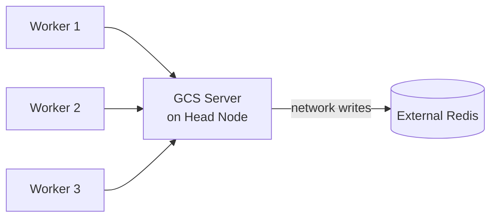
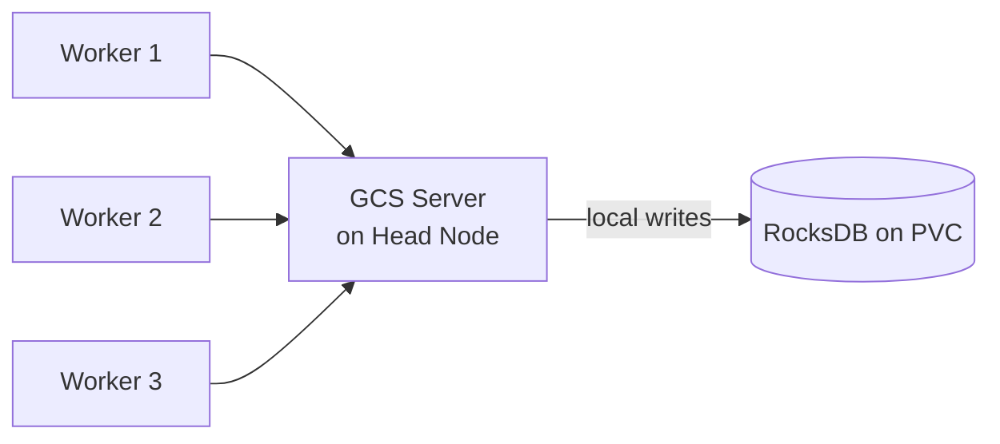
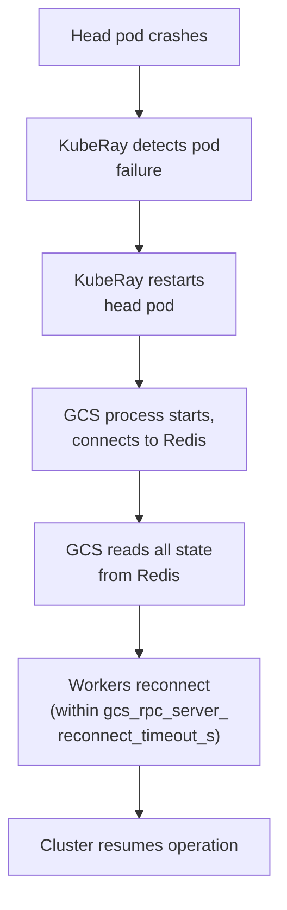
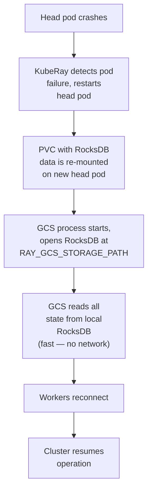

# REP: Embedded Storage Backend for GCS Fault Tolerance

## Summary

### General Motivation

Ray's Global Control Store (GCS) is a single process on the head node that stores all cluster metadata — node membership, actor state, placement groups, job history, and resource availability. Today, GCS fault tolerance requires an **external Redis instance** as a persistence backend. While this works, it introduces operational complexity and a fragile dependency:

- Redis must be provisioned, monitored, and maintained separately
- The Redis client implementation has multiple P1 bugs: SIGSEGV on connection reset ([#53475](https://github.com/ray-project/ray/issues/53475)), worker pods restarting unexpectedly during recovery ([#52480](https://github.com/ray-project/ray/issues/52480)), silent crashes on timeouts ([#47419](https://github.com/ray-project/ray/issues/47419)), and lost job history after recovery ([#44218](https://github.com/ray-project/ray/issues/44218))
- Redis Sentinel/Cluster topology changes cause GCS crashes ([#46982](https://github.com/ray-project/ray/issues/46982))
- No support for Redis IAM authentication ([#49001](https://github.com/ray-project/ray/issues/49001)) or SSL certificate validation ([#41161](https://github.com/ray-project/ray/issues/41161))

This enhancement proposes an **embedded storage backend** (RocksDB) as an alternative to Redis for GCS fault tolerance. Instead of writing state over the network to an external Redis instance, GCS writes to a local embedded database on a persistent volume. On head node restart, GCS reads state back from the local database and resumes — the same recovery model as Redis-based FT, but without the external dependency.

**Production context:** At LinkedIn, we run distributed PyTorch training jobs on Ray via Flyte on Kubernetes. These are long-running jobs (hours to days) where head node restarts — due to node maintenance, spot preemption, or transient failures — are inevitable. Today, head node failure is catastrophic: all training progress since the last application-level checkpoint is lost, and the entire job must be restarted. GCS fault tolerance with embedded storage, combined with training checkpointing, would allow these jobs to survive head node restarts and resume from where they left off — minimizing repeated computation and eliminating manual intervention.

### Should this change be within `ray` or outside?

This change affects both `ray` (new `StoreClient` implementation in C++) and `kuberay` (PVC provisioning and configuration for the embedded storage path).

## Stewardship

- **Required Reviewers**: @jjyao (GCS maintainer), @kevin85421 (KubeRay / GCS FT integration)
- **Shepherd of the Proposal**: TBD — requesting @jjyao or another GCS-experienced committer

## Design and Architecture

### Current Architecture (Redis based)



### Proposed Architecture (RocksDB based)



GCS fault tolerance is built on a clean `StoreClient` abstraction (`src/ray/gcs/store_client/store_client.h`) with two implementations:

1. **`InMemoryStoreClient`** — hash maps in GCS process memory. Used when FT is disabled. State is lost on crash.
2. **`RedisStoreClient`** — persists state to an external Redis instance. Used when `RAY_REDIS_ADDRESS` is set.

The `StoreClient` interface exposes ~9 async methods operating on a table-oriented key-value model:

```cpp
// Simplified interface
class StoreClient {
  virtual Status AsyncPut(table, key, data, overwrite, callback);
  virtual Status AsyncGet(table, key, callback);
  virtual Status AsyncGetAll(table, callback);
  virtual Status AsyncMultiGet(table, keys, callback);
  virtual Status AsyncDelete(table, key, callback);
  virtual Status AsyncBatchDelete(table, keys, callback);
  virtual Status AsyncGetNextJobID(callback);
  virtual Status AsyncGetKeys(table, prefix, callback);
  virtual Status AsyncExists(table, key, callback);
};
```

GCS recovery flow today (with Redis):



### Proposed Change: RocksDB StoreClient

We propose adding a third `StoreClient` implementation: **`RocksDbStoreClient`**.

#### Data Model Mapping

The `StoreClient` interface is table-oriented (table_name, key, value). RocksDB supports this naturally using **column families** (one per table) or **key prefixes** (`{table_name}/{key}`). We propose column families for cleaner isolation:

```cpp
// Each GCS table maps to a RocksDB column family
// Tables: ACTOR, NODE, PLACEMENT_GROUP, JOB, WORKER, etc.
//
// Put("ACTOR", "actor_123", data)  →  CF["ACTOR"].Put("actor_123", data)
// GetAll("ACTOR")                  →  CF["ACTOR"].NewIterator()
```

#### AsyncGetNextJobID

The `RedisStoreClient` uses Redis `INCR` for atomic job ID generation. RocksDB provides `Merge` operators that can implement atomic increment:

```cpp
// Option 1: Read-modify-write under a mutex (simple, GCS is single-process)
// Option 2: RocksDB Merge operator with uint64 addition
//
// Since GCS is a single process, a simple mutex-guarded read-modify-write
// on a reserved key is sufficient. No distributed coordination needed.
```

#### Storage Path and Configuration

```bash
# Enable embedded storage FT
export RAY_GCS_STORAGE=rocksdb
export RAY_GCS_STORAGE_PATH=/data/gcs-state    # must be on a persistent volume

# Existing Redis-based FT remains supported
export RAY_GCS_STORAGE=redis                    # or: export RAY_REDIS_ADDRESS=...
```

#### Recovery Flow



#### Performance Characteristics (Expected)

| Operation | Redis (network) | RocksDB (local SSD) |
|-----------|----------------|---------------------|
| Write latency | 0.5–2ms (network RTT) | 0.01–0.1ms (local I/O) |
| Read latency | 0.5–2ms | 0.01–0.05ms |
| Recovery read (full state) | Bound by network bandwidth | Bound by disk bandwidth (faster) |
| Failure mode | Network partition, Redis crash, topology change | Disk failure (rare with cloud PVs) |

#### What This Does NOT Provide

This proposal provides **persistence**, not **high availability**. The distinction:

- **Persistence**: GCS state survives head pod restart. There is a recovery window (seconds to minutes) during which the cluster is unavailable.
- **High Availability**: Zero-downtime failover with a standby GCS. This requires active/standby or Raft replication — a separate, larger effort.

The recovery model is identical to today's Redis-based FT: GCS goes down, restarts, reads state, workers reconnect. The difference is purely in where state is persisted — local disk instead of a remote Redis instance.

### Ray Core Changes

All changes are in `src/ray/gcs/store_client/`:

1. **New file: `rocksdb_store_client.h/.cc`**
   - Implements `StoreClient` interface
   - Opens RocksDB at configured path with one column family per GCS table
   - Synchronous RocksDB calls wrapped in async callbacks (RocksDB local ops are fast enough that blocking is acceptable)

2. **Modified: `store_client_factory` (or equivalent initialization code)**
   - Read `RAY_GCS_STORAGE` env var
   - Create `RocksDbStoreClient` when value is `rocksdb`
   - Preserve existing behavior for `redis` and default (in-memory)

3. **Build system: `BUILD.bazel`**
   - Add RocksDB dependency. RocksDB has a well-maintained Bazel build and is already used in many C++ projects.

### KubeRay Changes

1. **RayCluster CRD extension**

   ```yaml
   spec:
     gcsFaultTolerance:
       # Existing: Redis-based
       # redisAddress: "redis:6379"

       # New: Embedded storage
       backend: rocksdb
       storage:
         size: 10Gi
         storageClassName: ssd   # optional, uses default SC if omitted
   ```

2. **Operator reconciliation**
   - When `backend: rocksdb` is set, create a PVC and mount it on the head pod at the configured path
   - Set `RAY_GCS_STORAGE=rocksdb` and `RAY_GCS_STORAGE_PATH` env vars on the head container
   - Ensure PVC lifecycle is tied to the RayCluster (deleted when cluster is deleted, persists across head pod restarts)

3. **Head pod restart behavior**
   - KubeRay already restarts the head pod on failure
   - The PVC survives pod deletion/restart by design
   - No special handling needed beyond ensuring the PVC is mounted

## Compatibility, Deprecation, and Migration Plan

- **Fully backward compatible.** Redis-based FT remains the default when `RAY_REDIS_ADDRESS` is set. No existing behavior changes.
- **New opt-in feature.** Users explicitly choose embedded storage via `RAY_GCS_STORAGE=rocksdb`.
- **No migration path needed.** This is a new alternative, not a replacement. Users can switch between Redis and RocksDB by changing configuration.

## Test Plan and Acceptance Criteria

### Unit Tests

- `RocksDbStoreClient` passes all existing `StoreClient` test cases (the interface is well-tested via `InMemoryStoreClient` and `RedisStoreClient` tests)
- Column family creation, put/get/delete, batch operations, key prefix scanning, atomic job ID increment

### Integration Tests

- GCS starts with RocksDB backend, cluster forms normally
- GCS crash + restart recovers full state from RocksDB
- Workers reconnect successfully after head restart
- Actor state, placement groups, and job history survive recovery
- Concurrent writes during normal operation don't corrupt state

### KubeRay E2E Tests

- RayCluster with `gcsFaultTolerance.backend: rocksdb` creates PVC and mounts it
- Head pod deletion + restart recovers cluster state
- RayJob completes successfully after head pod restart mid-job
- PVC is cleaned up when RayCluster is deleted

### Performance Tests

- Write throughput comparison: RocksDB vs Redis vs InMemory
- Recovery time comparison: RocksDB vs Redis (expected: RocksDB faster due to local I/O)
- Steady-state overhead: memory and CPU impact of RocksDB on head node

### Acceptance Criteria

- All existing GCS FT tests pass when run against RocksDB backend
- Recovery time is equal to or better than Redis-based FT
- No measurable regression in GCS write latency during normal operation
- Documentation and examples for both bare-metal and KubeRay deployment

## Follow-on Work

1. **[potential] Active/Standby GCS** — A hot standby GCS process that takes over on failure, using RocksDB on a shared ReadWriteMany volume or replicated via WAL shipping. This would provide true HA (zero-downtime failover). The embedded storage backend proposed here is a prerequisite.

2. **[potential] Additional embedded backends** — SQLite or LevelDB as lighter alternatives for smaller clusters.

3. **[potential] State compaction and TTL** — Automatic cleanup of stale entries (completed jobs, dead actors) to bound RocksDB size.

4. **[potential] Pluggable external backends** — The `StoreClient` interface can support additional external backends (etcd, DynamoDB, etc.) using the same configuration pattern. This REP establishes the multi-backend configuration surface that future backends would use.

## References

- [#53115](https://github.com/ray-project/ray/issues/53115) — Pluggable KV store for GCS backup
- [#45824](https://github.com/ray-project/ray/issues/45824) — GCS FT without external dependencies
- [#20498](https://github.com/ray-project/ray/issues/20498) — GCS High Availability RFC
- [#52480](https://github.com/ray-project/ray/issues/52480) — Worker pods restart unexpectedly with GCS FT
- [#39820](https://github.com/ray-project/ray/issues/39820) — MySQL/Couchbase GCS store (LinkedIn)
- [KubeRay #1033](https://github.com/ray-project/kuberay/issues/1033) — GCS fault tolerance umbrella
- [KubeRay #4025](https://github.com/ray-project/kuberay/issues/4025) — GCS FT for operator-managed clusters
- `src/ray/gcs/store_client/store_client.h` — StoreClient interface
- `src/ray/gcs/store_client/redis_store_client.h` — Current Redis implementation
- `src/ray/gcs/store_client/in_memory_store_client.h` — Current in-memory implementation
