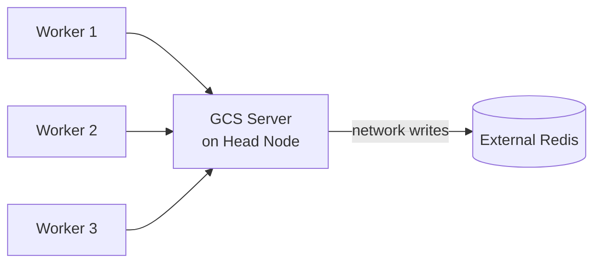
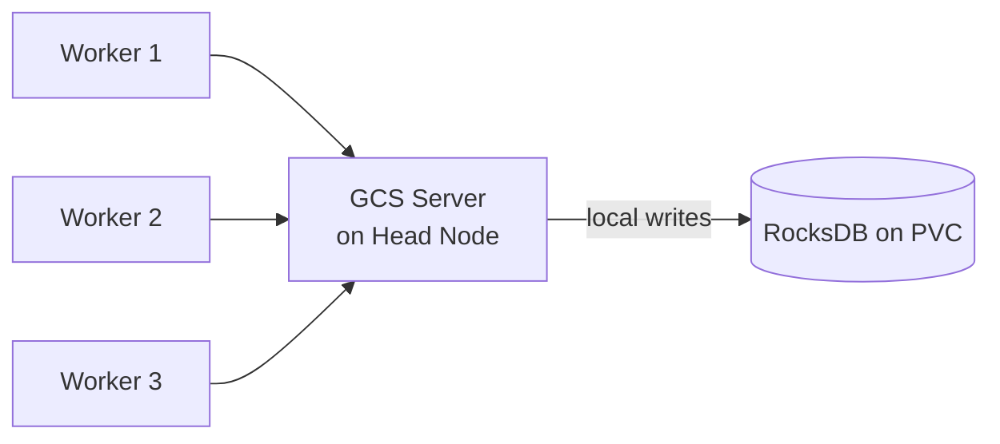
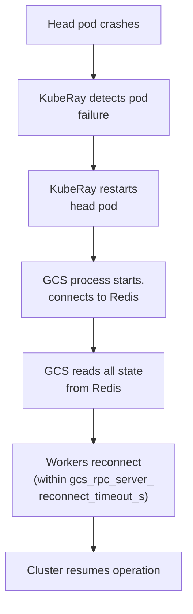
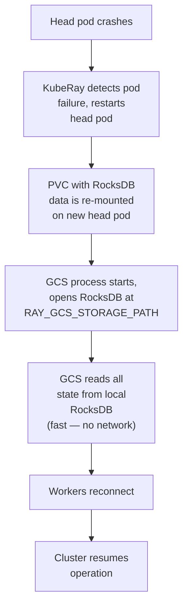

# REP: Embedded Storage Backend for GCS Fault Tolerance

## Summary

### General Motivation

Ray's Global Control Store (GCS) is a single process on the head node that stores all cluster metadata — node membership, actor state, placement groups, job history, and resource availability. Today, GCS fault tolerance requires an **external Redis instance** as a persistence backend. While this works, it introduces operational complexity and a fragile dependency:

- Redis must be provisioned, monitored, and maintained separately
- The Redis client implementation has multiple P1 bugs: SIGSEGV on connection reset ([#53475](https://github.com/ray-project/ray/issues/53475)), worker pods restarting unexpectedly during recovery ([#52480](https://github.com/ray-project/ray/issues/52480)), silent crashes on timeouts ([#47419](https://github.com/ray-project/ray/issues/47419)), and lost job history after recovery ([#44218](https://github.com/ray-project/ray/issues/44218))
- Redis Sentinel/Cluster topology changes cause GCS crashes ([#46982](https://github.com/ray-project/ray/issues/46982))
- No support for Redis IAM authentication ([#49001](https://github.com/ray-project/ray/issues/49001)) or SSL certificate validation ([#41161](https://github.com/ray-project/ray/issues/41161))

This enhancement proposes an **embedded storage backend** (RocksDB) as an alternative to Redis for GCS fault tolerance. Instead of writing state over the network to an external Redis instance, GCS writes to a local embedded database on a persistent volume. On head node restart, GCS reads state back from the local database and resumes — the same recovery model as Redis-based FT, but without the external dependency.

**Production context:** At LinkedIn, we run distributed PyTorch training jobs on Ray via Flyte on Kubernetes. These are long-running jobs (hours to days) where head node restarts — due to node maintenance, spot preemption, or transient failures — are inevitable. Today, head node failure is catastrophic: all training progress since the last application-level checkpoint is lost, and the entire job must be restarted. GCS fault tolerance with embedded storage, combined with training checkpointing, would allow these jobs to survive head node restarts and resume from where they left off — minimizing repeated computation and eliminating manual intervention.

### Should this change be within `ray` or outside?

This change affects both `ray` (new `StoreClient` implementation in C++) and `kuberay` (automatic PVC lifecycle management so users don't need to create or clean up PVCs manually).

## Stewardship

- **Required Reviewers**: @rueian, @andrewsykim, @MengjinYan 
- **Shepherd of the Proposal**: @edoakes 

## Design and Architecture

### Current Architecture (Redis based)



### Proposed Architecture (RocksDB based)



GCS fault tolerance is built on a clean `StoreClient` abstraction (`src/ray/gcs/store_client/store_client.h`) with two implementations:

1. **`InMemoryStoreClient`** — hash maps in GCS process memory. Used when FT is disabled. State is lost on crash.
2. **`RedisStoreClient`** — persists state to an external Redis instance. Used when `RAY_REDIS_ADDRESS` is set.

The `StoreClient` interface exposes ~9 async methods operating on a table-oriented key-value model:

```cpp
// Simplified interface
class StoreClient {
  virtual Status AsyncPut(table, key, data, overwrite, callback);
  virtual Status AsyncGet(table, key, callback);
  virtual Status AsyncGetAll(table, callback);
  virtual Status AsyncMultiGet(table, keys, callback);
  virtual Status AsyncDelete(table, key, callback);
  virtual Status AsyncBatchDelete(table, keys, callback);
  virtual Status AsyncGetNextJobID(callback);
  virtual Status AsyncGetKeys(table, prefix, callback);
  virtual Status AsyncExists(table, key, callback);
};
```

GCS recovery flow today (with Redis):



### Proposed Change: RocksDB StoreClient

We propose adding a third `StoreClient` implementation: **`RocksDbStoreClient`**.

#### Data Model Mapping

The `StoreClient` interface is table-oriented (table_name, key, value). RocksDB supports this naturally using **column families** (one per table) or **key prefixes** (`{table_name}/{key}`). We propose column families for cleaner isolation:

```cpp
// Each GCS table maps to a RocksDB column family
// Tables: ACTOR, NODE, PLACEMENT_GROUP, JOB, WORKER, etc.
//
// Put("ACTOR", "actor_123", data)  →  CF["ACTOR"].Put("actor_123", data)
// GetAll("ACTOR")                  →  CF["ACTOR"].NewIterator()
```

#### AsyncGetNextJobID

The `RedisStoreClient` uses Redis `INCR` for atomic job ID generation. RocksDB provides `Merge` operators that can implement atomic increment:

```cpp
// Option 1: Read-modify-write under a mutex (simple, GCS is single-process)
// Option 2: RocksDB Merge operator with uint64 addition
//
// Since GCS is a single process, a simple mutex-guarded read-modify-write
// on a reserved key is sufficient. No distributed coordination needed.
```

#### Durability and Consistency Semantics

Although the `StoreClient` API is async (`AsyncPut` returns immediately and invokes a callback), the storage-layer write itself is synchronous:

1. `AsyncPut` dispatches the write to an I/O worker thread so the GCS event loop is not blocked.
2. The worker calls `rocksdb::Put` with `WriteOptions::sync = true`, which fsyncs the WAL before returning.
3. The callback fires only after fsync completes. GCS's RPC reply to the caller is sent inside that callback.

The net effect: a caller observes an ack only after the write is durable on disk. The "async" here refers to thread decoupling, not fire-and-forget semantics. There is no separate in-memory GCS cache that can diverge from RocksDB — the store client is authoritative for persisted state.

#### Concurrency and Ordering Semantics

RocksDB I/O does not run on the GCS event loop. The store client maintains a `boost::asio::thread_pool` (size `gcs_rocksdb_io_pool_size`, default 4) and posts each `Async*` call onto it. The event loop returns in ~40 µs regardless of the underlying 3–5 ms fsync.

Because requests now execute concurrently across pool threads, per-key submission-order ordering must be preserved explicitly. The store client routes every single-key operation (`Put` / `Get` / `Delete` / `Exists`) through a `boost::asio::strand` chosen by `hash(table, key) % gcs_rocksdb_strand_buckets` (default 64 — comfortable headroom over the default 4-thread pool). This preserves:

- **`AsyncPut(K, !overwrite)` race resolution** — two concurrent inserts to the same key cannot both observe "not found" and both write.
- **Last-writer-wins** — `Put` followed by `Put` for the same key commits in submission order.
- **Read-your-writes** — `Put` followed by `Get` on the same key sees the new value.
- **Delete-then-Put / Put-then-Delete** ordering on the same key.

Multi-key and scan operations (`AsyncMultiGet`, `AsyncBatchDelete`, `AsyncGetAll`, `AsyncGetKeys`) use the bare pool without strand bucketing — their semantics intentionally match Redis pipelining and `InMemoryStoreClient` under concurrent callers, where global ordering across keys is not provided.

The offload path is currently opt-in (`RAY_GCS_ROCKSDB_ASYNC_OFFLOAD`, default `false`) pending a queue-fill backpressure design — under saturation the pool queue can grow without bound, masking fsync latency as queue-wait. The inline path (default) blocks the event loop for the full fsync per call; it is correct but unsuitable for non-trivial write rates. Promoting offload to default is tracked as follow-on work. POC measurements: offload yields ~2.5× aggregate throughput under pipelined writers (215 → 593 ops/s) via RocksDB group commit, with zero measurable cost from the strand layer.

#### Storage Path and Configuration

```bash
# Enable embedded storage FT
export RAY_GCS_STORAGE=rocksdb
export RAY_GCS_STORAGE_PATH=/data/gcs-state    # must be on a persistent volume

# Existing Redis-based FT remains supported
export RAY_GCS_STORAGE=redis                    # or: export RAY_REDIS_ADDRESS=...
```

#### RocksDB Configuration

GCS metadata is typically small (10–100 MB across ~10 column families: ACTOR, NODE, JOB, PLACEMENT_GROUP, WORKER, etc.) for a cluster in steady-state operation, with moderate write throughput and read-heavy recovery. This is an operating-size estimate, not a hard ceiling — long-running clusters with accumulating job history, dead-actor entries, and completed placement groups can grow beyond this. Unbounded growth is not unique to this proposal (the same applies to Redis-backed FT today) and is addressed by state compaction and TTL as follow-on work. The configuration priorities are **crash safety** and **fast recovery**, not write throughput.

##### Default Configuration (Hardcoded)

The following are compiled into `RocksDbStoreClient` with conservative values sized for this workload:

| Category | Setting | Default | Rationale |
|---|---|---|---|
| **Durability** | `WriteOptions::sync` | `true` (fsync every write) | GCS acknowledges state changes to callers. Without fsync, a crash can lose acknowledged writes — violating the FT durability contract. On SSD, fsync adds ~0.1–0.5ms per write, acceptable for GCS's moderate write rate. |
| **Durability** | `manual_wal_flush` | `false` | WAL writes flush to OS page cache immediately. Combined with sync writes, ensures durability. |
| **Durability** | `bytes_per_sync` | 1 MB | Periodic sync of SST files during compaction reduces data loss window. |
| **Memory** | Write buffer (per CF) | 16 MB × 2 buffers | Default 64 MB is oversized for CFs holding 1–10 MB each. With ~10 CFs, worst-case memory: `10 × 16 MB × 2 + 32 MB cache ≈ 352 MB`. |
| **Memory** | Block cache (shared) | 32 MB LRU | Covers a large fraction of total data. Hot metadata (active actors, live nodes) stays cached during normal operation. |
| **Compaction** | Style | Level compaction with dynamic level bytes | Correct for mixed read/write with recovery scans. Dynamic level bytes auto-adjusts for small data sizes. |
| **Compaction** | `max_background_jobs` | 2 | One flush thread, one compaction thread. With 10–100 MB data, compaction is rare and fast. |
| **Compaction** | `target_file_size_base` | 4 MB | Sized for small metadata. Smaller files = more granular compaction, faster recovery reads. |
| **Compaction** | `max_bytes_for_level_base` | 32 MB | Most data stays in L0/L1. Default 256 MB is far too large for this workload. |
| **Compression** | Per-level | None (L0–L1), LZ4 (L2+) | No compression on hot levels for fastest recovery reads. LZ4 on cold levels for modest space savings. |
| **Read perf** | Bloom filter | 10 bits/key | ~1% false positive rate. Essential for point lookups (`AsyncGet`, `AsyncExists`). |
| **Read perf** | `max_open_files` | -1 (unlimited) | With tiny data (tens of SST files), keep all files open to avoid table cache misses during recovery. |
| **I/O** | Direct I/O | Disabled | Does not apply to WAL (no durability benefit). OS page cache helps with repeated hot-path reads. Can break on NFS/FUSE-backed PVs in Kubernetes. |
| **Logging** | `info_log_level` | WARN | INFO-level RocksDB logs are extremely verbose. WARN captures actionable events (compaction stalls, corruption warnings). |

##### User-Configurable Options

Operators can tune these settings via environment variables for their deployment:

| Env Var | Default | Description |
|---|---|---|
| `RAY_GCS_STORAGE_PATH` | *(required)* | Path to persistent volume for RocksDB data. |
| `RAY_GCS_ROCKSDB_WAL_DIR` | *(same as storage path)* | Separate directory for WAL files. Useful if main storage is slow but a faster disk is available for WAL. |
| `RAY_GCS_ROCKSDB_ASYNC_OFFLOAD` | `false` | Run RocksDB I/O on a dedicated thread pool rather than the GCS event loop. Default off pending backpressure design; recommended for non-trivial write rates. See §"Concurrency and Ordering Semantics". |
| `RAY_GCS_ROCKSDB_IO_POOL_SIZE` | `4` | Thread pool size for offloaded I/O. Only meaningful when `RAY_GCS_ROCKSDB_ASYNC_OFFLOAD=true`. |
| `RAY_GCS_ROCKSDB_STRAND_BUCKETS` | `64` | Number of `boost::asio::strand` buckets for per-key ordering on the offload path. Only meaningful when `RAY_GCS_ROCKSDB_ASYNC_OFFLOAD=true`. |

All other RocksDB tuning knobs (sync writes, block cache size, write buffer size, background jobs, compression) are intentionally not exposed. fsync-on-write is non-negotiable for the FT durability contract — disabling it would silently break the guarantee this REP provides, so it is hardcoded rather than offered as a footgun env var. The remaining defaults are sized for the GCS metadata workload (10–100 MB); if operators report specific performance issues, we can expose targeted env vars in a follow-up — starting restrictive is safer than starting permissive.

##### Why Environment Variables, Not a Config File

An alternative is a single `RAY_GCS_ROCKSDB_CONFIG_FILE` pointing to a RocksDB options file. We chose env vars because:

- **Safety guardrails.** A raw RocksDB options file exposes ~200 settings, including ones that silently break correctness: changing `merge_operator` corrupts the job ID sequence, changing `create_if_missing` prevents startup, changing compaction style causes pathological space amplification. The env var approach acts as a curated API surface that only exposes safe-to-tune options.
- **Ray convention.** Every Ray component is configured via environment variables (`RAY_REDIS_ADDRESS`, `RAY_GCS_SERVER_PORT`, etc.). A config file would be the only exception.
- **Kubernetes-native.** Env vars map directly to pod spec `.env[]`. A config file requires creating a ConfigMap, mounting it, and keeping it in sync — extra operational burden for no functional benefit.

If advanced tuning demand emerges in production, a config file override can be added as follow-on work with an explicit allowlist of safe options.

##### What Is NOT Configurable (and Why)

The following are intentionally hardcoded because incorrect values can break correctness or crash safety:

- **`WriteOptions::sync`** — Always `true`. Disabling fsync would silently break the FT durability contract this REP exists to provide; a caller that received an ack would be lying about persistence. Tests that need non-sync mode use an internal-only fixture flag, not a public env var.
- **`create_if_missing` / `create_missing_column_families`** — Must be `true`. GCS creates the DB on first start, and new Ray versions may add column families.
- **Compaction style and level sizing** — Level compaction with dynamic level bytes is the only correct choice for this workload. `target_file_size_base` and `max_bytes_for_level_base` are coupled — changing one without the other causes pathological compaction.
- **Bloom filter bits and block size** — 10 bits/key and 16 KB blocks are tuned for point lookups on metadata. Subtle interactions with compression ratios and cache efficiency.
- **`prefix_extractor`** — Cannot be changed after DB creation. Incorrect settings are unrecoverable.
- **`merge_operator`** — Custom operator for `AsyncGetNextJobID` atomic increment. Changing it corrupts the job ID sequence.
- **Direct I/O** — No durability benefit (doesn't apply to WAL) and can break on Kubernetes PV implementations.
- **Memory settings** (block cache, write buffers) — Hardcoded at conservative values (32 MB cache, 16 MB × 2 write buffers per CF). These ensure bounded memory on shared head nodes without operator tuning.

#### Recovery Flow



#### Performance Characteristics

| Operation | Redis (network) | RocksDB (local SSD) |
|-----------|----------------|---------------------|
| Write latency (durable, fsync) | 0.5–2 ms (network RTT; default Redis is not synchronously persisted) | ~3–5 ms (fsync-bounded; POC ext4: 3.81 ms p50) |
| Write latency (non-durable, memtable only) | n/a | 0.01–0.1 ms (`WriteOptions::sync = false`; tests only, never production) |
| Read latency | 0.5–2 ms | 0.01–0.05 ms (POC ext4: 0.97 µs p50) |
| Recovery read (full state) | Bound by network bandwidth | Bound by disk bandwidth (POC: 34 / 39 / 81 ms cold open at 100 / 1k / 10k entries) |
| Failure mode | Network partition, Redis crash, topology change | Disk failure (rare with cloud PVs) |

**Note on write latency:** the durable-write path is fsync-bounded — per-call cost is a property of the storage substrate, not the software. The POC's offload path (see §"Concurrency and Ordering Semantics") leaves per-call latency unchanged but aggregates concurrent fsyncs via RocksDB group commit, yielding ~2.5× throughput under pipelined writers. Note also that Redis's "0.5–2 ms" assumes its default async-append-only behavior, which is not crash-durable; running Redis with `appendfsync always` (the closest equivalent to RocksDB's `sync = true`) brings Redis into the same fsync-bounded regime.

#### What This Does and Does NOT Provide

This proposal provides **GCS persistence** — cluster metadata survives head pod restarts. It is one layer in the full fault tolerance stack, not a complete solution by itself.

| Concern | What happens during head pod restart | Addressed by |
|---|---|---|
| **Cluster metadata** | Preserved in RocksDB, restored on restart | **This REP** |
| **Worker reconnection** | Workers reconnect within `gcs_rpc_server_reconnect_timeout_s` | Existing GCS FT mechanism |
| **Driver/submitter pod** | Survives if running in a separate pod (RayJob), but pending RPCs may timeout and crash the driver process | **Needs separate work** — RayJob controller and driver reconnection logic |
| **Distributed training (NCCL)** | NCCL training group breaks — NCCL has no reconnection. Training must restart from last checkpoint | **Application responsibility** — Ray Train + periodic checkpointing (`TorchTrainer.restore()`) |
| **High availability** | GCS is unavailable during restart (seconds to minutes) | **Separate effort** — active/standby GCS with Raft or WAL replication |

**For the distributed training use case that motivates this REP: this REP alone does not improve resilience of an in-flight training job.** The NCCL training group still breaks on head node failure, the driver process still has to restart, and training still resumes from the last application-level checkpoint regardless of which backend persists GCS state. What this REP delivers is (a) faster cluster recovery than Redis-based FT (POC measures sub-100 ms storage-layer cold open at 10k entries vs. Redis snapshot-restore time) and (b) a foundation for follow-on work — first-class "detached jobs" / checkpointable drivers (see Follow-on Work item 1) that can survive while the cluster recovers in place. End-to-end training resilience requires all three pieces: GCS persistence (this REP), driver resilience (follow-on), and application checkpointing (workload responsibility).

The recovery model is identical to today's Redis-based FT: GCS goes down, restarts, reads state, workers reconnect. The difference is purely in where state is persisted — local disk instead of a remote Redis instance.

#### Impact on GCS OOM

GCS is OOM-killed today primarily due to its in-memory working set (actor / task / node tables, task lineage), not the storage backend. This proposal does not change how much state GCS keeps resident and adds a small constant memory overhead (~20–50 MB for the RocksDB block cache and write buffers). In strict terms this makes head-pod memory pressure modestly worse, not better.

Durable local storage does, however, *unlock* a future optimization: paging cold state out of RAM and faulting it back from RocksDB on demand (analogous to a database buffer pool). Non-critical, high-volume data is a particularly good fit — for example, observability data (event logs, task/actor history, log indexes) that is read on demand and tolerant of slightly higher access latency could live primarily on disk rather than in RAM. That path to making GCS OOM-resistant is out of scope for this REP and is listed under "State compaction and TTL" in follow-on work.

#### Binary Size Impact

Adding RocksDB as a dependency increases artifact sizes measurably but modestly. POC-measured deltas (Linux x86_64, RocksDB built via `rules_foreign_cc` with all optional features OFF — compression backends, RocksDB tools, Java bindings):

| Artifact | Master | With RocksDB | Δ |
|---|---|---|---|
| `gcs_server` (stripped) | 16.5 MB | 23.1 MB | +6.5 MB (+39%) |
| `gcs_server` (unstripped) | 23.8 MB | 32.0 MB | +8.2 MB (+34%) |
| ray wheel (py3.10 manylinux x86_64) | 70.2 MiB | 73.4 MiB | +3.2 MiB (+4.6%) |
| Docker image (`ray-py3.10-cpu`) | 2.15 GB | 2.17 GB | +20 MB (+0.9%) |

The wheel and Docker image deltas are dominated by RocksDB statically linked into `gcs_server`; everything else is unchanged. Users who do not enable embedded FT (`RAY_GCS_STORAGE != rocksdb`) still pay this cost because the dependency is linked into the standard binary; an `extras_require` split (`ray[rocksdb]`) was considered and rejected — maintaining a separate release artifact is not worth the < 5% wheel-size increase.

#### When to Use Embedded Storage vs Redis

Both backends remain supported and the choice is left to the operator. Rough guidance:

| Situation | Suggested Backend |
|---|---|
| New deployment, especially on KubeRay — want fewer moving parts and minimal operational surface | Embedded (RocksDB) |
| Latency-sensitive writes; want to avoid network RTT on every state change | Embedded (RocksDB) |
| Already operate managed Redis at high quality, with monitoring / backup / upgrade story | Redis |
| Need external inspection of GCS state (e.g., `redis-cli`) or cross-cluster state sharing | Redis |
| Head-pod memory is tightly constrained and even ~20–50 MB of extra overhead matters | Redis |
| Cross-zone failover required (single-zone storage outage must not stop the cluster) | Redis, or embedded on a regional / RWX volume |

##### Volume Topology and Failover Scope

The embedded backend is not inherently node-scoped — the boundary depends on the PVC's access mode and the underlying volume provider's topology:

- **Access mode:** `ReadWriteOnce` (the KubeRay default) means "mounted on one node *at a time*," not "one node forever." When the head pod is rescheduled, Kubernetes detaches the volume from the old node and re-attaches it to the new node. `ReadWriteOncePod` (K8s 1.27+ GA) is stricter: single pod only. `ReadWriteMany` (RWX) allows simultaneous mounts on multiple nodes.
- **Volume provider topology:**
  - **Cloud block storage** (EBS, GCE Persistent Disk, Azure Managed Disk) is *zone-scoped*: the volume can re-attach to any node in the same zone but not across zones. This covers the common failure modes (node reboot, pod eviction, spot preemption within the zone).
  - **Regional disks** (GCE regional PD, Azure ZRS) span two zones, enabling failover across one zone boundary.
  - **RWX filesystems** (EFS, CephFS, NFS, Azure Files) have no locality restriction but typically trade off latency and per-op cost.
  - **Local PV / hostPath** is truly node-pinned — unsuitable for this feature because it defeats the recovery model.

**Practical takeaway:** on default KubeRay with cloud block storage, the head pod survives node-level failures within a zone, which covers the typical disruption modes driving this REP. Cross-zone head-node failure requires a regional disk, an RWX volume, or out-of-band backup. Redis, being external, is insulated from head-pod volume topology entirely.

##### Interaction with Active-Passive Head ([REP #65](https://github.com/ray-project/enhancements/pull/65))

[REP #65 (Ray Active-Passive Head Architecture)](https://github.com/ray-project/enhancements/pull/65) — recently merged — introduces a hot standby GCS process for sub-second failover via lease-based leader election. The embedded RocksDB backend proposed here is a natural fit for that design:

- **Storage topology:** a single `ReadWriteMany` PVC (e.g., EFS, CephFS, Azure Files) mounted on both the active and passive head pods. Only the active head opens the RocksDB instance for read/write; the passive head keeps the volume mounted but does not open the DB until it wins the lease.
- **Split-brain prevention — three layers, in priority order:**
  1. **Lease-based leader election (REP #65, primary)** — only the current lease holder serves GCS RPCs.
  2. **Cooperative self-termination (REP #65, primary fencing)** — the active leader runs a lease-watcher with a watchdog timeout strictly less than the lease TTL. On lease loss it calls exit(1) immediately; the kernel releases the RocksDB LOCK as part of process teardown. This is the path the expected failover follows.
  c. **RocksDB LOCK file (corruption safety net only)** — if cooperation fails (hung process, kernel wedge), the LOCK still prevents a passive from opening the DB and corrupting state. KubeRay pod-deletion fences the stuck process; failover then proceeds. The LOCK is not in the hot path under normal failover.
- **Failover sequence (common case):** active loses lease → watchdog fires → active exit(1) → kernel releases LOCK → passive acquires lease → passive opens RocksDB → resumes serving. Dominated by lease TTL + RocksDB cold open (sub-100 ms at 10k entries per POC).
- **Failover sequence (degraded case, hung leader):** lease TTL + KubeRay pod-delete + RocksDB cold open. Adds the pod-delete latency (~5–15 s).
- **Caveats with RWX volumes:** RWX filesystems trade off latency and per-op cost compared to block storage. The active head's write path will be slower than on `ReadWriteOnce` block storage; this is the price of zero-downtime failover. For deployments that don't need active/passive HA, `ReadWriteOnce` remains the default and recommended topology.

This section documents *how the embedded backend supports* the Active-Passive design; the failover protocol, lease management, and KubeRay multi-head provisioning are owned by REP #65.

### Ray Core Changes

All changes are in `src/ray/gcs/store_client/`:

1. **New file: `rocksdb_store_client.h/.cc`**
   - Implements `StoreClient` interface
   - Opens RocksDB at configured path with one column family per GCS table
   - Synchronous RocksDB calls wrapped in async callbacks (RocksDB local ops are fast enough that blocking is acceptable)

2. **Modified: `store_client_factory` (or equivalent initialization code)**
   - Read `RAY_GCS_STORAGE` env var
   - Create `RocksDbStoreClient` when value is `rocksdb`
   - Preserve existing behavior for `redis` and default (in-memory)

3. **Build system: `BUILD.bazel`**
   - Add RocksDB as a new third-party dependency. RocksDB is available in the [Bazel Central Registry](https://registry.bazel.build/modules/rocksdb) (`bazel_dep(name = "rocksdb", version = "9.11.2")`) and is widely used in C++ infrastructure projects (CockroachDB, TiKV, Kafka Streams).
   - **Note:** Ray does not currently depend on RocksDB. This is a new dependency.

### Deployment on Non-Kubernetes Platforms

The `RocksDbStoreClient` change is platform-agnostic. It only requires a local directory that survives head-process restarts. Examples:

- **Bare metal / VM** — attach a local SSD or block volume, mount at a stable path, set `RAY_GCS_STORAGE=rocksdb` and `RAY_GCS_STORAGE_PATH=/path/to/mount`.
- **Cloud VMs (EC2, GCE, Azure)** — mount an attached volume (EBS, Persistent Disk, Managed Disk) at the configured path.
- **On-prem NAS / SAN** — any stable POSIX filesystem mount works, with the usual caveats about NFS and fsync semantics.
- **Other orchestrators (Nomad, Slurm, ECS, etc.)** — the env-var configuration surface is the same; automating volume lifecycle (equivalent to the KubeRay PVC work below) would be orchestrator-specific follow-on work.

The KubeRay changes described below automate volume lifecycle for Kubernetes. Equivalent integrations for other orchestrators are out of scope for this REP.

### KubeRay Changes

When `gcsFaultToleranceOptions.backend: rocksdb` is set, the KubeRay operator automatically manages the full PVC lifecycle — users don't create, mount, or clean up PVCs manually.

**Note:** RocksDB is an embedded C++ library linked into the GCS process — it is not a sidecar or separate service. The PVC simply provides a persistent directory for GCS to write to.

#### User-Facing Configuration

```yaml
apiVersion: ray.io/v1
kind: RayCluster
metadata:
  name: my-ray-cluster
spec:
  gcsFaultToleranceOptions:                # extends KubeRay's existing GcsFaultToleranceOptions struct
    backend: rocksdb
    storage:
      # Operator-managed PVC (default path)
      size: 1Gi                            # GCS metadata is 10-100MB; 1Gi provides ample headroom
      storageClassName: ssd                # optional, uses default SC if omitted
      accessModes: [ReadWriteOnce]         # optional, defaults to [ReadWriteOnce]
      # OR: bring your own PVC
      # existingClaim: my-gcs-pvc          # mutually exclusive with size/storageClassName/accessModes
      # subPath: clusters/my-ray/gcs       # optional, mount a subdir of the volume
                                           # (useful for shared NFS/Vast exports with preallocated per-cluster dirs)
```

This is all the user specifies. The operator handles everything else.

#### What the Operator Does

When `backend: rocksdb` is set, the KubeRay operator reconciliation:

1. **Provisions storage:**
   - If `existingClaim` is set, the operator uses that PVC as-is. It does not create or delete the PVC, and does not set `ownerReferences` — the user owns the PVC's lifecycle.
   - Otherwise, the operator **creates a PVC** named `{cluster-name}-gcs-pvc` with the specified `accessModes` (default `[ReadWriteOnce]`), `size`, and `storageClassName`, and `ownerReferences` pointing to the RayCluster (so Kubernetes garbage collection deletes the PVC automatically when the cluster is deleted).
2. **Mounts the PVC** on the head pod at `/data/gcs-state`. If `storage.subPath` is set, the operator mounts that subdirectory of the volume rather than the volume root — useful for shared exports (NFS, Vast) where each cluster lives in a preallocated per-tenant subdirectory.
3. **Sets environment variables** on the head container: `RAY_GCS_STORAGE=rocksdb` and `RAY_GCS_STORAGE_PATH=/data/gcs-state`.

Steps 2 and 3 run on both the operator-managed and `existingClaim` paths — only step 1 (PVC creation) is skipped when `existingClaim` is set. Setting `backend: rocksdb` always wires the GCS env vars on the head pod regardless of which storage path the user chose.

The resulting head pod spec (generated by the operator, not written by the user):

```yaml
# Auto-generated by KubeRay operator — users do not write this
containers:
- name: ray-head
  env:
  - name: RAY_GCS_STORAGE
    value: "rocksdb"
  - name: RAY_GCS_STORAGE_PATH
    value: "/data/gcs-state"
  volumeMounts:
  - name: gcs-storage
    mountPath: /data/gcs-state
    # subPath: clusters/my-ray/gcs    # populated only when storage.subPath is set
volumes:
- name: gcs-storage
  persistentVolumeClaim:
    claimName: my-ray-cluster-gcs-pvc    # or storage.existingClaim, when BYO-PVC is used
```

#### PVC Lifecycle

- **Operator-managed PVC** (`size` / `storageClassName` / `accessModes`): created by the operator when the RayCluster is created, deleted automatically on cluster deletion via `ownerReferences` and Kubernetes garbage collection. No manual cleanup required.
- **RayService caveat.** When a RayCluster is owned by a RayService (zero-downtime upgrade pattern: the RayService controller creates a new RayCluster and deletes the old one on upgrade), the operator should set the PVC's `ownerReferences` to the **RayService**, not the RayCluster. Otherwise an upgrade garbage-collects the PVC alongside the old RayCluster and discards GCS state mid-upgrade. This is an implementation note for the KubeRay change, not a user-configurable option.
- **User-managed PVC** (`existingClaim`): the operator never creates or deletes the PVC. The user is responsible for provisioning, sizing, and cleanup; the operator only consumes the claim.
- **Survives head pod restarts** in both cases. Kubernetes does not delete a PVC when its pod is deleted. When the head pod restarts, it re-mounts the same PVC and GCS recovers from the existing RocksDB data.
- **Stale data protection.** A naive "compare to GCS-generated cluster ID" approach does not work — Ray's GCS init order calls `InitKVManager` before `GetOrGenerateClusterId`, and the persisted ID *is* the cluster ID, so there is no out-of-band authority to compare against during open. Two viable approaches:
  - **(a) Operator-injected cluster ID.** KubeRay sets a `RAY_CLUSTER_ID` env var on the head pod, sourced from the RayCluster UID via the Kubernetes downward API. `RocksDbStoreClient` writes this to a marker key on first open and refuses to open if a subsequent restart sees a different value. This is the recommended production design; it requires only operator-side plumbing and no change to GCS init order.
  - **(b) Defer to follow-on work.** Document the failure mode (operator misconfigures `existingClaim` → GCS silently loads stale state from a previous cluster) and rely on operator discipline in the meantime. The POC took this path for the initial proof of concept.

  This protection matters most for `existingClaim` and shared `subPath` exports. Operator-managed PVCs with `ownerReferences` are deleted with their owner (see RayService caveat above) and cannot accidentally outlive their original cluster.

## Compatibility, Deprecation, and Migration Plan

- **Fully backward compatible.** Redis-based FT remains the default when `RAY_REDIS_ADDRESS` is set. No existing behavior changes.
- **New opt-in feature.** Users explicitly choose embedded storage via `RAY_GCS_STORAGE=rocksdb`.
- **No migration path needed.** This is a new alternative, not a replacement. Users can switch between Redis and RocksDB by changing configuration.

## Test Plan and Acceptance Criteria

### Unit Tests

- `RocksDbStoreClient` passes all existing `StoreClient` test cases (the interface is well-tested via `InMemoryStoreClient` and `RedisStoreClient` tests)
- Column family creation, put/get/delete, batch operations, key prefix scanning, atomic job ID increment

### Integration Tests

- GCS starts with RocksDB backend, cluster forms normally
- GCS crash + restart recovers full state from RocksDB
- Workers reconnect successfully after head restart
- Actor state, placement groups, and job history survive recovery
- Concurrent writes during normal operation don't corrupt state

### KubeRay E2E Tests

- RayCluster with `gcsFaultToleranceOptions.backend: rocksdb` creates PVC and mounts it on head pod automatically
- RayCluster with `gcsFaultToleranceOptions.storage.existingClaim` consumes a pre-provisioned PVC and does not create or delete it
- RayCluster with `gcsFaultToleranceOptions.storage.subPath` mounts the configured subdirectory of the volume on the head pod
- Head pod deletion + restart recovers cluster state from PVC
- RayJob completes successfully after head pod restart mid-job
- PVC is cleaned up when RayCluster is deleted

### Performance Tests

- Write throughput comparison: RocksDB vs Redis vs InMemory
- Recovery time comparison: RocksDB vs Redis (expected: RocksDB faster due to local I/O)
- Steady-state overhead: memory and CPU impact of RocksDB on head node

### Acceptance Criteria

The embedded RocksDB backend is considered ready to ship when all of the following pass:

1. **Ray release tests** — the standard release test suite passes with `RAY_GCS_STORAGE=rocksdb`.
2. **Ray Core GCS FT test equivalent** — a new postmerge CI job mirroring the existing Redis GCS FT job in [`.buildkite/core.rayci.yml`](https://github.com/ray-project/ray/blob/master/.buildkite/core.rayci.yml#L114), running against a local-file RocksDB. Labeled `skip-premerge`, with path-based triggers on `src/ray/gcs/**` so it runs whenever GCS code is changed.
3. **Ray scale tests** — `test_many_actors.py` and other GCS-heavy scale tests pass with the RocksDB backend at parity with Redis.
4. **Ray Serve chaos testing** — Serve chaos tests (head pod kills, network partitions) pass with RocksDB-backed GCS FT.

## Embedded Storage Backend Selection

Ray does not currently depend on any embedded database. Adding one is a new dependency, so we evaluated candidates systematically against the `StoreClient` requirements: table-oriented key-value model, prefix scans, atomic increment, crash recovery, and single-process access on Linux with persistent volumes.

### Candidates Evaluated

| Criteria | RocksDB | SQLite | LMDB | LevelDB | BerkeleyDB | UnQLite | Speedb |
|---|---|---|---|---|---|---|---|
| **License** | Apache 2.0 | Public Domain | OpenLDAP (BSD-like) | BSD-3 | **AGPL v3** | BSD-2 | Apache 2.0 |
| **Compatible with Ray?** | Yes | Yes | Yes | Yes | **No** | Yes | Yes |
| **Language** | C++ | C | C | C++ | C | C | C++ |
| **Write perf (local SSD)** | Excellent (100-400K ops/s) | Good (50-100K ops/s) | Moderate | Good | N/A | Adequate | Good |
| **Read perf** | Good | Excellent | Excellent (zero-copy) | Good | N/A | Good | Good |
| **Crash safety** | Strong (WAL) | Strong (WAL) | Excellent (copy-on-write) | Adequate | N/A | Questionable | Strong |
| **Memory (10-100MB data)** | 20-50MB | 5-20MB | ~data size | 10-30MB | N/A | Small | 20-50MB |
| **Active maintenance?** | Yes (v10.10.1, Feb 2026) | Yes (daily commits) | Yes | **No** (maintenance-only since 2021) | No (last release 2020) | Minimal | **Dead** (website down, no release since Jan 2024) |
| **Bazel integration** | BCR native | Trivial (1 file) | Custom BUILD | Custom BUILD | N/A | Trivial | N/A |
| **Column family / table support** | Native column families | Tables via SQL | Named databases | No (prefix only) | N/A | No | Native |
| **Atomic increment** | Merge operators | SQL UPDATE | Manual txn | No | N/A | No | Merge operators |
| **Major production users** | Meta, CockroachDB, TiKV, LinkedIn | Everywhere | OpenLDAP, Monero | Chrome (legacy) | Legacy only | Niche | N/A |

### Disqualified Candidates

- **BerkeleyDB** — AGPL v3 license is incompatible with Ray's Apache 2.0 license.
- **LevelDB** — Maintenance-only since 2021. Google's README explicitly states it is "receiving very limited maintenance." RocksDB (forked from LevelDB) is strictly superior in every dimension.
- **Speedb** — RocksDB fork by a startup that appears defunct. Website unreachable, no releases in 14+ months. High abandonment risk.
- **UnQLite** — History of data corruption bugs. 157 total commits, sparse releases. Too risky for infrastructure.
- **DuckDB** — Columnar OLAP engine, architecturally wrong for point-lookup KV workloads. Not evaluated further.

### Top Three Candidates

#### RocksDB — Recommended

RocksDB is the best fit for the `StoreClient` interface:

- **Column families** map 1:1 to GCS tables (ACTOR, NODE, JOB, etc.), providing clean isolation without key-prefix hacks.
- **Merge operators** implement atomic `GetNextJobID` (equivalent to Redis `INCR`).
- **WriteBatch** maps to `AsyncBatchDelete`.
- **Prefix iterators** map to `AsyncGetKeys(table, prefix)`.
- **Bazel Central Registry** availability (`bazel_dep(name = "rocksdb")`) makes build integration straightforward.
- **Production proven** at the exact scale and use case: Meta (social graph), CockroachDB/TiKV (distributed KV), Kafka Streams (state stores).
- **Apache 2.0 license** — no friction with Ray.

Downsides: ~20-50MB memory overhead (acceptable for head node), background compaction threads consume some CPU, many tuning knobs (sensible defaults exist). Requires C++20 / GCC >= 11.

#### SQLite — Runner-up

SQLite is the simplest option with the smallest dependency footprint (single C file, public domain). It has the strongest crash-safety track record of any database and the smallest memory footprint (~5-20MB).

However, the SQL layer adds unnecessary overhead for pure KV operations. Each `StoreClient` call would go through SQL parsing and query planning. There are no native column families — tables must be created via DDL. The relational model is overkill for what is fundamentally a KV store. If minimal dependency surface were the primary concern, SQLite with a thin KV wrapper would be viable.

#### LMDB — Honorable Mention

LMDB's copy-on-write B-tree provides the strongest crash safety guarantee: the on-disk structure is always valid, no WAL needed. Zero-copy reads are the fastest of all candidates. Named databases map to GCS tables.

Downsides: requires setting `mapsize` upfront, smaller ecosystem than RocksDB/SQLite, no Bazel BCR presence, architecture-dependent format. Single-writer model is fine for GCS but limits future flexibility.

### Decision

We recommend **RocksDB** based on:

1. Best API fit — every `StoreClient` method has a natural, efficient RocksDB counterpart
2. Bazel-native integration via BCR
3. Largest production ecosystem and active maintenance
4. Apache 2.0 license compatibility

## Follow-on Work

1. **[needed] Driver resilience during head pod restart** — The RayJob submitter pod survives head pod restarts physically, but the driver process may crash due to gRPC timeouts on pending RPCs. The RayJob controller and driver reconnection logic need hardening so the driver can survive GCS downtime gracefully and resume orchestration after recovery.

2. **[in flight] Active/Passive GCS** — Covered by the recently merged [REP #65 (Ray Active-Passive Head Architecture)](https://github.com/ray-project/enhancements/pull/65), which adds a hot standby GCS process with lease-based leader election for sub-second failover. The embedded storage backend proposed here is a prerequisite — see "Interaction with Active-Passive Head" in the Design and Architecture section for the storage topology and split-brain story.

3. **[potential] SQLite backend** — SQLite as a lighter alternative for smaller clusters where minimal dependency footprint is preferred over KV-optimized performance (see alternatives analysis above).

4. **[potential] State compaction and TTL** — Automatic cleanup of stale entries (completed jobs, dead actors) to bound RocksDB size.

5. **[potential] Pluggable external backends** — The `StoreClient` interface can support additional external backends (etcd, DynamoDB, etc.) using the same configuration pattern. This REP establishes the multi-backend configuration surface that future backends would use.

## References

- [#53115](https://github.com/ray-project/ray/issues/53115) — Pluggable KV store for GCS backup
- [#45824](https://github.com/ray-project/ray/issues/45824) — GCS FT without external dependencies
- [#20498](https://github.com/ray-project/ray/issues/20498) — GCS High Availability RFC
- [#52480](https://github.com/ray-project/ray/issues/52480) — Worker pods restart unexpectedly with GCS FT
- [#39820](https://github.com/ray-project/ray/issues/39820) — MySQL/Couchbase GCS store (LinkedIn)
- [KubeRay #1033](https://github.com/ray-project/kuberay/issues/1033) — GCS fault tolerance umbrella
- [KubeRay #4025](https://github.com/ray-project/kuberay/issues/4025) — GCS FT for operator-managed clusters
- `src/ray/gcs/store_client/store_client.h` — StoreClient interface
- `src/ray/gcs/store_client/redis_store_client.h` — Current Redis implementation
- `src/ray/gcs/store_client/in_memory_store_client.h` — Current in-memory implementation
