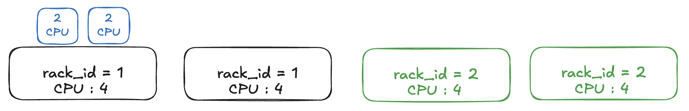
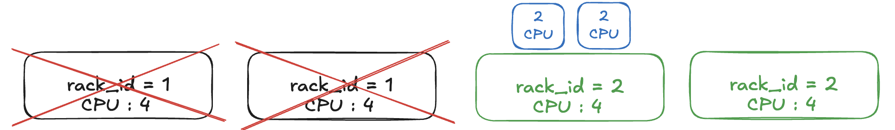
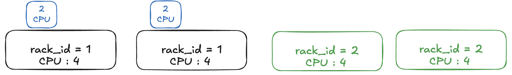
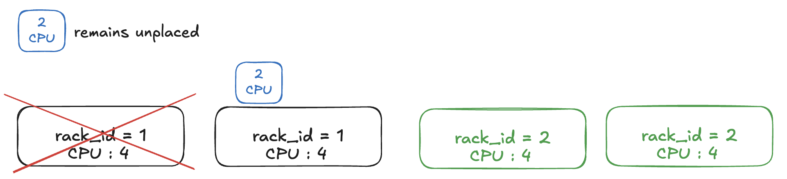
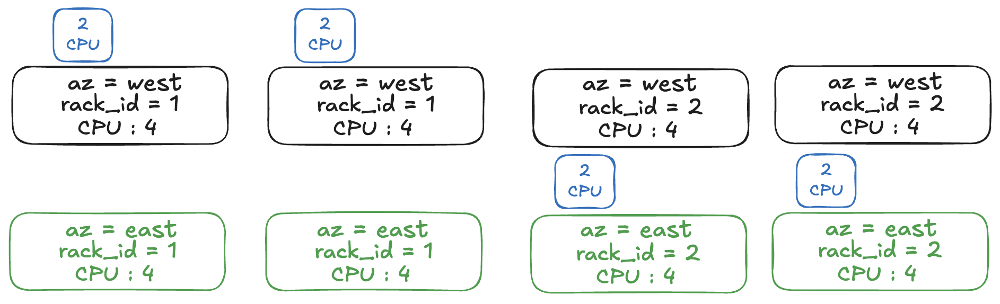
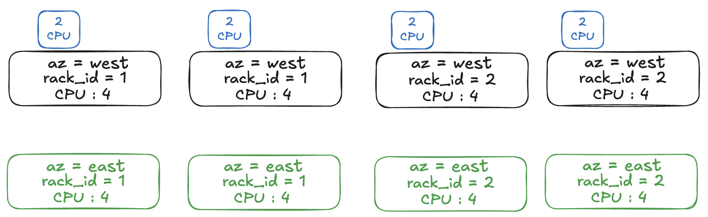
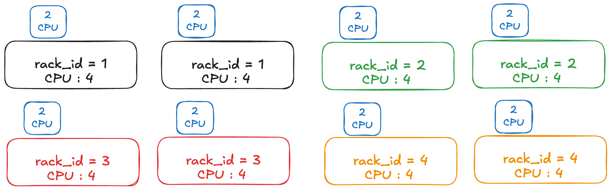

# Ray Toplogy Strategy
## General Motivation
The goal of this API is to introduce topology aware scheduling for placement groups. This allows users to specify a given label to have a specified placement strategy, such as packing all bundles of a placement group within one rack.

This change is in part motivated by new GB300 racks that are connected by a NVLink domain. The end goal is to further abstract to placement groups that target general groups such as TPU pods, NVLink domains, availability zones, etc.

### Current Functionality Issues

Currently, there is no way exposed by the ray API to specify topology aware scheduling for placement groups, since the functionality only supports targeting specific labels, rather than targeting any possible value given some topology strategy. For example, if you tried to reserve resources to occupy an entire rack: 

```py
ray.util.placement_group([{"GPU": 4, "CPU": 2}] * 18, strategy="STRICT_PACK")
```

This would fail since it would try to reserve all the bundles within a SINGLE node with 72 GPUs and 36 CPUs. If you used PACK instead of STRICT\_PACK

```py
ray.util.placement_group([{"GPU": 4, "CPU": 2}] * 18, strategy="PACK")
```

This would also (potentially) fail since there’s no guarantee we’ll place these bundles all on nodes within the same rack. If your cluster isn’t just 1 rack, some of the resources reserved will very likely be on nodes outside of the rack.

Thus, our new topology strategy API proposal will allow users to specify for a placement group to be placed on a given value of some defined label, e.g. any rack for some rack\_id label.

## Should this change be within `ray` or outside?

This change will affect both `ray` and `KubeRay`.

## Stewardship

### Owners
- @aaronscalene
- @Sparks0219

### Reviewers
- @MengjinYan
- @andrewsykim

### Shepherd of the Proposal (should be a senior committer)
- @edoakes

## Design and Architecture
### Basic API

Support a topology\_strategy option on ray.util.placement\_group(). Topology\_strategy denotes a label and the placement strategy over the label. Ray groups candidate nodes by the value of that label and applies the chosen strategy over those groups. Let us first assume that we have started a cluster of nodes with custom labels, which can either be done through [CLI](https://docs.ray.io/en/latest/ray-core/scheduling/labels.html#custom), [yaml](https://docs.ray.io/en/latest/cluster/vms/references/ray-cluster-cli.html) files, or through [KubeRay](https://docs.ray.io/en/latest/cluster/kubernetes/user-guides/label-based-scheduling.html). An example of how one might use the Ray CLI to start a cluster with rack\_ids for specific nodes:

```
ray start --head --labels="rack_id=1"
ray start --labels="rack_id=1" # rack 1 nodes
ray start --labels="rack_id=2" # rack 2 nodes
```

To create a placement group with the new API:

```py
pg = ray.util.placement_group(
bundles = [{"CPU": 2, "GPU": 4}] * 16,
# NEW FIELD
topology_strategy = [{"ray.io/node-id": "STRICT_PACK", "rack_id" : "STRICT_PACK"}],
)
```

We define the topology strategy for the `rack_id` label, and based on the `rack_id` label, we will `STRICT_PACK` all the bundles. Thus, we want to find a feasible allocation for the bundles such that all the bundles’ nodes that share the same label value of `rack_id`, let’s say `{rack_id : 1}`, or we deem this infeasible (so the autoscaler can deal with it). Furthermore, for the `ray.io/node-id` label, this keeps with the existing placement group `strategy` field, where we will `STRICT_PACK` all bundles such that they also share the same node id. Combining this with the other restriction means all bundles of this placement group must be placed on the **same** `rack_id` and **same** `ray.io/node-id`.

```py
@PublicAPI
@client_mode_wrap
def placement_group(
...
strategy: str, # if defined along with topology_strategy, will error out
...
bundle_label_selector: List[Dict[str, str]] = None,
# NEW FIELD
topology_strategy: Dict[str, str] = None,
)
```

Note that, we no longer support a `strategy` field above if the `topology_strategy` option is defined. This is because the topology strategy already supports node-wise strategy using the `ray.io/node-id` label, so the user may just specify their preference within that field. This on default will be `PACK`, keeping the same functionality as the `strategy` field. For more examples, see [example use cases](?tab=t.0#heading=h.zeti7487w99n).

### Supported Strategies

Strategies mirror the existing placement-group semantics, except that they are evaluated over the values of a label rather than only over nodes.

* STRICT\_PACK: all bundles must share a single value of the label or the request is infeasible, meaning each scheduled bundle for the placement group has a single (label, value) tuple.

### Fault Tolerance and Rescheduling Semantics

The public API only exposes topology\_strategy, but internally there are two distinct phases. During initial placement, Ray is choosing any acceptable topology that fits the strategy, i.e. some specific rack / node etc. During recovery of a failed bundle, Ray usually wants to preserve the placement that was already chosen by the surviving bundles of the same placement group. For example:

* For STRICT\_PACK on a rack, initial scheduling may choose any rack that satisfies the placement group. (i.e. rack 1\)  
  1. If one node later fails, the replacement bundle should prefer a node in that same rack when spare capacity exists or a new node can be brought up with the same rack label. (i.e. place bundle on some rack 1 node)  
  2. If the entire rack fails (100% of bundles failed), the replacement bundle should revert to the initial phase, finding any rack that satisfies the placement group (i.e. place placement group on rack 2\)  
     * In the future, we can allow the 100% to be more flexible, for instance if 50% of the bundles have failed we may try to immediately reschedule our placement group onto different topology

## Example Use Cases
### Strict Pack based on Rack Id and Strict Pack for Bundles

```py
pg = ray.util.placement_group(
bundles = [{"CPU": 2}] * 2,
topology_strategy = [{"ray.io/node-id" : "STRICT_PACK", "rack_id" : "STRICT_PACK"}],
)

ray.get(pg.ready(), timeout=10)
```

The placement, with 2 nodes labeled rack\_id \= 1 and 2 nodes labeled rack\_id \= 2 each having 4 CPU resources each:



The bundles are STRICT\_PACKed based on rack\_id=1, so one node with rack\_id=1 is selected and placed with the bundles. Now, let us assume rack 1 goes down, and takes down all of its nodes. The placement will now be as follows:   


Since rack 1 has gone down, the bundles are now scheduled onto another value of rack\_id, which in this case is rack\_id=2.

### Strict Pack based on Rack Id and Strict Spread for Bundles

```py
pg = ray.util.placement_group(
bundles = [{"CPU": 2}] * 2,
topology_strategy = [{"ray.io/node-id" : "STRICT_SPREAD", "rack_id" : "STRICT_PACK"}],
)

ray.get(pg.ready(), timeout=10)
```

Note here that, we enforce that all bundles are STRICT\_PACK on the same value rack\_id=1, however we can STRICT\_SPREAD our bundles across the nodes within the topology, which would have the following placement.



Let us say one node within this placement fails, since our placement group is not completely unplaced as in the previous example, we will still try to reschedule the unplaced bundle to no avail, marking this placement group as infeasible.  


### Spread Across Availability Zone and Within Rack (Possible Future Steps)

```py
pg = ray.util.placement_group(
bundles = [[{"CPU": 2}, {"CPU": 2}], [{"CPU": 2}, {"CPU": 2}]],
topology_strategy = 
[{"ray.io/node-id" : "STRICT_SPREAD", "rack_id" : "STRICT_PACK"}, {"availability_zone" : "STRICT_SPREAD"}]
)

ray.get(pg.ready(), timeout=10)
```

Note that this is a rough sketch of how possible future steps would be for hierarchical topology scheduling. In this case, we have the initial list, which represents two groups of bundles, each defined as: `[{"CPU": 2}, {"CPU": 2}]`. So, both of these groups will try to be STRICT\_SPREAD across availability\_zone labels, so bundles of each group will not overlap.

Now for each group, the individual `{"CPU": 2}` bundles will be STRICT\_PACK on the same rack\_id, and STRICT\_SPREAD across the nodes, similar to the examples above. Hence, we would have a potential following placement.



### Strict Pack Within Availability Zone and Within Rack (Possible Future Steps)

```py
pg = ray.util.placement_group(
bundles = [[{"CPU": 2}, {"CPU": 2}], [{"CPU": 2}, {"CPU": 2}]],
topology_strategy = 
[{"ray.io/node-id" : "STRICT_SPREAD", "rack_id" : "STRICT_PACK"}, {"availability_zone" : "STRICT_PACK"}]
)

ray.get(pg.ready(), timeout=10)
```

In this case, we have the initial list, which represents two groups of bundles, each defined as: `[{"CPU": 2}, {"CPU": 2}]`. Both of these groups will try to be STRICT\_PACK within some availability\_zone. Now for each group, the individual `{"CPU": 2}` bundles will be STRICT\_PACK on the same rack\_id, and STRICT\_SPREAD across the nodes, similar to the examples above. Hence, we would have a potential following placement.

The following is only a potential configuration. Another possible configuration is that both bundle groups are scheduled with the same rack\_id.



### Strict Spread Across Racks And Nodes (Possible Future Steps)

```py
pg = ray.util.placement_group(
bundles = [[{"CPU": 2}, {"CPU": 2}] * 4],
topology_strategy = 
[{"ray.io/node-id" : "STRICT_SPREAD"}, {"rack_id" : "STRICT_SPREAD"}]
)

ray.get(pg.ready(), timeout=10)
```

In this case, we have groups of bundles that we want to STRICT\_SPREAD across all racks, so each group of bundles has the same rack\_id locality, but no group of bundles will share the same rack. We then STRICT\_SPREAD the bundles across the nodes within the rack. The configuration would look similar to below.



### Nuances Between Different Hierarchical Scheduling (Possible Future Steps)

```py
pg = ray.util.placement_group(
bundles = [[{"CPU": 2}, {"CPU": 2}], [{"CPU": 2}, {"CPU": 2}]],
topology_strategy = 
[{"ray.io/node-id" : "STRICT_SPREAD", "rack_id" : "STRICT_PACK"}, {"availability_zone" : "STRICT_PACK"}]
)

ray.get(pg.ready(), timeout=10)
```

This is a similar placement group scheduling that we have specified in the previous example, but instead we are STRICT\_PACK both groups of bundles within the same availability zone instead.

```py
pg = ray.util.placement_group(
bundles = [[{"CPU": 2}, {"CPU": 2}], [{"CPU": 2}, {"CPU": 2}]],
topology_strategy = 
[{"ray.io/node-id" : "STRICT_SPREAD"}, {"rack_id" : "STRICT_PACK", "availability_zone" : "STRICT_PACK"}]
)

ray.get(pg.ready(), timeout=10)
```

This is a different placement group scheduling that we have. The subtle difference is that the `rack_id` requirement is moved as the requirement for how to place the groups of bundles. At first, it might be hard to wrap around what is the difference between these two scheduling patterns.

In the first strategy, both groups of bundles have to be in the same availability zone. However, these groups of bundles can be on the same / different racks. The bundles themselves within each group must be spread on different nodes of the rack. In the second strategy, both groups of bundles have to be in the same availability zone AND same rack. However, these groups of bundles have to then be spread across different nodes of that rack.

## Implementation Plan

### Milestone 1: public topology\_strategy API for placement groups

* Create public topology\_strategy API on placement groups.  
* Support STRICT\_PACK placement groups on arbitrary labels.  
* Confirming functionality with NVIDIA / Reflection folks.

### Milestone 2: support multiple scheduling strategies

* Support PACK, SPREAD, STRICT\_SPREAD, etc.

### Milestone 3: e2e autoscaler integration

* Support TPU-slice labels, availability zones, etc.

### Milestone 4: nested and hierarchical topology scheduling

* Add a nested representation so that a higher-level label topology\_strategy can treat lower-level groups as units.  
* Helps support cases such as rack-in-AZ, multi-rack NVLink topology\_strategies, and future region-level scheduling on a high level (without autoscaler automatic labeling / scaling integration yet)

## Compatibility, Deprecation, and Migration Plan
As mentioned above, we will continue to support all current functionality as normal, and only provide additional functionality with the new topology_strategy field. Only when users specify this new field will we disable the strategy field.

## Test Plan and Acceptance Criteria
All APIs will be rigorously unit tested, ensuring thorough validation of the documented specifications. 
