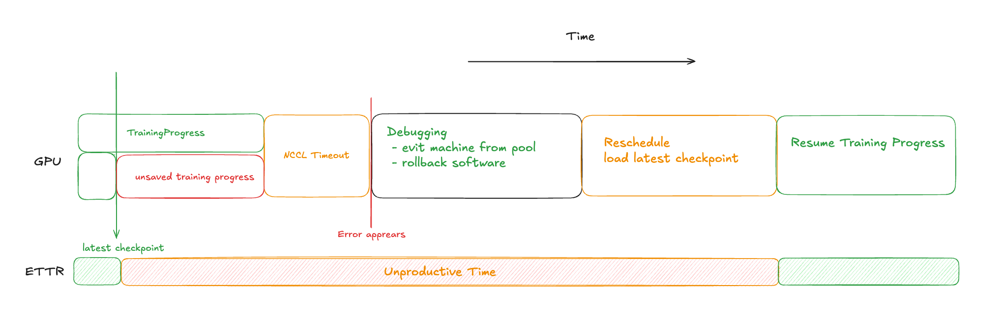
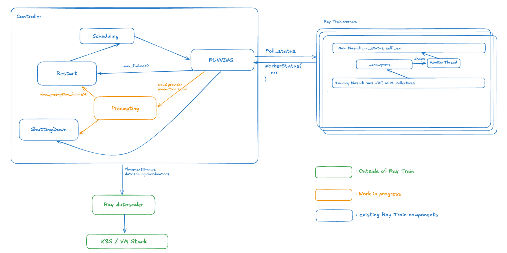
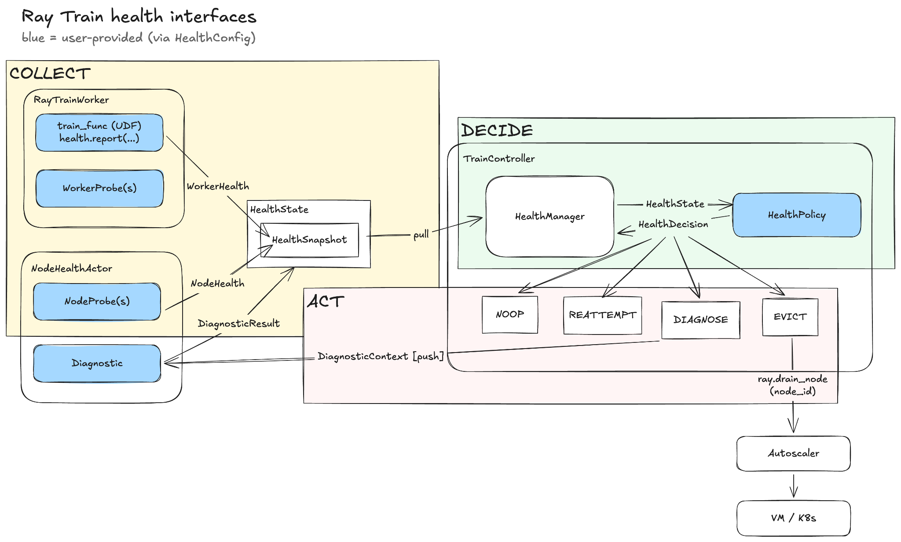

# Ray Train Monitoring and Diagnostics


## Summary

When something goes wrong in a long pretraining run today, detection is slow and recovery is
manual. The `TrainController` only learns about a failure when a rank raises an error, so a silent
hang or a degraded-but-alive run surfaces late or not at all. There is no place to plug in hardware
or framework health checks, and no way to correlate signals across ranks.

This REP extends Ray Train's control plane with a closed fault-tolerance loop,
**Collect → Decide → Act**, that widens the controller's health view:

- **Collect:** users plug in their own signal sources (DCGM, NCCL RAS, NVSentinel, NVIDIA
  Resiliency Extension, or custom) as per-worker `WorkerProbe`s and per-node `NodeProbe`s. Node
  signals are gathered by a `NodeMonitor` actor that survives worker death.
- **Decide:** a `HealthManager` in the controller fuses everything collected into one view and, on
  each poll, hands it to user-replaceable `Evaluator`s, which return a `HealthDecision`: the
  smallest safe action to take.
- **Act:** the controller carries out that decision (reattempt from checkpoint, evict the node and
  restart on healthy ones, or push an on-demand diagnostic(`OnDemandProbe`)) through the same event path a raised
  error takes today. This makes the flow bidirectional instead of poll-only.

The result: failures are caught in seconds instead of after a collective timeout, silent
degradation surfaces early, and recovery is automated, so more of the allocated GPU-time is spent
training.

> **Full design doc:** this REP is a condensed version of the design. The complete document —
> including the full API reference, both rejected API alternatives, the end-to-end examples, and
> the feature-coverage matrix — lives in a Google Doc that is open for comment:
> **[[External][REP][Train] Ray Train Monitoring and Diagnostics](https://docs.google.com/document/d/1ByACl2pLGmD3cibACZxWgKcqzACaPXcceSKf_ziCzaI/edit?tab=t.0)**.

### General Motivation

Pretraining runs are long and brittle, and growing cluster sizes with new accelerator generations
make them less stable, not more. Meta's [FT-HSDP paper](https://arxiv.org/pdf/2602.00277) counted
678 unexpected interruptions during production training on 32K H100s. The NVIDIA GR00T team put it:
"A GB300 rack has many more things that can break than A100. It's becoming necessary to inspect
trainers and take actions during a training run."

Failures come from hardware, software infrastructure, and user code. ByteDance's
[ByteRobust](https://arxiv.org/pdf/2509.16293) groups production incidents into three classes:

- **Explicit errors:** clear diagnostic signals from hardware or infrastructure, such as remote
  storage errors, preemption, and OOMs.
- **Implicit errors:** hangs, stragglers, low MFU, and silent data corruption. Nothing fails loudly,
  but throughput collapses, and these non-deterministic faults are the slowest to reproduce and
  debug.
- **Manual restarts:** code and data upgrades.

Whatever the cause, recovery today follows the same manual loop: the run stops (with or without a
usable checkpoint) → an engineer diagnoses the root cause → bad hardware is evicted or software is
rolled back → pods are rescheduled → training resumes from the latest checkpoint. Every trip
through this loop costs real time and lowers goodput, the fraction of allocated GPU-time actually
spent training.



*Figure 1: The manual recovery loop today.*

#### Current status and gaps

Ray Train is a single controller wrapped around an SPMD job. The controller holds the global
orchestration view (which ranks are alive, and on which nodes), but the user-defined training
function (UDF) is opaque to it.



*Figure 2: Ray Train today.*

Today, every failure reaches the controller the same way: through the `error` field of
`WorkerStatus`. An explicit exception raised in the UDF and an NCCL collective timeout escalated by
the watchdog abort look identical at the controller. Anything deeper requires an engineer to comb
logs after the job has already failed.

The structural limitation runs along three axes. Today's health view is:

1. **Spatially flat:** a 1D list of data-parallel ranks, with no node or topology awareness.
2. **Temporally flat:** a stateless point-in-time snapshot, with no history.
3. **One-directional:** the controller can only poll for errors, never push a command.

Concretely, five gaps stand between the current architecture and the requirements below:

1. **No pre-flight hooks.** Bad nodes are discovered only after launch, when they are already
   expensive.
2. **No health signals in `WorkerStatus`.** It carries `running`, `error`, and `training_report`,
   but no health metrics.
3. **No out-of-process node health.** The controller sees only what a live training worker reports;
   once the worker dies, the node goes dark.
4. **No temporal view.** Without signal history, implicit errors like stragglers and silent data
   corruption (SDC) are invisible.
5. **No push channel to workers.** If a training worker is killed, the controller cannot ask the
   faulty node to run a diagnostic or collect traces.

#### Goals and requirements

**Pre-flight validation** — reject bad runs before they become expensive (slow interconnects,
unhealthy nodes, failed sanity checks).

1. A hook for users to screen GPU and node health before training starts, such as a TFLOPS or
   temperature screen, DCGM diagnostics, or an NCCL/collective proof.

**Mid-flight monitoring and detection** — actively monitor ranks and nodes during training instead
of relying on an NCCL timeout and abort, using the controller's global view to correlate signals
across ranks, including degraded-but-alive runs (memory leaks, data-pipeline slowdowns, hardware
degradation) that silently lose throughput.

2. A **worker-level** monitoring hook that shares the lifecycle of the training process (actor
   liveness, collective awareness, step timing, numerical/SDC signals).
3. A **node-level** monitoring hook that survives training-process failure (DCGM/NVML, host
   RAM/OOM).
4. A **temporal view**: the ability to keep state across polls, so time-series checks can catch
   hangs, slowdowns, and silent degradation.

**Automated fault tolerance** — remove the human from the loop. When a failure is confidently
attributable to hardware and is retryable, evict the faulty nodes and restart on healthy ones
without a person babysitting the run.

5. A way to emit events from health signals, so bad nodes can be quarantined and the run restarted
   on healthy nodes.

These three areas map onto the three axes above: per-worker and per-node monitoring make the view
**spatial**, state kept across polls makes it **temporal**, and pre-flight checks plus on-demand
probes make it **bidirectional**.

### Should this change be within `ray` or outside?

Within `ray`. The loop needs to read and extend `WorkerStatus` at poll time, drive the controller's
restart/retry state machine, and push work to nodes whose training worker is dead — all
controller-internal paths that cannot be layered on from outside.

We start scoped to Ray Train, in a new `ray.train.health` module, plus one small addition to Ray
Core (`ray.drain_node`, see [Act](#act)). If the same collect/decide machinery later proves useful
to other workloads (Serve, Data), the workload-agnostic parts can be extracted into a shared
`ray.health`.

What stays outside is the content: probes, evaluators, and policies are user-supplied, and vendor
integrations (DCGM, NCCL RAS, NVSentinel, NVIDIA Resiliency Extension) live in their own packages.

## Stewardship

### Required Reviewers

@richardliaw 
@matthewdeng 

### Shepherd of the Proposal (should be a senior committer)

@richardliaw 
@edoakes 

## Design and Architecture

The proposal extends the controller's health view along the three axes above with a closed loop,
**Collect → Decide → Act**, that runs continuously alongside training. It turns the controller from
a poll-only observer into a system that senses degradation, judges it, and recovers on its own.

The division of responsibility is the same throughout: **Ray Train owns how signals are collected,
correlated, and how a decision becomes an action; the user (or an adapter) owns what to measure on
the hardware and what to conclude from it.**

- **Collect:** health signals are gathered at two levels — worker-level, for what only the training
  process can see, and node-level, for what must outlive that process and cover the whole host.
  Collection is cheap, read-only, and never perturbs training.
- **Decide:** a `HealthManager` in the controller fuses everything collected into one `HealthState`
  and, on each poll, hands it to the configured evaluators to produce a `HealthDecision`.
- **Act:** the controller carries out that decision through the same event path a raised error takes
  today. This is what makes the loop bidirectional rather than poll-only.



*Figure 3: The Collect → Decide → Act loop and its interfaces. Blue boxes are user-provided via
`HealthConfig`. (The `HealthPolicy` box in DECIDE is refined below: a policy is a bundle of probes
plus the evaluators that judge them.)*

| Axis | Today | Proposed |
| --- | --- | --- |
| **Spatial** (which nodes/GPUs?) | Flat list of data-parallel ranks; no node or topology awareness | Per-worker and per-node probes, extensible to topology groups |
| **Temporal** (how is it changing?) | A single stateless poll, no history | Evaluators keep state across polls, catching gradual regressions a single reading would miss |
| **Directional** (can it act, or only listen?) | One-way: polls for errors | Two-way: polls for signals and pushes diagnostics |

### Collect

Every signal comes through one of two paths, and the distinction runs through the whole design:

- **Probes** are passive and continuous. They are polled on a fixed interval, are read-only, and
  never disrupt training. This is the always-on monitoring path.
- **On-demand probes (diagnostics)** are active. They run only when the controller pushes one, and
  they can be heavy (e.g. stopping workers, running an all-reduce).

Both are hosted on the node by the same component, the `NodeMonitor`. Every collector is a `Probe`
and returns a `ProbeResult`:

```python
@dataclass
class ProbeResult:
    """What every probe returns."""
    metrics: dict[str, float] = field(default_factory=dict)
    devices: dict[str, dict[str, float]] = field(default_factory=dict)
    events: list[str] = field(default_factory=list)
    passed: Optional[bool] = None
    detail: str = ""


class Probe(ABC):
    name: str = ""


class WorkerProbe(Probe):        # runs in each train worker, on every poll
    @abstractmethod
    def poll(self) -> Optional[ProbeResult]: ...


class NodeProbe(Probe):          # runs in each NodeMonitor's monitor loop
    interval_s: float = 10.0

    @abstractmethod
    def poll(self, ctx: NodeContext) -> Optional[ProbeResult]: ...


class OnDemandProbe(Probe):      # a diagnostic is just an on-demand probe
    stop_workers: bool = False   # True if it needs the accelerator to free up
    timeout_s: float = 60.0

    @abstractmethod
    def poll(self, ctx: OnDemandProbeContext) -> ProbeResult: ...
```

#### Per-worker health

Worker-level health carries what only the training process can know: step progress, phase timings,
collective awareness, and numerical signals such as gradient norm, NaN counts, and weight checksums.
There are two ways to produce it, both optional:

- `ray.train.health.report(...)` reports signals the user computes inside the training loop.
- A `WorkerProbe` reads signals from inside the worker process without touching the training loop.

```python
import ray.train.health as health

def train_func(config):
    ...
    health.report(
        metrics={"grad_norm": float(grad_norm), "nan_count": nan_steps},
        step=step,
    )
```

On each poll, the worker snapshots whatever `health.report()` has accumulated and whatever each
`WorkerProbe` produced, and returns it as a new `health` field on the existing `WorkerStatus`. This
rides along the `poll_status` call the controller already makes — no new RPC.

```python
@dataclass
class WorkerHealth:
    worker_rank: int
    node_id: str
    snapshot_at: float
    step: Optional[int] = None
    probe_results: dict[str, ProbeResult] = field(default_factory=dict)
    reported: dict[str, Any] = field(default_factory=dict)   # health.report()
```

#### Per-node health

When a training process hangs or is killed, its rank goes silent at exactly the moment its evidence matters most. Node-level health covers that blind spot. A
`NodeProbe` runs inside the `NodeMonitor`, so its signals keep flowing regardless of worker state,
and a single sample covers every worker on the host.

```python
@dataclass
class NodeHealth:
    node_id: str
    snapshot_at: float
    probe_results: dict[str, ProbeResult] = field(default_factory=dict)
```

#### The NodeMonitor

There is one `NodeMonitor` per node: a lightweight actor (`num_cpus=0`, pinned to its node) that
owns everything at node level. Its defining property is that it lives outside the training worker
process, so when a worker hangs or is killed it keeps running and can report what the dead worker no
longer can.

```python
@ray.remote(num_cpus=0)   # one per node, pinned via NodeAffinitySchedulingStrategy
class NodeMonitor:
    def poll_health(self) -> NodeHealth:
        ...   # pull: latest monitor sample

    def run_on_demand_probe(self, probe: OnDemandProbe, ctx: OnDemandProbeContext) -> ProbeResult:
        ...   # push: runs an on-demand probe, a.k.a Diagnostics
```

It runs in two modes, matching the two signal paths:

- **Monitoring (pull).** Node probes run on a background thread at a fixed interval; the controller
  reads the latest sample with `poll_health()` when it polls worker status. It is cheap and
  invisible: no GPU, and it never slows down or interferes with training.
- **OnDemandProbe (push).** When the controller decides it needs an active check, it pushes an
  `OnDemandProbe` to the actor to run on the relevant node(s) — a tracer that does not need training
  stopped (e.g. `py-spy`), or a heavy screen such as an NCCL all-reduce that does. Because a check
  can hang or crash, diagnostics run in a subprocess with a hard timeout, keeping the `NodeMonitor`
  alive for continued monitoring.

### Decide

Collect produces a continuous stream of raw signals. **Decide** turns them into an action: it
aggregates every signal into one coherent view, applies decision logic to that view, and emits a
single instruction for the controller to carry out.

#### The HealthDecision

The output of Decide is a `HealthDecision`: an `Action` plus enough context to say *which* node,
*which* ranks, and *why*. The four actions are ordered by severity; when several signals fire at
once, the most severe action wins.

```python
class Action(Enum):
    NOOP = auto()        # healthy, do nothing
    DIAGNOSE = auto()    # run an active check (may need workers stopped)
    REATTEMPT = auto()   # restart from the last checkpoint
    EVICT = auto()       # remove node(s) and restart without them

SEVERITY = {Action.NOOP: 0, Action.DIAGNOSE: 1, Action.REATTEMPT: 2, Action.EVICT: 3}

@dataclass
class HealthDecision:
    action: ClassVar[Action]
    reason: str = ""

@dataclass
class Noop(HealthDecision):
    action: ClassVar[Action] = Action.NOOP

@dataclass
class Reattempt(HealthDecision):
    action: ClassVar[Action] = Action.REATTEMPT

@dataclass
class Evict(HealthDecision):
    action: ClassVar[Action] = Action.EVICT
    target_nodes: list[str] = field(default_factory=list)

@dataclass
class Diagnose(HealthDecision):
    action: ClassVar[Action] = Action.DIAGNOSE
    on_demand_probes: list[OnDemandProbe] = field(default_factory=list)
    target_nodes: list[str] = field(default_factory=list)
    target_ranks: list[int] = field(default_factory=list)
```

#### The HealthManager

There is one `HealthManager` per run, living inside the `TrainController`. It is the single point
every health signal flows into, and its job is to fuse those separate streams into one view the
decision logic can reason about. Three streams feed it: worker health (from each `poll_status`
response), node health (from each `NodeMonitor`), and results from any on-demand probe the
controller has pushed.

On each poll, the `HealthManager` assembles those streams into a `HealthState`, runs the evaluators
from every configured policy over it, merges what they return into one `HealthDecision`, and
forwards it to the controller.

```python
class HealthManager:  # controller-side, one per run
    def ingest_worker_health(self, poll_status: WorkerGroupPollStatus): ...
    def ingest_node_health(self, node_health: NodeHealth): ...
    def ingest_probe_result(self, result: ProbeResult): ...

    def poll_decision(self) -> Optional[HealthDecision]:
        """Assemble a HealthState, run every evaluator, merge into ONE decision."""
        ...
```

Policies are peers, so `poll_decision()` runs every policy's evaluators over the same `HealthState`
— each returning a `list[HealthDecision]`, empty when it sees nothing wrong — and merges those lists
into the single instruction the controller acts on:

1. **Concatenate** every evaluator's returned decisions, and drop `NOOP`.
2. **Rank by severity** — `NOOP < DIAGNOSE < REATTEMPT < EVICT`. The most severe decision wins, so
   the run takes the smallest action that covers the worst thing anyone saw. Position in
   `HealthConfig.policies` carries no priority.
3. **Merge at the winning severity** rather than picking one arbitrarily: `Evict`s union their
   `target_nodes`, `Diagnose`s union their `on_demand_probes` / `target_nodes` / `target_ranks`, and
   `reason`s are concatenated so the emitted event names every evaluator that fired.
4. **Suppress what is already being handled** — a fault with a reattempt in flight, or a node
   already draining, so a signal that persists across polls does not retrigger every poll.

If nothing survives, `poll_decision()` returns `None` and training continues untouched.

`HealthState` is the input contract for the decision logic — the aggregated `WorkerHealth` and
`NodeHealth` from that poll, laid out for evaluators to read by probe:

```python
# typed reads on HealthState:
#   state.results(SomeProbe)                  -> latest slice, per entity, by probe
#   state.reported                            -> {rank: health.report() metrics}
#   state.on_demand_probe_results(SomeProbe)  -> {node_id: ProbeResult}
```

The `HealthManager` holds the latest snapshot from each source, not a history. History lives on the
evaluator instead: `evaluators_creator` runs once per run, so an evaluator is long-lived and can
keep its own bounded buffer (e.g. a `deque` of the last N steps per rank) across polls, and clear it
on restart. This is what gives the temporal axis its teeth — an evaluator can tell "this rank is
slowing down" from "this rank is fine" — while letting each evaluator size the window its own check
actually needs, instead of the framework guessing on everyone's behalf.

#### Evaluators and HealthPolicy (the user-facing API)

Evaluation reads collected metrics and returns `HealthDecision`s. It runs on the controller:

```python
class Evaluator(ABC):
    @abstractmethod
    def evaluate(self, state: HealthState) -> list[HealthDecision]: ...
```

An evaluator reads whatever it needs off `HealthState`, so correlating across several probes — or
joining a probe against `health.report()` metrics from the UDF — is just a second lookup, not a
special case.

A `HealthPolicy` bundles the two halves — what to measure, and what to conclude from it — into one
unit. It is a dataclass of two creators, so nothing is constructed at import time and the framework
builds fresh probes and evaluators per run:

```python
ProbeCreator     = Callable[[], list[Probe]]
EvaluatorCreator = Callable[[], list[Evaluator]]

@dataclass
class HealthPolicy:
    """(probes, evaluators) — what to measure, and what to conclude from it."""
    probe_creator: ProbeCreator = None
    evaluators_creator: EvaluatorCreator = None
    preflight: bool = False
```

`HealthConfig` then has exactly one field. Probes, evaluators, pre-flight gates, and cross-signal
logic all register the same way — as a policy with only the fields it needs:

```python
@dataclass
class HealthConfig:
    policies: list[HealthPolicy] = field(default_factory=list)
```

A contributor ships one policy per concern or symptom, and a user composes them — see the
[end-to-end example](#end-to-end-example) below.

### Act

Act is where a `HealthDecision` becomes a real change to the run. The key point is that it needs no
new machinery. The controller already has exactly one way a problem reaches it today: a raised error
on `WorkerStatus.error`. A `HealthDecision` enters through that same path, as an input event. Seen
this way, today's raised error is just the simplest possible decision, a reattempt. If a decision
arrives for a fault the controller is already handling, it is dropped.

- **REATTEMPT** restarts from the last checkpoint, reusing the existing `FailurePolicy` retry path.
- **EVICT** emits a structured evict event, then restarts the worker group with the bad node
  excluded.
- **DIAGNOSE** is the push path. It stops the affected workers if the check needs the GPU, runs the
  `OnDemandProbe` on the relevant node(s) through their `NodeMonitor`, and feeds the `ProbeResult`
  back to the `HealthManager`. This is what closes the loop: an action produces fresh evidence that
  the next Decide step reads.
- **NOOP** needs no action.

Eviction lands in two milestones.

**Milestone 1 — extend `UserCallback` with a health-decision hook.** Today
[`ray.train.UserCallback`](https://docs.ray.io/en/master/train/api/doc/ray.train.UserCallback.html)
lets users hook custom code into training events. We add `after_health_decision`, so users can
attach their own eviction logic (for example, handing off to a remediation service) without waiting
on Ray Core:

```python
@DeveloperAPI
class UserCallback(RayTrainCallback):
    ...
    # NEW
    def after_health_decision(
        self, run_context: TrainRunContext, health_decision: HealthDecision
    ):
        pass
```

**Milestone 2 — a Ray Core drain primitive.** Eviction of faulty hardware should be
workload-agnostic: Serve, Train, and Data can all benefit from a shared Ray Core primitive that
evicts a node and prevents it from being rescheduled onto.

```python
# ray core
def drain_node(
    node_id: str,
    *,
    reason: str,
    severity: str = "unhealthy",
    replace: bool = True,
    grace_period_s: float = 0.0,
) -> "DrainResult": ...
```

With this in place, Ray Train simply calls `drain_node(...)` when acting on
`Evict(target_nodes=["..."], reason="bad node")`.

### End-to-end example

Health monitoring adds two touchpoints to an otherwise standard training script: the
`health.report()` line in the training loop shown in [Collect](#per-worker-health), and the
`HealthConfig` passed to the trainer. A contributor ships one policy per concern or symptom, and a
user composes them:

```python
DCGM = HealthPolicy(
    probe_creator=lambda: [DcgmProbe()],
    evaluators_creator=lambda: [EccEvaluator(), ThermalEvaluator(temp_limit=90)],
)

ALL_REDUCE = HealthPolicy(
    probe_creator=lambda: [NcclCheck()],       # an OnDemandProbe
    evaluators_creator=lambda: [FabricEvaluator()],
    preflight=True,                            # same check, also used as a pre-flight gate
)

NUMERICAL = HealthPolicy(
    evaluators_creator=lambda: [NumericalEvaluator()],   # reads health.report() only
)

# Cross-signal: a slow rank is ambiguous, so join it with that node's GPU temperature.
class ThermalStraggler(Evaluator):
    def evaluate(self, state):
        gpu = state.results(DcgmProbe)
        for rank, node in slow_ranks(state.reported).items():
            if node in gpu and max_temp(gpu[node]) > 90:
                return [Evict(target_nodes=[node], reason=f"rank {rank} slow + GPU throttling")]
            return [Diagnose(on_demand_probes=[NcclCheck()],
                             reason=f"rank {rank} slow, HW clean")]
        return []

CROSS_SIGNAL = HealthPolicy(evaluators_creator=lambda: [ThermalStraggler()])

trainer = TorchTrainer(
    train_fn,
    run_config=ray.train.RunConfig(
        health_config=HealthConfig(policies=[DCGM, ALL_REDUCE, NUMERICAL, CROSS_SIGNAL]),
    ),
)
```

#### A faulty NIC causes a silent NCCL hang

About 6 hours into a 1,024-GPU run, one node's InfiniBand NIC begins to fail (link flap, degraded
bandwidth). During the next gradient all-reduce, the rank on that node stalls inside the collective.
Because the collective is a barrier, all 1,023 other ranks block waiting for it, and throughput
drops to zero. No exception is raised: the stuck rank is frozen in a C++ NCCL call, and the healthy
ranks are simply waiting. This is the classic silent hang — the most common shape in Ray Train's
NCCL-debugging cases and in ByteRobust's "job hang" class (9.9% of incidents).

| | Today | With this proposal |
| --- | --- | --- |
| **Detection** | ~30 min (torch process-group timeout, then watchdog abort) | seconds (NCCL RAS + a no-progress check across polls) |
| **Localization** | human log-reading; the silent rank logs nothing, so the culprit must be inferred across 128 nodes | automatic — RAS names the rank, joined with the node's already-polled ibstat/DCGM to name NIC `mlx5_1` on host N |
| **Classification** | none | the join plus an active diagnostic confirms hardware, not data/code/SDC, which authorizes quarantine |
| **Progress loss** | up to a full checkpoint interval (e.g. 30–60 min) | near-zero (emergency checkpoint from a healthy DP peer) |
| **Human** | paged, for hours | none (automated quarantine + restart on healthy nodes) |

## Compatibility, Deprecation, and Migration Plan

This is purely additive. No existing API changes shape or behavior, and no deprecations are
proposed.

- **Off by default.** `RunConfig.health_config` defaults to `None`. With no `HealthConfig`, no
  `NodeMonitor` is started, no probes run, and the controller behaves exactly as it does today.
  Existing training scripts are unaffected.
- **`WorkerStatus` gains a `health` field**, defaulting to empty. It is an additive field on an
  internal status object carried by an RPC that already happens; nothing is removed or renamed.
- **`UserCallback` gains `after_health_decision`** with a `pass` default, so existing callbacks
  continue to work unmodified.
- **`ray.drain_node` is a new Ray Core API** (Milestone 2). Until it lands, eviction is driven
  through the Milestone 1 callback hook, so Train does not block on Core.
- **API stability.** `ray.train.health` ships as alpha/`@DeveloperAPI` for at least one release
  while probe and evaluator contracts settle with real vendor integrations, and graduates once the
  `ProbeResult` and `HealthState` shapes have been exercised by more than one adapter.

## Test Plan and Acceptance Criteria

### Unit Tests

- `HealthState` assembly across worker, node, and on-demand probe results; serialization of
  `ProbeResult` / `WorkerHealth` / `NodeHealth` across the actor boundary.
- Decision aggregation: severity ordering, same-severity merging, and suppression of a fault already
  being handled.
- `HealthPolicy` construction: creators run per run, not at import time; a policy with only
  `evaluators_creator` works.
- Fault injection: a probe or evaluator that raises, returns `None`, or times out must not fail the
  training run.

### Integration & E2E Tests

Small multi-node clusters, with faults injected by test probes:

- **Survives worker death**: `SIGKILL` a training worker and verify node health is still reported and
  a decision is produced.
- **Push path**: a `Diagnose` decision stops workers when `stop_workers=True`, runs the on-demand
  probe, and the result reappears in the next `HealthState`. A probe that hangs is killed at
  `timeout_s` without taking down the `NodeMonitor`.
- **Evict path**: an `Evict` decision restarts the worker group with the target node excluded and
  fires `after_health_decision`; with Milestone 2, the drained node is not rescheduled onto.
- **No-config regression**: a script with no `HealthConfig` runs unchanged and starts no
  `NodeMonitor`.
- **Silent hang**: a release test reproducing the NIC example above — detection in seconds rather
  than at the collective timeout, correct node localized, run resumes with no human intervention.

### Acceptance Criteria

1. All three goals demonstrated end-to-end: pre-flight rejection of a bad node, mid-flight detection
   of a silent hang, and automated eviction plus restart.
2. Step-time regression within noise (target < 1%) on a multi-node GPU run with a representative
   policy set enabled.
3. Documentation: a user guide for `HealthConfig` / `HealthPolicy`, an API reference for the probe
   and evaluator contracts, and a runnable end-to-end example.
4. At least one real signal-source adapter (e.g. DCGM or NCCL RAS) implemented against the public
   contracts, proving the interfaces are sufficient from outside the framework.

## (Optional) Follow-on Work

- **Ray Core `drain_node` (Milestone 2)** as a shared, workload-agnostic eviction primitive for
  Train, Serve, and Data.
- **Topology-aware grouping.** Probes are per-worker and per-node today; extending the spatial axis
  to topology groups (rack, TP/PP group) would let evaluators reason about a shared switch or
  rack-level fault.
- **A shipped policy library**, so common cases (DCGM ECC/thermal, NCCL RAS, host OOM, NaN loss, no
  progress) work without the user writing any evaluator code.