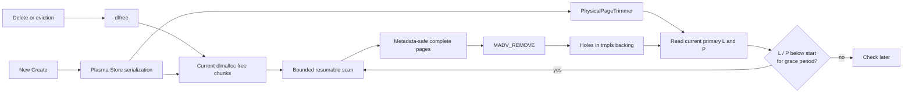
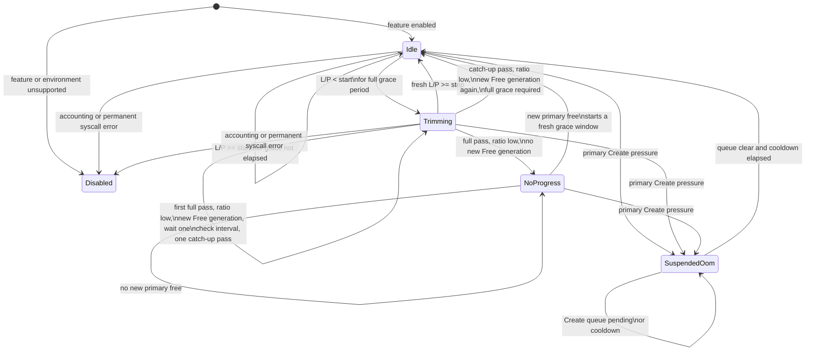
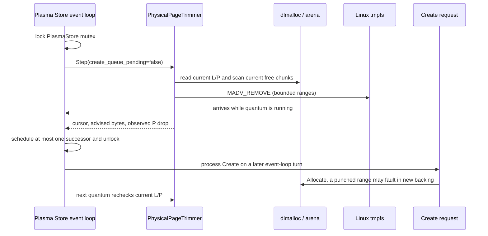

# REP: Reclaim Physical Backing from Free Pages in the Plasma Object Store

## Summary

This REP proposes an opt-in, Linux-only mechanism for returning the physical
backing of free pages in the Plasma object store's primary shared-memory arena.
Today, deleting or evicting a Plasma object calls `dlfree()`: the allocation
becomes logically reusable, but pages that were touched generally remain backed
by tmpfs and continue to consume `/dev/shm` blocks and, while resident, node
memory until the entire arena is destroyed.

The proposed mechanism runs in the raylet and:

1. measures logical live bytes and physical tmpfs backing for the same primary
   arena;
2. starts reclaim after their ratio remains below a configured threshold;
3. incrementally scans current dlmalloc free chunks for complete pages that do
   not contain allocator metadata;
4. calls `madvise(..., MADV_REMOVE)` on those pages while allocation and free
   operations are serialized; and
5. stops when the current logical-to-physical ratio reaches a higher threshold.

The virtual mapping, file size, and dlmalloc free chunks remain intact. A later
allocation can reuse the same virtual address range; its first write faults in
new tmpfs backing. Reclaim is bounded by byte, syscall, and soft time budgets so
the Plasma Store event loop regularly regains control, and each trim episode is
limited to one full arena pass plus at most one delayed catch-up pass.

The feature is disabled by default. The initial scope is the normal-page,
tmpfs-backed primary arena on Linux. Fallback allocations, huge pages, and
`preallocate_plasma_memory=true` are excluded. This REP proposes only this
default-off, opt-in experimental capability; enabling it by default is out
of scope and would require a separate REP under the boundary described in
the Compatibility section.

### General Motivation

#### Current behavior

The Plasma primary arena is a large, unlinked, `MAP_SHARED` file, normally in
`/dev/shm`. Object creation allocates a chunk from the arena and object deletion
returns that chunk to dlmalloc. In upstream Ray commit
[`71df155`](https://github.com/ray-project/ray/commit/71df1551d91571a5fef508b8330f401e90f86170),
the [allocator free path](https://github.com/ray-project/ray/blob/71df1551d91571a5fef508b8330f401e90f86170/src/ray/object_manager/plasma/plasma_allocator.cc#L122-L129)
is:

```cpp
dlfree(allocation.address_);
allocated_ -= allocation.size_;
```

This makes the address range available to a future Plasma allocation, but it
does not punch holes in the tmpfs file. Ray also deliberately rejects partial
`munmap` requests from dlmalloc so that the long-lived primary mapping is not
trimmed piecemeal
([source](https://github.com/ray-project/ray/blob/71df1551d91571a5fef508b8330f401e90f86170/src/ray/object_manager/plasma/dlmalloc.cc#L279-L307)).

As a result, three quantities can diverge substantially in a long-lived,
churn-heavy raylet:

- **Logical live bytes:** payload currently owned by Plasma objects.
- **Process RSS:** pages mapped into a particular process's page tables.
- **Physical backing:** blocks allocated to the primary tmpfs inode, which
  consume `/dev/shm` capacity and contribute to node memory pressure while
  resident.

For example, a 400 GiB arena may contain only 1 GiB of live objects while close
to 400 GiB of its tmpfs backing remains allocated. The free chunks are reusable
by Plasma, but the capacity cannot be used by unrelated processes or other
tmpfs files.

[ray-project/ray#53261](https://github.com/ray-project/ray/issues/53261) reports
a closely related long-lived Plasma mapping problem. Configurable jemalloc for
workers ([ray-project/ray#47243](https://github.com/ray-project/ray/pull/47243))
addresses anonymous worker-heap fragmentation, but not Plasma's shared tmpfs
backing. A later, unmerged experiment
([ray-project/ray#62854](https://github.com/ray-project/ray/pull/62854)) used
worker-side `MADV_DONTNEED` to reduce a releasing worker's RSS. That can remove
the worker's page-table entries, but it intentionally leaves the shared tmpfs
data and backing available to other Plasma clients.

This REP addresses a different layer: after Plasma has actually deleted an
object and dlmalloc considers its chunk free, reclaim the inode's physical
backing from allocator-confirmed free pages.

#### Target workloads

The primary beneficiaries are long-lived Ray nodes with all of the following:

- large object stores, commonly tens or hundreds of GiB;
- repeated creation, eviction, deletion, and reuse of large immutable objects;
- working sets that can fall far below the arena's historical high-water mark;
- other node workloads that can make productive use of released memory or
  `/dev/shm` capacity.

The proposal is not intended to make a logically full object store accept more
objects. Object spilling and eviction remain responsible for logical capacity.
It is also not live-object compaction: live objects never move, and free regions
separated by live chunks do not become contiguous.

### Should this change be within `ray` or outside?

This change should be within `ray`.

Only Ray's Plasma allocator can safely determine whether a page is inside a
currently free dlmalloc chunk and whether it overlaps dlmalloc bookkeeping. The
operation must also be serialized with Plasma allocation, free, object
eviction, Create retry, and raylet shutdown. An external process can observe a
tmpfs file or RSS, but it cannot establish these allocator and lifecycle
invariants.

## Stewardship

### Required Reviewers

- [@Kunchd](https://github.com/Kunchd) - Ray Core, raylet, and memory-management
  review.

Additional focused review from Plasma/object-spilling and Linux memory-management
owners is welcome before the proposal leaves draft.

### Shepherd of the Proposal (should be a senior committer)

[@Kunchd](https://github.com/Kunchd) - Ray Core shepherd for this proposal.

## Design and Architecture

### Goals and non-goals

The design has the following goals:

- release real tmpfs backing, not only one process's RSS;
- never remove a page containing live object data or required dlmalloc
  metadata;
- keep the arena's virtual mapping and normal dlmalloc reuse behavior;
- bound work performed while holding the Plasma Store serialization lock;
- give Create/OOM handling priority over physical reclaim;
- avoid repeatedly scanning an unchanged arena that has no reclaimable full
  pages; and
- fail open by disabling reclaim when the environment or accounting is unsafe.

The initial implementation does **not**:

- move live objects or compact the address space;
- replace object spilling or use reclaim to satisfy logical allocation failure;
- unmap primary Plasma mappings from workers;
- reclaim fallback allocations, which already own independent mappings;
- support hugetlb-backed arenas or non-Linux platforms;
- preserve the eager physical-reservation guarantee of
  `preallocate_plasma_memory`; or
- provide a hard wall-clock bound for a kernel `MADV_REMOVE` syscall.

### Architecture overview



The trimmer is a synchronous state machine, not a worker thread. One event-loop
callback performs at most one trim quantum while holding the same Plasma Store
mutex that serializes Allocate and Free. It then posts at most one cancellable
successor callback and releases the mutex.

The separation of responsibilities is deliberate:

- **PlasmaAllocator** exposes exact primary-arena accounting and a resumable
  view of current free chunks.
- **PhysicalPageTrimmer** implements ratio policy, state transitions, scan
  progress, budgets, and error handling.
- **PlasmaStore** serializes a quantum with object lifecycle operations,
  prioritizes Create pressure, and owns timer/shutdown safety.
- **StoreRunner** validates the Linux/tmpfs environment and supplies the actual
  `MADV_REMOVE` callback.

### Exact accounting domain

The control signal compares quantities from the same primary arena:

```text
L = primary logical live bytes
  = allocator allocated bytes - fallback allocated bytes

P = primary physical backing bytes
  = fstat(primary_arena_fd).st_blocks * 512

ratio = L / P, when P > 0
```

The denominator is inode backing, not RSS and not the sum of every file whose
name contains `plasma`. Fallback allocations are excluded from both sides.
They are direct mappings backed by separate files and are already fully
unmapped when freed. The numerator tracks requested live bytes rather than
dlmalloc headers; workloads dominated by small objects can therefore have a
low ratio without many complete reclaimable pages. The `NoProgress` state
handles that case without promising that every ratio target is attainable.

`st_blocks` is sampled before and after a quantum. A successful
`MADV_REMOVE` reports that the advice was accepted, not that all advised bytes
had backing. The implementation therefore records both **advised bytes** and
the independently observed reduction in `P`.

### Trigger policy and state machine

Two ratio thresholds provide hysteresis:

- in `Idle`, reclaim becomes eligible only when `L / P < start_ratio`
  continuously for `low_ratio_grace_ms`;
- in `Trimming`, reclaim stops when a fresh sample satisfies
  `L / P >= stop_ratio`; and
- configuration requires `0 < start_ratio < stop_ratio <= 1`.

Both numerator and denominator are sampled at the current step. The controller
does not compare the current live size with the historical physical peak. For
example, after moving from `L=199, P=400` to `L=199, P=200`, the second ratio is
`199/200`, so reclaim stops.



The grace period filters short-lived dips caused by normal churn. Once reclaim
has started, a successful small Create does not directly cancel it; each new
quantum first re-reads the current ratio. A primary allocation does, however,
change the dlmalloc topology and invalidate the scanner's fast validation
token. The target remains monotonic, but PoC-B (see Test Plan) demonstrates
the liveness limit of this design: when every quantum begins with a new
topology generation, the scanner repeatedly discards its validation prefix
and can fail to reach a deep target for as long as that cadence persists,
recovering only after churn stops. This starvation risk, its diagnostics in
the default-off v1, and the bounded-progress work required before default-on
are covered under Risks.

### Allocator-safe page discovery

The scanner walks dlmalloc's current physical chunk chain. In-use chunks are
skipped. For a free chunk `q`, the reclaimable interval is conceptually:

```cpp
metadata_end = is_small(chunksize(q))
                   ? q + sizeof(malloc_chunk)
                   : q + sizeof(malloc_tree_chunk);
safe_begin = align_up(metadata_end, page_size);
safe_end = align_down(next_chunk(q), page_size);
```

Only `[safe_begin, safe_end)` is offered to `MADV_REMOVE`. This conservative
range preserves:

- `head`, `fd`, and `bk` fields of an ordinary free chunk;
- child, parent, and index fields of a tree-bin free chunk;
- the next chunk's `prev_foot`/boundary tag; and
- any page shared by free bytes and live object data.

The rule is consistent with the free-region boundaries used by dlmalloc's
`internal_inspect_all`, followed by inward page alignment. It may leave up to
two boundary pages backed for a free chunk; that is a deliberate safety and
simplicity trade-off.

The visitor runs synchronously while the allocator is serialized. It must not
re-enter or mutate dlmalloc. A free range is split into syscall-sized pieces,
and the scan stops at the quantum byte or soft-time budget.

### Resumable scanning and allocator generations

An arena can contain millions of chunks or hundreds of GiB of virtual address
space. A scan therefore cannot restart from byte zero on every event-loop turn,
but retaining a raw `mchunk *` across turns would be unsafe: an intervening
allocation can split a free chunk and a free can coalesce adjacent chunks.

The cursor contains only numeric offsets relative to the primary mapping:

```cpp
struct FreePageScanCursor {
  uint64_t topology_generation;
  size_t target_offset;
  size_t validation_chunk_offset;
};
```

- `target_offset` is the first byte threshold not yet processed. It never moves
  backward during a pass.
- `validation_chunk_offset` is a trusted chunk boundary derived from a
  validated predecessor in the same topology generation. The chunk at that
  boundary is validated again before it is used.
- no allocator pointer survives a scan call.

Two generations serve different correctness purposes:

1. **Topology generation** increments whenever a primary allocation or free
   can split, create, or coalesce chunks. If it changes between quantums, the
   old validation offset is discarded, while `target_offset` is retained. The
   scanner rebuilds the chunk chain from a valid boundary under the same soft
   deadline before processing pages at the target. This prevents a stale chunk
   header from being interpreted after reuse without repeatedly reclaiming the
   already processed prefix. The rebuild is linear in the chunks that precede
   the target, and PoC-B (see Test Plan) measures the liveness consequence
   when every quantum begins with a new generation.
2. **Free generation** increments only when new primary free space appears. A
   pass snapshots it at the start. If the generation changes while the cursor
   is ahead, a free may have appeared behind the cursor, so completing the
   pass does not prove that every free page was visited. Whether another pass
   runs is decided by the bounded catch-up policy below. If a complete pass
   ends with the same free generation and the ratio is still low, the
   controller enters `NoProgress` instead of repeatedly advising the same
   sparse pages.

Allocation and free are still externally serialized with the complete scan;
the generations do not make dlmalloc concurrently readable. They make a
numeric cursor safe and complete across separate serialized quantums.

### Bounded catch-up passes

A full pass that ends with a changed free generation may have missed pages
freed behind the cursor. Restarting from offset zero immediately and
unconditionally is unbounded: PoC-C (see Test Plan) ran exactly that original
unconditional policy, and continuous small Free traffic made every completed
pass observe a new free generation, producing about 17 back-to-back full
passes and roughly 39 times more advised bytes than observed physical
reclaim, mostly re-advising already sparse ranges.

Each trim episode is therefore limited to at most two full passes:

```text
full pass completes
  |- free generation unchanged
  |    -> NoProgress
  |- free generation changed, catch-up pass not used yet
  |    -> reset cursor to offset zero
  |    -> wait one check interval
  |    -> run exactly one catch-up pass
  |- free generation changed again during the catch-up pass
       -> return to Idle; a new episode requires
          a full low-ratio grace period
```

Regions freed behind the cursor still receive one delayed catch-up scan, and
free space that appears after the catch-up pass waits for the next grace
window. This removes zero-delay pass chaining inside an episode and
rate-limits long-run advice amplification; it does not eliminate that
amplification, because a later episode may begin whenever the start-ratio
condition and a complete grace period are satisfied again. The added delay
affects only physical-reclaim latency; logical capacity, allocator behavior,
and data safety are unaffected. Stop-ratio checks and OOM suspension apply
to a catch-up pass exactly as to a first pass.

This policy is motivated by PoC-C but is not validated by it: PoC-C measured
only the original unconditional rescan behavior. Before merge, a test must
drive continuous Free churn and assert that each episode performs at most
one normal pass plus one delayed catch-up pass and then returns to `Idle`
through a complete low-ratio grace window, and it must report episode
frequency and the advised-to-reclaimed amplification.

The episode limit is a fixed pass count, chosen for deterministic work
bounding rather than safety, and not a controller driven by the ratio of
`ObservedReclaimed` to `Advised` bytes. Allocation and free cannot reuse a
punched free range during the same serialized quantum, but `st_blocks` is
inode-wide: clients can concurrently fault pages of already allocated live
objects and add backing while a quantum runs, and `MADV_REMOVE` on an
already sparse range succeeds without reducing `st_blocks`. Inode accounting
is therefore not a per-range progress oracle, and an advice-efficiency
controller built on it would misread exactly the churn scenarios that need
the bound.

### Bounded execution and Create concurrency

The initial default budgets are:

- 128 MiB of successfully advised virtual address space per quantum;
- 4 MiB per `MADV_REMOVE` syscall; and
- a 10 ms soft deadline for scanning plus syscalls.

The byte budget counts candidate free-page bytes successfully advised, not all
virtual address space walked and not observed physical reduction.
`MADV_REMOVE` on an already sparse range may succeed while `st_blocks` remains
unchanged; using only the desired physical reduction as a scan budget could
otherwise advance by one page per callback through a very large sparse arena.

The time budget is soft. It is checked between chunk-walk and syscall units,
but an individual kernel syscall cannot be interrupted at 10 ms. Successfully
advised bytes are capped per quantum and each offered range is capped per
syscall; time spent walking in-use chunks and allocator metadata has only the
soft deadline.

The 4 MiB syscall cap follows from PoC-A (see Test Plan). Hole-punch latency
is dominated by how many clients hold present PTEs for the advised range, not
by mapper count alone. With 64 present-PTE clients, one 16 MiB call shows a
p99 near 12 ms and by itself exceeds the 10 ms soft target, while 4 MiB calls
keep the per-syscall p99 near 3 ms at the same throughput to within about 1%
and let the soft deadline take effect between syscalls.

Concurrency with Create is:



A Create arriving during a quantum waits for the current serialized quantum.
Posting a zero-delay successor still returns control to the event loop; the
implementation never recursively executes a chain of quantums. The event loop
does not provide a hard business-priority guarantee among already-ready
handlers, so a Create can wait behind more than one callback. Once the Store has
observed primary allocation pressure or a pending Create queue, however, the
controller suspends further trim work as described below.

If a primary allocation fails or a Create remains in the request queue, logical
allocation pressure takes priority:

- the pending trim timer is cancelled;
- the state becomes `SuspendedOom`;
- no scan or physical-accounting read is performed while the queue is pending;
- existing spill, eviction, retry, grace, and fallback behavior is unchanged;
  and
- after the queue clears, reclaim waits for an OOM cooldown and then starts a
  new low-ratio grace period.

Physical reclaim is never treated as allocation progress and does not reset the
existing Create OOM grace period.

### `MADV_REMOVE` behavior

On a writable shared tmpfs mapping, Linux documents `MADV_REMOVE` as punching a
hole in the underlying file. The mapping and file size remain; a later read
from the hole returns zero and a later write allocates backing again
([`madvise(2)`](https://man7.org/linux/man-pages/man2/madvise.2.html)). This is
the required behavior for a dlmalloc free chunk: its virtual range stays
available for reuse while its unused backing becomes available to the node.

The call is made only after the scanner has confirmed that the range is inside
a current free chunk and while Allocate/Free are excluded by the Plasma Store
mutex. The design does not apply `MADV_REMOVE` merely because one client has
released an object reference; the object must already be absent from the
allocator's live chunks.

### Environment gates and error handling

The feature is enabled only when all of the following are true:

- the platform is Linux and `MADV_REMOVE` is available;
- the primary arena file descriptor can be identified;
- `fstatfs(primary_fd)` reports `TMPFS_MAGIC`;
- the arena is not using huge pages;
- `preallocate_plasma_memory` is false; and
- all ratio, timing, alignment, and byte-limit configuration is valid.

An unsupported environment logs a warning and leaves the trimmer disabled; it
does not prevent the raylet from starting. Invalid or unavailable runtime
accounting also disables the trimmer.

For page removal:

- `EINTR` retries the exact same range while the deadline permits;
- a transient `EAGAIN` preserves the cursor at the unprocessed range and backs
  off; and
- permanent errors such as an unsupported operation or invalid mapping disable
  the feature and are surfaced through logs and metrics.

The logical free has already completed independently of physical reclaim, so a
reclaim error never resurrects or leaks a Plasma object.

### Configuration

The initial configuration is internal/experimental and disabled by default.

| Ray configuration | Default | Meaning |
|---|---:|---|
| `plasma_physical_trim_enabled` | `false` | Enable the trimmer after environment validation. |
| `plasma_physical_trim_start_ratio` | `0.50` | Start eligibility when current `L/P` is strictly below this value. |
| `plasma_physical_trim_stop_ratio` | `0.60` | Stop when current `L/P` reaches this value. |
| `plasma_physical_trim_low_ratio_grace_ms` | `30000` | Required continuous low-ratio period. |
| `plasma_physical_trim_check_interval_ms` | `1000` | Idle, suspended, and no-progress polling interval. |
| `plasma_physical_trim_quantum_bytes` | `128 MiB` | Maximum successfully advised virtual bytes per turn. |
| `plasma_physical_trim_syscall_bytes` | `4 MiB` | Maximum range per `MADV_REMOVE` call. |
| `plasma_physical_trim_quantum_time_ms` | `10` | Soft scan/syscall time budget per turn. |
| `plasma_physical_trim_min_yield_ms` | `0` | Minimum delay before posting the next trim turn. |
| `plasma_physical_trim_oom_resume_cooldown_ms` | `1000` | Cooldown after Create pressure clears. |

Validation requires page-aligned byte limits,
`page_size <= syscall_bytes <= quantum_bytes`,
`0 < start_ratio < stop_ratio <= 1`, and non-overflowing timing values.

### Observability

The implementation exposes the current state and separates requested work from
observed reclaim:

| Metric | Type | Purpose |
|---|---|---|
| `object_store_primary_logical_bytes` | Gauge | Current primary `L`. |
| `object_store_primary_physical_bytes` | Gauge | Current primary `P`, or unavailable sentinel. |
| `object_store_primary_logical_physical_ratio` | Gauge | Current `L/P`. |
| `object_store_physical_trim_state` | Gauge | Disabled, Idle, Trimming, SuspendedOom, or NoProgress. |
| `object_store_physical_trim_bytes_total{Type}` | Sum | `Advised` and `ObservedReclaimed` bytes. |
| `object_store_physical_trim_events_total{Type,Errno}` | Sum | Quantums, syscalls, full passes, catch-up passes, catch-up backoffs, no-progress, OOM suspension, and errors. |
| `object_store_physical_trim_duration_ms{Type}` | Histogram | Quantum, per-syscall, and aggregate syscall wall time. |

Full-pass, catch-up, and backoff counts make residual advice amplification
visible. The per-syscall duration histogram measures and characterizes the
stalls observed by serialized Store operations; it does not bound them, and
the 10 ms quantum deadline remains a soft target. High-cardinality details
such as cursor offsets stay in test-only telemetry rather than exported
metrics.

The existing aggregate `object_store_physical_bytes` remains available for
compatibility, but it is not used as the controller denominator because it may
include fallback files.

### Alternatives and prior art

#### Worker-side `MADV_DONTNEED`

The experiment in [ray-project/ray#62854](https://github.com/ray-project/ray/pull/62854)
is complementary. It can reduce page-table residency in a worker that releases
an object, even while the object remains live for another process. It cannot
remove the shared data or inode backing without corrupting other clients. This
REP acts later, after allocator-level deletion, and uses `MADV_REMOVE` to return
the backing itself.

#### Synchronous removal in every `Free`

Removing each object's pages directly in `Free` would put potentially large
syscall work on the deletion path, perform poorly for rapid reuse, and reason
about object payload boundaries rather than the allocator's final coalesced free
chunks. The proposed delayed scan amortizes work, applies hysteresis, and uses
the current free topology.

#### `dlmalloc_trim` or partial `munmap`

Generic heap trimming is principally useful for a top chunk or detachable
segments. Plasma intentionally maintains a stable, shared primary mapping and
rejects partial fake-`munmap` requests. It also cannot release interior free
pages separated by live chunks. Hole punching retains the mapping and handles
interior pages.

#### Rely only on spilling or eviction

Spilling and eviction make objects logically removable, which ultimately calls
`dlfree`, but the primary tmpfs backing remains. They solve logical object-store
capacity and durability, not the physical high-water mark addressed here.

#### Replace dlmalloc or move live objects

An allocator with page-granular extent metadata could make reclaim cheaper, and
live-object relocation could address fragmentation. Either change would affect
the shared-memory ABI, raw client pointers, and object lifetime substantially.
This REP deliberately adds a conservative capability to the existing
non-moving allocator.

#### Related allocator designs

- glibc's [`malloc_trim`](https://man7.org/linux/man-pages/man3/malloc_trim.3.html)
  releases complete pages inside free heap regions while preserving allocator
  metadata. It is an anonymous/private-heap analogue of the safe-page scan.
- [Cxlalloc](https://www.cs.utexas.edu/~witchel/pubs/ni26asplos-cxlalloc.pdf),
  a cross-process shared-memory allocator, keeps virtual mappings while using
  `MADV_REMOVE` when whole slabs become globally free. Plasma needs finer
  chunk-aware scanning because its objects are variably sized.
- [TCMalloc adaptive subrelease](https://research.google/pubs/adaptive-hugepage-subrelease-for-non-moving-memory-allocators-in-warehouse-scale-computers/)
  demonstrates the value of delayed, demand-aware release to avoid reclaim and
  immediate refault churn.

## Compatibility, Deprecation, and Migration Plan

There is no wire-protocol, object format, Python API, or client ABI change.
Existing clusters retain current behavior because the feature defaults to off.
Fallback allocation and object spilling behavior remain unchanged.

The proposed rollout is:

1. merge the scanner, controller, Store integration, metrics, and tests with
   reclaim disabled by default;
2. document the feature as experimental and Linux/tmpfs-only;
3. enable it explicitly on canary nodes with normal-page arenas,
   `preallocate_plasma_memory=false`, and monitored `/dev/shm` headroom;
4. compare Create latency, physical backing, reclaim/refault churn, SIGBUS/OOM,
   and object correctness against control nodes; and
5. treat any default change as out of scope for this REP, subject to the
   default-on boundary below.

### Default-on boundary

This REP approves only a default-off, opt-in experimental feature.

Canary and stress evidence can quantify SIGBUS/OOM risk under specific
workloads; it cannot prove the risk absent, because reclaimed capacity is
genuinely returned to the node and a later reuse fault depends on future
node state. Zero feature-induced SIGBUS across isolated tests and canaries
is necessary evidence for any default-on proposal, not a permanent
guarantee.

A future default-on proposal must be a separate REP. In addition to the
measurement gates in the Test Plan (continuous-churn liveness and Create
latency through a real `PlasmaStore`, high-fanout active-mapper data on
non-oversubscribed hosts, pressure/refault/OOM/SIGBUS behavior, and
production canaries), it must provide an allocator-certified
bounded-progress design for topology churn, because PoC-B demonstrates that
the v1 cursor can starve under sustained per-quantum generation changes (see
Risks), and at least one of:

- backing reservation or admission control that reserves physical backing
  before a previously reclaimed range is mutated again, so that reuse cannot
  fail on the fault path; or
- an enforceable deployment contract that dedicates tmpfs capacity to the
  object store with hard headroom.

Backing reservation is therefore a default-on prerequisite rather than
optional follow-on work, unless such a deployment contract applies.

Disabling the configuration and restarting the raylet restores the previous
behavior. Holes already punched before restart are semantically ordinary sparse
tmpfs regions and require no migration.

`preallocate_plasma_memory=true` is intentionally incompatible. Preallocation
exists to reserve backing up front and reduce later allocation-fault failure
([current source](https://github.com/ray-project/ray/blob/71df1551d91571a5fef508b8330f401e90f86170/src/ray/object_manager/plasma/dlmalloc.cc#L179-L189));
punching holes would revoke that guarantee while claiming the option is still
active.

## Test Plan and Acceptance Criteria

### Early prototype (superseded)

An earlier standalone prototype reported reclaiming roughly 24 GiB of tmpfs
backing from a 36 GiB arena at about 12 GiB/s with retained-object
validation. Its source, raw output, and complete host environment were never
published, and it quarantined objects before `dlfree` rather than scanning
coalesced free chunks, so this REP does not rely on it as evidence. It is
recorded only as the origin of the design; the reproducible PoC results
below supersede it.

### Focused PoC results

Three focused PoCs isolate the main open questions of the design. The probes
are self-contained C++/Make programs published separately as the immutable PoC
artifact commit
[`a2af81b`](https://github.com/wuxueyang96/enhancements/commit/a2af81b5a7b045638b9895eba994385230cfea74),
with build and run instructions in its
[`README.md`](https://github.com/wuxueyang96/enhancements/blob/a2af81b5a7b045638b9895eba994385230cfea74/poc_plasma_reclaim/README.md).
The artifact is intentionally outside the community REP repository so this PR
remains a reviewable design decision record. No Ray checkout, Ray fork, source
overlay, patch, or Bazel workspace is required to run the probes.

The evidence model is deliberately narrow. PoC-B and PoC-C vendor Doug Lea's
public-domain dlmalloc 2.8.6, create one fixed-size, file-backed tmpfs
`mspace`, and walk its real physical chunk topology; the scanner and
controller are a standalone reproduction of the algorithms proposed here,
not the production Ray source. They do not test `PlasmaStore`, Store mutex
ownership, event-loop ordering, `CreateRequestQueue`, shutdown gating, or
real `Create` latency. PoC-A is an independent C harness that measures the
`MADV_REMOVE` syscall itself.

The single authoritative result set is the artifact's immutable
[`results/latest/`](https://github.com/wuxueyang96/enhancements/tree/a2af81b5a7b045638b9895eba994385230cfea74/poc_plasma_reclaim/results/latest):
every raw result plus provenance metadata (`manifest.toml`,
`environment.txt`, `commands.sh`, `build_commands.txt`, source-hash files,
and a `SHA256SUMS` file covering every other artifact in the directory).
`source_sha256.txt` verifies that every PoC-B/C source and build input
matches the committed tree; the manifest records the generating checkout as
revision `ed00f45` and truthfully retains `git_dirty = "true"` because that
checkout carried uncommitted changes, so source identity rests on the hash
file rather than the revision id alone. PoC-B/C regeneration is one command,
`./run_pocs.sh all ./results/latest`. PoC-A regeneration uses the artifact's
`results/latest/poc_a_command.sh` replay wrapper, which requires at least
4 GiB of free tmpfs and host-aware active-client selection.

The published results come from one Linux 5.15 x86_64 host: 32 available
CPUs, one NUMA node, 4 KiB pages, tmpfs `/dev/shm`, shmem transparent huge
pages set to `never`, and zero memory PSI during the PoC-A run (details in
`environment.txt` and `poc_a_environment.txt`). They inform parameter
defaults and v1 scope; they do not replace the automated tests, stress
validation, or production canaries below.

#### PoC-A: `MADV_REMOVE` latency versus present PTEs

`poc_a_hole_punch_latency.c` measures the wall time of one `MADV_REMOVE` on a
shared tmpfs region while varying the number of extra client mappings `M`, the
number of clients `P` that faulted the advised range into their page tables,
parked versus actively polling clients, and the advised range size. Each cell
ran three rounds in randomized order with 32 warmup and 1,024 measured samples
per round. Every sample verified an `st_blocks` decrease, every range verified
zero-fill after the punch, and all syscall, backing, and zero-check failure
counts were zero. Active cases ran only where every client had a dedicated CPU
(P=1 and P=8 on the 32-CPU host); oversubscribed active combinations were
skipped by design. The complete aggregate is published as
[`poc_a_summary.csv`](https://github.com/wuxueyang96/enhancements/blob/a2af81b5a7b045638b9895eba994385230cfea74/poc_plasma_reclaim/results/latest/poc_a_summary.csv)
together with its environment (`poc_a_environment.txt`) and source hashes
(`poc_a_source_sha256.txt`);
per-sample raw data is intentionally regenerated rather than published in the
artifact, via `results/latest/poc_a_command.sh`.

| M | P | Mode | Range | Mean p50 | Mean p99 | p50 throughput |
|---:|---:|---|---:|---:|---:|---:|
| 64 | 0 | parked | 4 MiB | 0.271 ms | 0.336 ms | 14,790 MiB/s |
| 256 | 0 | parked | 4 MiB | 0.305 ms | 0.423 ms | 13,106 MiB/s |
| 8 | 8 | parked | 4 MiB | 0.737 ms | 0.788 ms | 5,426 MiB/s |
| 32 | 32 | parked | 4 MiB | 1.713 ms | 1.781 ms | 2,335 MiB/s |
| 64 | 64 | parked | 4 MiB | 2.967 ms | 3.055 ms | 1,348 MiB/s |
| 64 | 64 | parked | 16 MiB | 11.772 ms | 12.186 ms | 1,359 MiB/s |

- Mapper count alone is a minor factor: at P=0, raising M from 64 to 256 moves
  the 4 MiB mean p99 only from about 0.34 ms to 0.42 ms, and the 16 MiB mean
  p99 stays near 1.3 ms.
- The number of clients with present PTEs is the dominant variable: the 4 MiB
  mean p99 grows through 0.336, 0.788, 1.781, and 3.055 ms as P grows through
  0, 8, 32, and 64.
- At P=64, growing the range from 4 MiB to 16 MiB raises p50 throughput by
  under 1% while raising the single-syscall mean p99 from 3.055 ms to
  12.186 ms, which by itself exceeds the 10 ms soft quantum target.
- The non-oversubscribed active cases (P <= 8) show no consistent directional
  penalty in this rerun: P=1 active measured slightly faster than parked and
  P=8 active slightly slower, both within a few percent. High-fanout active
  mappers on non-oversubscribed hosts remain unmeasured and stay a canary
  item; earlier oversubscribed-harness results suggesting
  tens-to-hundreds-of-milliseconds cliffs are superseded and must not be
  cited.

These results keep `plasma_physical_trim_syscall_bytes` at 4 MiB as the safer
initial cap. PoC-A characterizes the observed serialization cost of one
syscall; it is not a measurement of complete `PlasmaStore::Create` p99, and
the 10 ms quantum deadline stays soft because a single syscall cannot be
interrupted.

#### PoC-B: deep-cursor liveness under per-quantum topology resets

`poc_b_cursor_rebuild.cc` builds one fixed file-backed dlmalloc mspace whose
chunk chain begins with a large prefix of live 512-byte objects, places a
known deep free range behind that prefix, and drives the standalone scanner
toward the deep target in 10 ms quantums. At the configured cadence, the
harness performs a real dlmalloc allocate-plus-free near the arena base
before a quantum, which advances the topology generation and discards the
scanner's validation offset; the visitor never removes pages, so the arms
measure pure cursor rebuild. Arms are sized in live prefix objects (200K,
500K, 1M); because dlmalloc alignment splits create additional chunks, the
visited chunk count is roughly twice the requested object count. Complete
per-arm output is published under the immutable result directory and summarized
in
[`poc_b_summary.csv`](https://github.com/wuxueyang96/enhancements/blob/a2af81b5a7b045638b9895eba994385230cfea74/poc_plasma_reclaim/results/latest/poc_b_summary.csv):

| Live prefix objects | Cadence | Mutation phase | Same-cursor recovery |
|---:|---:|---|---|
| 200K | 0 (stable control) | reached in 3 quanta | not needed |
| 200K | 8 | reached in 3 quanta | not needed |
| 200K | 4 | reached in 3 quanta | not needed |
| 200K | 2 | reached in 4 quanta | not needed |
| 200K | 1 | not reached in 4,000 quanta | reached in 2 quanta |
| 500K | 0 (stable control) | reached in 8 quanta | not needed |
| 500K | 1 | not reached in 400 quanta | reached in 7 quanta |
| 1M | 0 (stable control) | reached in 15 quanta | not needed |
| 1M | 1 | not reached in 400 quanta | reached in 15 quanta |

This is the strong starvation signature at every measured scale. The stable
control reaches the deep target within a handful of quantums. The cadence-1
arm, in which every quantum starts with a fresh topology generation, never
reaches it while mutations continue: each quantum must revalidate from
offset zero, 10 ms of rebuilding covers only part of the prefix, and the
accumulated validation progress is discarded again before the next quantum.
At 200K objects the cadence-1 arm made no target progress across 4,000
consecutive mutation quanta and then arrived within 2 quanta of churn
stopping.

Two boundaries apply. First, this is a mechanism-level liveness failure of
unbounded prefix revalidation, not a live-data safety failure: chunk
validation stays correct throughout, no unsafe pointer is retained, and
PoC-C's practical-size layout shows the controller still reclaiming under
per-quantum churn. Second, the standalone harness does not establish how
often a full `PlasmaStore` workload sustains a per-quantum mutation cadence;
measuring that frequency in real workloads is future work. The cadence-2 arm
is timing-sensitive - an earlier run of the same arm exhausted its 4,000
mutation quanta while this run reached the target in four - so no
intermediate cadence should be read as a deterministic starvation threshold.
The robust adversarial signature is the cadence-1 contrast between the
stable control, the starved mutation phase, and same-cursor recovery.

Consequences for this proposal: the default-off experimental v1 keeps the
two-offset cursor together with its kill switch and starvation diagnostics
(zero-progress quanta, validation resets, full-pass counters), but broader
rollout must not rely indefinitely on rebuilding an unbounded prefix after
every generation change. An allocator-certified bounded-progress design is
required before default-on. A raw dirty offset or a retained stale chunk
header is not an acceptable restart boundary, because backward coalescing
can delete the chunk it names; a region or epoch index, or another design
with an explicit validity argument, is preferable.

#### PoC-C: standalone-controller safety and full-pass amplification

`poc_c_active_trim_churn.cc` drives the standalone scanner, the standalone
controller reproduction, and real `MADV_REMOVE` on the same file-backed
mspace; there is no `PlasmaStore`, so Store-serialization, event-loop,
Create-queue, and shutdown integration stay out of scope. The run interleaves
about 256 MiB of freed payload with 64 live 64 KiB objects, then executes
2,500 trim quantums with both the syscall and quantum byte caps at 4 MiB,
performing eight small allocate/free operations per quantum, keeping two
objects live across each `Step`, and re-verifying every live checksum. The
probe fixes `stop_ratio` at 0.95 as deliberate stress so trimming stays
active for the entire run, and it exercises the original unconditional
rescan-on-new-free-generation behavior, not the bounded catch-up policy
proposed above. Complete telemetry and the verdict are published as
[`poc_c.csv`](https://github.com/wuxueyang96/enhancements/blob/a2af81b5a7b045638b9895eba994385230cfea74/poc_plasma_reclaim/results/latest/poc_c.csv)
and
[`poc_c.log`](https://github.com/wuxueyang96/enhancements/blob/a2af81b5a7b045638b9895eba994385230cfea74/poc_plasma_reclaim/results/latest/poc_c.log).

Safety and cursor-liveness results:

- live checksums passed throughout, with 10,000 cross-`Step` object
  validations and zero invalid or mismatched scanner results;
- physical backing stayed at about 260 MiB immediately after `dlfree` of the
  dead payload - `dlfree` did not materially reduce backing in this run -
  and fell from 272,646,144 to 4,460,544 bytes by the end, a 255.8 MiB
  total drop (255.4 MiB during active churn, 0.3 MiB after churn stopped);
- 2,500 quantums saw 2,499 topology changes and 2,499 validation resets, yet
  zero target stalls and zero zero-progress quantums: no deep-cursor
  starvation signal appears in this practical-size layout, and the focused
  deep-cursor verdict belongs to PoC-B; and
- after churn stopped, the controller reached `NoProgress`.

Efficiency results, measured on the original unconditional policy, expose
the amplification that motivated the bounded catch-up proposal:

| Phase | Advised | Observed drop | Arena-end arrivals |
|---|---:|---:|---:|
| Active churn, 2,500 quantums | 9,995.2 MiB | 267.8 MiB summed, ~255.4 MiB net | 17 |
| Post-churn drain | 1,019.5 MiB | ~0.3 MiB | 2 |

Under continuous Free traffic, every completed pass observed a new free
generation, reset the cursor to zero with no delay, and rescanned the whole
arena: about 17 consecutive full passes, an advised-to-net-reclaimed ratio
near 39x, and 1,409 of 2,500 quantums advising without any observed backing
drop. The cursor was never stuck; it was repeatedly told to rescan ranges
that were already sparse.

Two calibrations apply. First, the probe uses `stop_ratio=0.95` as
deliberate stress; at the default 0.60 this workload stops during the first
pass, once backing falls to roughly 6.7 MiB. Second, the amplification is an
efficiency problem for high stop ratios, workloads whose target ratio is
unattainable, and long-lived low-volume churn, not a safety problem. It
motivates the bounded catch-up passes and the full-pass, catch-up, and
backoff counters in Observability, but it does not validate the bounded
policy itself; that validation is a pre-merge test obligation.

### Required automated tests

Before merge, the implementation should include:

1. **Pure state-machine tests** with a fake backend for ratio boundaries,
   hysteresis, grace, current/current resampling, quantum budgets, OOM
   suspension/cooldown, transient/permanent errors, full-pass no-progress,
   bounded catch-up passes with backoff to `Idle`, and generation wakeup.
   Because PoC-C measured only the original unconditional rescan policy, a
   dedicated continuous-churn test must assert that each trim episode
   performs at most one normal pass plus one delayed catch-up pass and then
   returns to `Idle` through a complete low-ratio grace window, reporting
   episode frequency and advised-to-reclaimed amplification.
2. **Linux allocator tests** on a real tmpfs arena for safe free-page ranges,
   tree/small/top chunks, split and coalescing changes, visitor stop/resume,
   stale topology rebuilding, deterministic deadline interruption, and primary
   versus fallback accounting.
3. **Linux end-to-end backing tests** that touch pages, prove `dlfree` alone does
   not materially lower `st_blocks`, run the real trimmer, observe a backing
   reduction, validate neighboring live data, and allocate/write/read/free from
   the punched free space again.
4. **Plasma Store scheduling tests** for one-task deduplication, Create priority,
   queued and immediate OOM paths, queue clearing by success/error/disconnect,
   cancellation, shutdown, and ready-callback lifetime safety.
5. **Metrics tests** that validate metric names, aggregation types, labels,
   state values, byte deltas, and duration distributions without requiring
   `MADV_REMOVE`.

### Required stress and performance validation

Before broad enablement, Linux stress tests should cover:

- mixed object sizes from sub-page objects through multi-GiB objects;
- long-running allocation/free/reuse churn with retained-object checksums;
- hundreds-of-GiB arenas where validation and reclaim span many quantums;
- continuous-churn liveness in the real `PlasmaStore` integration,
  reproducing PoC-B's cadence-1 starvation signature and measuring how often
  production-like workloads generate that mutation cadence;
- continuous successful small Creates while the ratio remains low;
- Create OOM, spilling, fallback allocation, and client disconnects;
- repeated enable/disable and raylet shutdown under pending callbacks;
- tmpfs pressure from unrelated processes; and
- at least the supported production kernel families and cgroup modes.

Acceptance requires:

- no corruption of live or reallocated objects;
- no allocator validation failure or stale-cursor access under split/coalesce
  churn;
- physical backing, measured through the exact primary fd, to fall toward the
  configured stop ratio whenever complete free pages with allocated backing
  exist;
- `NoProgress` rather than an unbounded rescan when fragmentation leaves no
  eligible pages;
- at most one first pass plus one delayed catch-up pass per trim episode
  under continuous Free churn, followed by `Idle` and a complete grace
  window, confirmed by full-pass and catch-up counters, with episode
  frequency and advised-to-reclaimed amplification reported;
- each syscall range and quantum to respect configured byte caps;
- disabled-mode Create, Delete, and eviction performance to remain unchanged
  within benchmark noise; and
- enabled-mode Create p50/p99/max latency measured through a real
  `PlasmaStore`, reclaim throughput, refault rate, high-fanout active-mapper
  latency on non-oversubscribed hosts, and OOM/SIGBUS outcomes to be
  published before any default-on decision.

## Risks

### Re-fault cost and reclaim/reuse churn

Reusing a punched free chunk requires tmpfs backing to be allocated and zeroed
again. Aggressive reclaim can therefore trade memory footprint for page faults
and CPU latency. The grace period, hysteresis, and bounded quantums reduce this
risk; operators can disable the feature or tune thresholds for reuse-heavy
workloads.

### Capacity can be consumed by another process

After `MADV_REMOVE`, the released tmpfs capacity is genuinely available to the
node. Another process can consume it before Plasma reuses the hole. A later
fault can then encounter tmpfs or cgroup pressure, including SIGBUS or OOM
behavior. This is inherent in returning physical reservation to the system and
is why the feature is opt-in and incompatible with preallocation. Initial
rollouts must preserve `/dev/shm`/cgroup headroom and monitor these failures.
The current proposal does not attempt to convert a page-fault failure into an
object-spilling retry. Tests and canaries can quantify this risk but cannot
prove it absent, which is why the default-on boundary in the Compatibility
section requires backing reservation, admission control, or a capacity
contract before any default change.

### Event-loop and Create latency

Scanning and `MADV_REMOVE` run while Plasma allocation is serialized. Byte and
soft-time budgets bound normal work, but a slow kernel syscall can exceed the
soft deadline. PoC-A quantifies the dominant term: latency scales with the
number of clients holding present PTEs in the advised range, reaching about
3 ms p99 for one 4 MiB call with 64 present-PTE clients, versus about 12 ms
for 16 MiB, which is why the default cap is 4 MiB. PoC-A measures kernel
syscall time only; it is a lower bound on Store-serialization hold time, and
real `PlasmaStore` Create-latency measurements remain a default-on gate.
Per-syscall caps, event-loop yielding, and per-syscall duration metrics are
required; production results may justify smaller defaults.

### Topology churn can starve deep scan progress

Every primary allocation can split a chunk and advance the topology
generation. The cursor safely preserves its target, but it must rebuild a
validated chunk path from a trusted boundary after each change, and that
rebuild is linear in the prefix ahead of the target. PoC-B demonstrates the
resulting liveness failure at every measured scale (200K, 500K, and 1M live
prefix objects): with a topology reset before every 10 ms quantum, the deep
target was never reached while churn continued - including 4,000 consecutive
unproductive quanta at 200K - yet the same cursor reached it within 2 to 15
quanta once churn stopped, and stable controls reached it in 3 to 15 quanta.
This is a mechanism-level liveness failure, not a data-safety failure, and
the standalone harness does not establish how often real workloads sustain
such a cadence.

The default-off v1 ships with this limitation, a kill switch, and starvation
diagnostics: zero-progress quanta, validation resets, and full-pass counters
make a starved cursor visible. Broader rollout must not rely indefinitely on
rebuilding an unbounded prefix after every generation change: default-on is
gated on an allocator-certified bounded-progress design. A raw dirty offset
or retained stale chunk header is not a safe restart boundary, because
backward coalescing can delete the chunk it references; a region or epoch
index, or another design with an explicit validity argument, is preferable.

### Continuous Free traffic can amplify advice work

Running the original unconditional rescan-on-new-free policy, PoC-C measured
about 17 consecutive full passes and roughly 39 times more advised bytes
than observed reclaim under continuous small-object churn with a
deliberately high 0.95 stop ratio. The default 0.60 stop ratio normally
stops within the first pass, but high stop ratios, target ratios made
unattainable by small-object metadata, and long-lived low-volume churn are
realistic. The bounded catch-up policy caps each episode at one first pass
plus at most one delayed catch-up pass, after which new free space waits for
a fresh grace window. That rate-limits long-run amplification rather than
eliminating it, and the policy itself is not yet PoC-validated; the
pre-merge continuous-churn test must verify it, and full-pass and catch-up
metrics keep any residual amplification observable.

### Allocator metadata corruption

Removing a page containing free-list/tree metadata or a boundary tag could
corrupt dlmalloc and later crash or overwrite live data. The implementation
uses conservative interior ranges, validates every current chunk while
serialized, carries no raw pointer across turns, and disables itself on an
invalid scan. Linux split/coalesce/reuse stress tests are mandatory.

### Fragmentation can prevent the target ratio

Many small free regions or pages shared with live chunks may contain no complete
eligible page. The controller then enters `NoProgress` rather than claiming the
stop ratio is always achievable. This proposal releases backing; it does not
compact live objects or promise a particular fragmentation ratio.

### Platform and filesystem variability

`MADV_REMOVE` support, accounting, and performance vary by mapping type and
kernel. The initial implementation checks the actual backing fd for tmpfs and
otherwise disables itself. Huge pages and other filesystems require separate
design and validation.

## Follow-on Work

- Evaluate a separate, complementary worker-side `MADV_DONTNEED` policy for
  reducing client PTE/RSS after local reference release.
- Explore adaptive thresholds based on recent allocation demand and observed
  refault churn rather than static ratios alone.
- Design the allocator-certified bounded-progress mechanism that default-on
  requires, such as a region or epoch index over free space, using PoC-B's
  cadence-1 arms as the acceptance benchmark. Raw dirty offsets and retained
  stale chunk headers are excluded as restart boundaries because backward
  coalescing can invalidate the chunks they reference.
- Consider page/extent metadata in a future allocator to avoid chunk-chain
  validation and expose backed-versus-sparse free ranges directly.
- Evaluate normal-page file-backed mappings beyond tmpfs and hugepage-aware
  reclaim only after their syscall and accounting semantics are proven.
