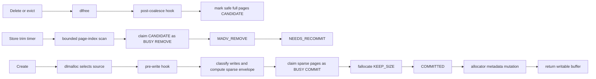
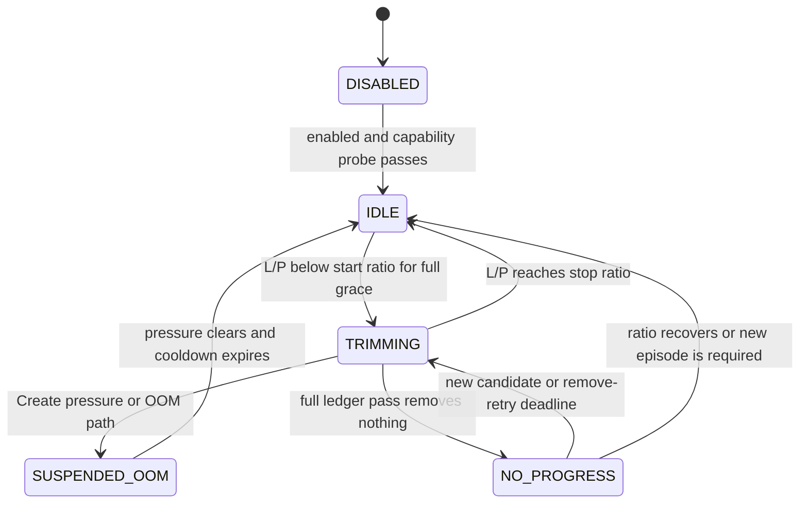

# REP: Reclaim Physical Backing from Free Pages in the Plasma Object Store

## Summary

This REP proposes an opt-in, Linux-only mechanism for returning the physical
backing of free pages in the Plasma object store's primary shared-memory arena.
Today, deleting or evicting a Plasma object calls `dlfree()`: the allocation
becomes logically reusable, but pages that were touched generally remain backed
by tmpfs and continue to consume `/dev/shm` blocks until the arena is destroyed.

The proposal treats reclaim and safe reuse as one protocol. The raylet keeps a
fixed 2-bit state for every primary-arena page. A narrow dlmalloc hook certifies
metadata-safe page interiors after final free-chunk coalescing. A persistent
page-index cursor claims those candidates and calls
`madvise(..., MADV_REMOVE)` in bounded quantums. Before dlmalloc can mutate or
return any possibly sparse range, a second hook synchronously admits every
possibly sparse page in the allocation write set with
`fallocate(FALLOC_FL_KEEP_SIZE)`.

The central invariant is:

> Once this protocol is enabled for an arena, no page may be written by
> dlmalloc or exposed to a Plasma client while its backing is absent or
> uncertain.

If preparation fails, allocation stops before allocator topology is mutated,
before an object-table entry is inserted, and before a client receives a
writable buffer. The virtual mapping, file size, and non-moving object layout
remain intact.

The feature is disabled by default. The initial scope is one normal-page,
tmpfs-backed primary arena on Linux. Fallback allocations, hugetlb arenas,
non-tmpfs mappings, and `preallocate_plasma_memory=true` are excluded. It does
not move live objects, replace spilling or eviction, or increase logical object
store capacity. Enabling it by default is out of scope and would require a
separate REP under the boundary in the Compatibility section.

### General Motivation

#### Current behavior

The Plasma primary arena is a large, unlinked, `MAP_SHARED` file, normally in
`/dev/shm`. Object creation allocates a chunk from the arena and object deletion
returns that chunk to dlmalloc. In upstream Ray commit
[`71df155`](https://github.com/ray-project/ray/commit/71df1551d91571a5fef508b8330f401e90f86170),
the [allocator free path](https://github.com/ray-project/ray/blob/71df1551d91571a5fef508b8330f401e90f86170/src/ray/object_manager/plasma/plasma_allocator.cc#L122-L129)
is:

```cpp
dlfree(allocation.address_);
allocated_ -= allocation.size_;
```

This makes the address range available to a future Plasma allocation, but it
does not punch holes in the tmpfs file. Ray also deliberately rejects partial
`munmap` requests from dlmalloc so that the long-lived primary mapping is not
trimmed piecemeal
([source](https://github.com/ray-project/ray/blob/71df1551d91571a5fef508b8330f401e90f86170/src/ray/object_manager/plasma/dlmalloc.cc#L279-L307)).

As a result, three quantities can diverge substantially in a long-lived,
churn-heavy raylet:

- **Logical live bytes:** payload currently owned by Plasma objects.
- **Process RSS:** pages mapped into a particular process's page tables.
- **Allocated inode backing:** blocks allocated to the primary tmpfs inode,
  measured by `st_blocks * 512`.

Allocated inode backing is not the same as resident DRAM. It is nevertheless
the accounting domain that consumes `/dev/shm` capacity and that
`MADV_REMOVE` can release. For example, a 400 GiB arena may contain only 1 GiB
of live objects while close to 400 GiB of tmpfs blocks remain allocated. The
free chunks are reusable by Plasma, but that capacity cannot be used by
unrelated processes or other tmpfs files.

Sparse backing also creates the other half of the correctness problem.
`ftruncate` establishes the arena's file length without reserving every block,
and `MADV_REMOVE` deliberately makes selected pages sparse again. If tmpfs,
quota, or cgroup capacity is exhausted when dlmalloc or a worker later writes
one of those pages, the write may fail as `SIGBUS`, without returning an errno
to the allocation call. Reclamation therefore requires synchronous backing
admission before allocator mutation and client exposure; relying on a lazy
first-write fault is not acceptable.

[ray-project/ray#53261](https://github.com/ray-project/ray/issues/53261) reports
a closely related long-lived Plasma mapping problem. Configurable jemalloc for
workers ([ray-project/ray#47243](https://github.com/ray-project/ray/pull/47243))
addresses anonymous worker-heap fragmentation, but not Plasma's shared tmpfs
backing. A later, unmerged experiment
([ray-project/ray#62854](https://github.com/ray-project/ray/pull/62854)) used
worker-side `MADV_DONTNEED` to reduce a releasing worker's RSS. That can remove
the worker's page-table entries, but it intentionally leaves the shared tmpfs
data and backing available to other Plasma clients.

This REP addresses a different layer: after Plasma has actually deleted an
object and dlmalloc considers its chunk free, release the inode backing of
allocator-certified pages and safely readmit it before reuse.

#### Target workloads

The primary beneficiaries are long-lived Ray nodes with all of the following:

- large object stores, commonly tens or hundreds of GiB;
- repeated creation, eviction, deletion, and reuse of large immutable objects;
- working sets that can fall far below the arena's historical high-water mark;
- other node workloads that can make productive use of released memory or
  `/dev/shm` capacity.

The proposal is not intended to make a logically full object store accept more
objects. Object spilling and eviction remain responsible for logical capacity.
It is also not live-object compaction: live objects never move, and free regions
separated by live chunks do not become contiguous.

### Should this change be within `ray` or outside?

This change should be within `ray`.

Only Ray can place hooks at dlmalloc's final-coalesce and pre-metadata-write
commit points and order them with Plasma Create, Free, eviction, shutdown, and
error replies. An external process can observe a tmpfs file, RSS, or
`st_blocks`, but it cannot prove page ownership, exclude allocator metadata,
or prevent a sparse page from being mutated before backing admission.

## Stewardship

### Required Reviewers

- [@Kunchd](https://github.com/Kunchd) - Ray Core, raylet, and memory-management
  review.

Additional focused review from Plasma/object-spilling and Linux memory-management
owners is welcome before the proposal leaves draft.

### Shepherd of the Proposal (should be a senior committer)

[@Kunchd](https://github.com/Kunchd) - Ray Core shepherd for this proposal.

## Design and Architecture

### Goals and non-goals

The design has the following goals:

- release allocated tmpfs backing, not only one process's RSS;
- never remove a page containing live object data or required dlmalloc
  metadata;
- admit backing before every possible write to a sparse or uncertain page;
- preserve the arena's virtual mapping and normal non-moving allocation model;
- make scan progress depend on fixed page indices rather than mutable chunk
  topology;
- bound work per Plasma Store turn and give Create/OOM handling priority; and
- fail closed whenever page state or backing is uncertain.

The initial implementation does **not**:

- move live objects or compact the address space;
- replace spilling, eviction, or logical allocation limits;
- reclaim fallback allocations, hugetlb arenas, or non-tmpfs mappings;
- support non-Linux platforms;
- preserve the eager reservation contract of
  `preallocate_plasma_memory=true`;
- pre-fault every admitted page or protect against unrelated truncation,
  foreign hole punching, hardware faults, or every possible source of
  `SIGBUS`; or
- provide a hard wall-clock bound for a kernel `MADV_REMOVE` or `fallocate`
  syscall.

Capability failure before any hole is created may disable the experiment and
leave existing behavior unchanged. Once a page may be sparse, however, the
allocation path remains fail-closed: it must successfully prepare the page or
reject the allocation.

### Architecture overview



Responsibilities are deliberately narrow:

| Component | Responsibility |
|---|---|
| dlmalloc adapter | Invoke a post-coalesce observation hook and a pre-first-write admission hook on every allocation source path. |
| `PlasmaAllocator` | Own the page ledger, summaries, state transitions, bootstrap preparation, and preparation error. |
| `PhysicalPageTrimmer` | Own the persistent normal/retry cursors, apply the logical/backing policy, and run a bounded remove quantum. |
| `PlasmaStore` | Serialize Create/Free/trim, prioritize Create and OOM recovery, translate preparation errors, and stop callbacks before shutdown. |

V1 does not add an allocator-mutating worker thread. One small synchronous trim
quantum runs in the existing Store callback and posts at most one successor.

### Exact accounting domain

The controller compares quantities from the same primary arena:

- `L` is logical live bytes allocated from the primary arena;
- `P` is `fstat(primary_fd).st_blocks * 512`; and
- `ratio = L / P` when `P > 0`; `P = 0` means there is no measured backing to
  reclaim and the controller does not divide.

If the allocator exposes only aggregate logical bytes, then
`L = allocated_bytes - fallback_allocated_bytes`. Fallback files are excluded
from both numerator and denominator. The controller samples the actual primary
file descriptor rather than rediscovering the unlinked file by path.

`P` is filesystem block accounting. It is neither process RSS nor guaranteed
resident DRAM. Successfully advised bytes and the observed decrease in `P`
are reported separately because delayed filesystem accounting or an already
sparse range can make them differ.

The ratio decides **when** to reclaim. It never decides **which** page is safe;
only allocator hooks and the page ledger establish that.

### Allocator hooks and the fixed page-state ledger

The allocator stores one 2-bit state for every 4 KiB primary-arena page. The
packed numeric values are an implementation detail, not a compatibility
contract:

| State | Meaning |
|---|---|
| `COMMITTED` | No known hole risk. The page may be live, protected metadata, or conservatively tracked free space. |
| `CANDIDATE` | A backed page certified as a metadata-safe interior of a current free chunk. |
| `NEEDS_RECOMMIT` | The page is initially sparse, removed, or may have been removed; it must be admitted before any write. |
| `BUSY` | The page belongs to an in-flight REMOVE or COMMIT operation descriptor. |

With 4 KiB pages, the ledger costs about 1.875 MiB for a 30 GiB arena,
6.25 MiB for 100 GiB, and 64 MiB for 1 TiB. A coarse 2 MiB region summary may
cache candidate occupancy to skip empty words; it cannot override per-page
truth. The same fixed region table also carries one required transient-retry
bit per region (about 6.25 KiB for 100 GiB or 64 KiB for 1 TiB), so retry
provenance never grows with the number of failures.

Allowed transitions are:

```text
COMMITTED       --post-free certification--> CANDIDATE
CANDIDATE       --claim REMOVE-------------> BUSY
BUSY            --REMOVE may have run------> NEEDS_RECOMMIT
BUSY            --initial REMOVE not run---> CANDIDATE
BUSY            --retry REMOVE not run-----> NEEDS_RECOMMIT
CANDIDATE       --allocation cancels trim--> COMMITTED
NEEDS_RECOMMIT  --claim COMMIT-------------> BUSY
NEEDS_RECOMMIT  --deferred REMOVE retry----> BUSY
BUSY            --fallocate succeeds-------> COMMITTED
BUSY            --fallocate fails----------> NEEDS_RECOMMIT
```

The safety asymmetry is intentional. A false positive for
`NEEDS_RECOMMIT` causes an extra `fallocate`; a false negative can cause
`SIGBUS` and is forbidden. Metrics, `st_blocks`, and an observed zero-filled
page never downgrade `NEEDS_RECOMMIT` to `COMMITTED`.

`NEEDS_RECOMMIT` is also a quarantine: bootstrap and REMOVE may assign it only
to data pages that are safe from allocator/client writes. Such a page remains
free until allocation admission changes it to `COMMITTED`, which is why a
bounded deferred REMOVE retry may safely re-examine this state.

Each `BUSY` range has an owner descriptor
`{kind, begin_page, end_page, operation_id}`. Only that owner, or its RAII
cleanup on every exit path, may finalize the range. The V1 Store serialization
means contention should be rare, but this ownership rule is required before
any future asynchronous implementation.

A timeout or non-owner must not guess a stable state for `BUSY`. If completion
ownership is lost while the process remains alive, the range stays quarantined
and overlapping allocation fails closed. A raylet process exit needs no
persistent recovery: the unlinked arena fd, VMA, ledger, and operation state are
destroyed together.

### Sparse bootstrap

The primary file is sparse after `ftruncate`, so the page ledger cannot be
initialized optimistically as entirely `COMMITTED`. Bootstrap follows this
order:

1. validate tmpfs, page geometry, `MADV_REMOVE`, and
   `FALLOC_FL_KEEP_SIZE` support before enabling removal;
2. identify and synchronously reserve the complete write set used to construct
   the initial dlmalloc segment and install the hooks;
3. permanently classify allocator control pages as `COMMITTED`;
4. initialize every remaining unproven data page as `NEEDS_RECOMMIT`; and
5. enable trimming only after the pre-write hook covers every allocation source
   path.

The bootstrap write set is a semantic allocator contract, not merely the first
and last raw file pages. It includes the initial segment header, the actual
`init_top` trailing header and `TOP_FOOT` placement, and any first-split
metadata write that can occur before the normal pre-write hook takes control.
The implementation must prove this with source assertions and a capacity-
constrained Linux test. Inferring safe initialization from `st_blocks` is not
allowed.

An environment rejected by the pre-bootstrap capability gates remains on the
existing non-trimming path. Once an explicitly requested trim mode begins page
classification and backing admission, however, bootstrap failure aborts Store
startup. It must not silently fall back to lazy faults or drop the admission
hook after establishing sparse-page state.

### Free path: certify reclaim candidates

The post-free hook runs under the allocator mutation gate, after dlmalloc has
finished all forward/backward coalescing and written the final free-chunk
metadata. It receives the final free interval and excludes every byte that may
contain a chunk header, free-list link, footer, boundary tag, segment marker, or
other allocator-owned word.

Only complete pages in the safe interior are eligible:

```text
safe_begin = AlignUp(chunk_begin + required_leading_metadata, page_size)
safe_end   = AlignDown(chunk_end - required_trailing_metadata, page_size)
```

For `[safe_begin, safe_end)`, `COMMITTED` pages become `CANDIDATE`.
`NEEDS_RECOMMIT` pages remain `NEEDS_RECOMMIT`; freeing an allocation does
not prove that a previously removed page has backing. Pages shared with live
payload or allocator metadata remain `COMMITTED`.

Free performs no synchronous `MADV_REMOVE`. Ledger marking still scales with
the safe page/word span and must be benchmarked, but it avoids size-dependent
kernel hole-punch work and lets policy coalesce adjacent candidates.

### Trim path and topology-independent bounded progress

The controller starts only after `L/P < 0.50` continuously for 30 seconds and
stops when `L/P >= 0.60`. While trimming, one Store turn:

1. enters the allocator mutation gate and yields immediately if Create/OOM
   work has priority;
2. resamples `L` and `P`;
3. scans the fixed page-state array from a persistent `page_cursor`;
4. claims contiguous `CANDIDATE` runs as `BUSY/REMOVE`, capped at 4 MiB;
5. calls `MADV_REMOVE` and finalizes the states described below;
6. advances the cursor past every inspected range, including failed ranges; and
7. stops when either 128 MiB worth of page indices has been inspected,
   128 MiB has been advised, 32 remove calls have been attempted, the soft
   10 ms deadline is reached, a state transition occurs, or Create pressure
   appears, then returns control to the event loop.

No raw dlmalloc pointer, chunk offset, or topology generation is retained across
turns. Allocations and frees update page states but never reset the page cursor.
Here `B = plasma_physical_trim_quantum_bytes / page_size` (32,768 pages with
the proposed defaults) is a maximum per-turn scan budget. A full pass completes
after cumulative inspected pages reach `N`, because no allocator mutation
erases cursor progress. If every turn consumes `B`, that is `ceil(N / B)`
turns; the soft deadline, a state transition, or Create/OOM suspension can end a
turn earlier, so the design does not claim an unconditional turn-count bound.
This is a bounded-progress **mechanism**, not a guarantee that every free page
is reclaimed: an adversarial workload may reuse a candidate before removal.

After a complete ledger pass with no removable page, the controller enters
`NO_PROGRESS` instead of spinning. A new certified candidate, a new low-ratio
episode, or a pending remove-retry deadline wakes it. No topology-prefix
reconstruction, generation reset, normal/catch-up pass pair, or unbounded
rescanning policy is part of this design.

### Allocate path: transactional pre-write backing admission

Performing admission after `dlmalloc` returns is too late: depending on the
source path, dlmalloc may unlink a bin entry, update headers, split a remainder,
write boundary tags, or update the designated-victim/top chunk before returning
the user pointer.

Every small-bin, tree-bin, designated-victim, and top-chunk source path therefore
calls the preparation hook after selecting the source interval but before its
first metadata mutation. The hook first enumerates the complete mutation write
set and partitions it:

- process-local allocator state is outside the primary file;
- non-local bin/tree neighbor nodes and other allocator metadata inside the
  primary mapping must already be on protected `COMMITTED` pages; and
- source-local pages that can legally be `CANDIDATE` or `NEEDS_RECOMMIT` form
  the page-aligned **sparse-capable allocation envelope**.

The sparse-capable envelope includes:

- the allocated chunk header and alignment padding that will be written;
- chunk-local free-list or split bookkeeping inside the primary arena;
- a split remainder's header and trailing boundary tag;
- object data, object metadata, and the mutable Plasma header exposed to the
  client; and
- any adjacent allocator word that the selected path writes before returning.

Process-local allocator state such as bin roots or `malloc_state` must also wait
until admission succeeds, but its addresses do not enter the file envelope.
Likewise, distant free-node links are not allowed to expand one small allocation
into an arena-spanning `fallocate`: the ledger invariant permanently excludes
their metadata pages from `CANDIDATE` and `NEEDS_RECOMMIT`. Before mutation, the
hook asserts that every primary-arena write target is either a protected
`COMMITTED` metadata page or part of the sparse-capable envelope; an unclassified
target fails closed as an invariant error.

Untouched tail bytes of the source free chunk are excluded. For pages in the
envelope:

1. `CANDIDATE` is canceled to `COMMITTED`;
2. `BUSY/REMOVE` is waited on or retried under the ownership protocol;
3. all `NEEDS_RECOMMIT` pages are claimed as `BUSY/COMMIT`;
4. if any backing is required, one
   `fallocate(FALLOC_FL_KEEP_SIZE)` covers the minimum-to-maximum page range of
   the sparse-capable envelope; and
5. only after success are all envelope pages made `COMMITTED` and dlmalloc
   allowed to cross its mutation point.

On failure, RAII cleanup restores every page to its pre-admission state
(`CANDIDATE` stays a reclaim candidate and sparse pages return to
`NEEDS_RECOMMIT`), allocator topology remains unchanged, no buffer or
object-table entry is exposed, and the Create request receives a typed error.
The implementation must not retry this failure through GC, spill, or a fallback
allocation whose semantics would hide the backing admission failure.

`fallocate` reserves blocks for the admitted tmpfs range at that moment. It
does not pre-fault worker PTEs, and it cannot protect against a later foreign
truncate or hole punch. Those limitations do not weaken the allocator invariant
within Ray's ownership boundary.

### Trigger policy and state machine



`DISABLED` describes the trim controller. If a fatal trim error occurs after
holes may exist, new removal is fused off, but page-state tracking and allocation
admission remain active until the arena is destroyed. They must never be disabled
merely because the trim controller is disabled.

`SUSPENDED_OOM` gives Create, spill, and eviction recovery priority and applies
a one-second cooldown after pressure clears. `NO_PROGRESS` prevents hot
polling, but a pending transient remove-retry pass uses its own bounded backoff
and does not require a new Free operation to make progress.

### Bounded execution, concurrency, and shutdown

Each quantum is bounded by:

- at most 128 MiB worth of ledger pages inspected;
- at most 128 MiB successfully advised;
- at most 32 REMOVE syscall entries, counting retries, as an independent V1
  attempt cap;
- at most 4 MiB in one `MADV_REMOVE` call; and
- a 10 ms soft wall-clock budget checked between calls.

The deadline is soft because a running kernel syscall is not interruptible by
the controller. PoC-A therefore informs the 4 MiB cap, while real Store Create
latency remains an acceptance measurement.

V1 accesses the ledger in the same external serialization domain as allocator
mutation and therefore does not require an independently acquired page-state
mutex. If a dedicated state lock is used or later introduced, the mandatory
lock order is:

```text
allocator mutation gate -> page-state lock
```

V1 performs REMOVE and COMMIT synchronously while allocator mutation is
excluded. The callback checks already queued Create pressure before starting a
turn. Because new event-loop requests are not observable inside that synchronous
turn, the independent budgets bound their delay; the callback then returns and
posts at most one successor. Shutdown first prevents new quantums, then waits
for the current synchronous turn before destroying the allocator, file
descriptor, page ledger, or Store callbacks.

Any future syscall offload must preserve explicit range ownership, quarantine
`BUSY` ranges from allocator reuse, cancel or join work at shutdown, and prove
the same lock order. It is not an implementation detail that can be added
without revisiting the concurrency proof.

### `MADV_REMOVE` and remove-retry semantics

On a writable shared tmpfs mapping, Linux documents `MADV_REMOVE` as punching a
hole in the underlying file while preserving the VMA and file length. A later
read returns zero and a later write allocates backing again
([`madvise(2)`](https://man7.org/linux/man-pages/man2/madvise.2.html)).

If the syscall succeeds, is interrupted after entry, returns a result with
partial/unknown effect, or otherwise may have reached the kernel, every page in
the issued range becomes `NEEDS_RECOMMIT`. Only an error proven to occur before
syscall entry may restore `CANDIDATE`. Allocation admission therefore remains
safe even when reclaim accounting is ambiguous.

A transient `EAGAIN` must not strand the last candidates in
`NO_PROGRESS`. Immediate retries are finite. If they are exhausted while
reclaim remains eligible, V1 sets the fixed retry bits for the 2 MiB regions
overlapping the failed range and schedules a bounded retry pass after capped
backoff, even if no Allocate or Free occurs. A persistent region/page retry
cursor visits only marked regions, claims their `NEEDS_RECOMMIT` pages as
`BUSY/REMOVE`, rechecks safety under the allocator gate, and applies the same
scan, advice, call-count, range, and time budgets as a normal turn.

An overlapping allocation recommits only its envelope to `COMMITTED` and does
not clear a region retry bit. The retry pass skips those committed pages while
preserving and visiting every non-overlapping `NEEDS_RECOMMIT` tail. After a
marked region is fully inspected without a new transient failure, its bit is
cleared; another `EAGAIN` leaves it set and schedules another capped-backoff
pass. Coarse regions can cause bounded redundant REMOVE work inside an affected
2 MiB region, but one failure cannot trigger an arena-wide rescan. Page safety
continues to come from `NEEDS_RECOMMIT`, not from retry metadata.

### Environment gates and error handling

The experiment is eligible only when all of the following are true:

- Linux with 4 KiB normal pages and `MADV_REMOVE`;
- one writable `MAP_SHARED`, tmpfs-backed primary arena identified by its fd;
- no huge pages and `preallocate_plasma_memory=false`;
- a successful non-destructive capability probe for the required
  `FALLOC_FL_KEEP_SIZE` behavior; and
- valid, non-overflowing ratio, alignment, byte, and timing configuration.

An unsupported environment discovered before removal logs the reason and leaves
the trimmer disabled without preventing raylet startup.

For REMOVE, `EINTR` and `EAGAIN` use finite immediate retry. A still-transient
result is deferred to the bounded retry pass above. Any range that may have
entered the kernel remains `NEEDS_RECOMMIT`. Permanent errors fuse new trimming,
increment an errno-labeled metric, and preserve admission.

For allocation admission:

- `EINTR` retries the same sparse-capable envelope a finite number of times;
- `ENOSPC` and `EDQUOT` map to a backing-store-capacity status and the
  ordinary Object Store full error seen by `ray.put`;
- every other errno, including `ENOMEM`, maps to a distinct backing-store
  error and the existing unexpected-error path; and
- no error permits allocator mutation, buffer exposure, object-table insertion,
  GC/spill retry, or fallback allocation.

`ENOMEM` remains distinct because it does not unambiguously identify tmpfs or
quota capacity exhaustion. Reclassifying it as Object Store full requires
portable kernel evidence and is not implied by this REP.

`EOPNOTSUPP` or `ENOSYS` found by the startup probe disables the experiment.
If an invariant, fd, or range error such as `EINVAL`, `EBADF`, or `EFBIG`
appears after holes may exist, the trimmer is fused and allocations remain
fail-closed. Task-return propagation follows the existing wrapped Object Store
error path; uniform propagation through every object-transfer path is a
separate completion criterion and is not claimed here.

### Configuration

The initial configuration is internal, experimental, and disabled by default.

| Ray configuration | Default | Meaning |
|---|---:|---|
| `plasma_physical_trim_enabled` | `false` | Enable the trimmer after environment and bootstrap validation. |
| `plasma_physical_trim_start_ratio` | `0.50` | Start eligibility when `L/P` is strictly below this value. |
| `plasma_physical_trim_stop_ratio` | `0.60` | Stop when `L/P` reaches this value. |
| `plasma_physical_trim_low_ratio_grace_ms` | `30000` | Required continuous low-ratio period. |
| `plasma_physical_trim_check_interval_ms` | `1000` | Idle, suspended, retry, and no-progress polling interval. |
| `plasma_physical_trim_quantum_bytes` | `128 MiB` | Maximum scan/advice work per Store turn. |
| `plasma_physical_trim_syscall_bytes` | `4 MiB` | Maximum range per `MADV_REMOVE` call. |
| `plasma_physical_trim_quantum_time_ms` | `10` | Soft scan/syscall time budget per turn. |
| `plasma_physical_trim_min_yield_ms` | `0` | Minimum delay before posting the next trim turn. |
| `plasma_physical_trim_oom_resume_cooldown_ms` | `1000` | Cooldown after Create pressure clears. |

Validation requires page-aligned byte limits,
`page_size <= syscall_bytes <= quantum_bytes`,
`0 < start_ratio < stop_ratio <= 1`, and non-overflowing timing values.
V1 also enforces an internal cap of 32 REMOVE syscall entries per turn. That
number matches `quantum_bytes / syscall_bytes` for contiguous default-size
ranges, but it is enforced independently because fragmented candidates and
`EINTR` retries can produce more calls without exhausting the byte budget.

### Observability

The final implementation must separate policy, page truth, requested work,
observed reclaim, and allocation admission:

| Metric family | Purpose |
|---|---|
| Primary logical/backing bytes and `L/P` | Report the controller inputs for the exact primary fd. |
| Ledger storage, page states, and region summaries | Report ledger/region bytes; count `COMMITTED`, `CANDIDATE`, `NEEDS_RECOMMIT`, `BUSY`, and retry-marked regions; expose summary hits and conservative false positives. |
| Scanned pages/words, cursor, full-ledger passes, and `NO_PROGRESS` | Compare each turn with `B`, report quantums per pass, and demonstrate topology-independent bounded inspection. |
| Advised versus observed-reclaimed bytes | Keep requested `MADV_REMOVE` work separate from `st_blocks` change. |
| Quantum/REMOVE counts, ranges, errno, total duration, and maximum call duration | Expose all four budgets, amplification, retries, and serialized stalls. |
| Whole-envelope `fallocate` calls, bytes, errno, repeated prepares, total duration, and maximum call duration | Expose backing-admission cost, redundancy, and failure. |
| Create p50/p99/p999/max latency | Measure end-to-end user-visible impact rather than inferring it from syscall timing. |

The existing aggregate `object_store_physical_bytes` remains an observation
metric for compatibility, but it is not the denominator because it may include
fallback files. High-cardinality operation ids and page offsets remain in
debug/test telemetry, not exported labels.

### Alternatives and prior art

#### Worker-side `MADV_DONTNEED`

The experiment in [ray-project/ray#62854](https://github.com/ray-project/ray/pull/62854)
is complementary. It can reduce page-table residency in a worker that releases
an object while preserving shared data for other clients. It cannot remove the
tmpfs inode backing. This REP acts after allocator-level deletion.

#### Synchronous removal in every Free

Removing each object's pages directly in Free puts potentially large syscall
work on deletion, performs poorly for rapid reuse, and observes object payload
boundaries rather than the allocator's final coalesced free interval. The
post-free hook records candidates cheaply; the controller later removes them
under hysteresis and byte limits.

#### Cross-quantum dlmalloc chunk cursor

An earlier design resumed a dynamic chunk walk with a target offset, validation
offset, and topology generations. Backward coalescing can invalidate a retained
chunk, so each generation change had to reconstruct an unbounded prefix.
PoC-B demonstrates cadence-1 deep-cursor starvation, and PoC-C demonstrates
advice amplification when each Free generation restarts a pass. Raw dirty
offsets and stale chunk pointers are unsafe; one normal pass plus a delayed
catch-up pass only bounds amplification and does not provide topology-
independent inspection progress.

The fixed page ledger and page-index cursor replace that design. PoC-B and
PoC-C remain regression inputs, not validation of the replacement.

#### `dlmalloc_trim` or partial `munmap`

Generic heap trimming is principally useful for a top chunk or detachable
segments. Plasma maintains a stable shared primary mapping and rejects partial
fake-`munmap` requests. It also needs to release interior free pages separated
by live chunks. Hole punching retains the mapping and handles those pages.

#### Rely only on spilling or eviction

Spilling and eviction make objects logically removable, which ultimately calls
`dlfree`, but the primary tmpfs backing remains. They solve logical capacity
and durability, not this physical high-water mark.

#### Replace dlmalloc or move live objects

An extent-based allocator could make page ownership cheaper, and object
relocation could address fragmentation. Either change affects shared-memory
layout, raw client pointers, and object lifetime substantially. This REP adds a
conservative protocol to the existing non-moving allocator.

#### Related allocator designs

- glibc's [`malloc_trim`](https://man7.org/linux/man-pages/man3/malloc_trim.3.html)
  releases complete pages inside free heap regions while preserving allocator
  metadata.
- [Cxlalloc](https://www.cs.utexas.edu/~witchel/pubs/ni26asplos-cxlalloc.pdf)
  keeps cross-process mappings while using `MADV_REMOVE` when whole slabs are
  globally free.
- [TCMalloc adaptive subrelease](https://research.google/pubs/adaptive-hugepage-subrelease-for-non-moving-memory-allocators-in-warehouse-scale-computers/)
  demonstrates delayed, demand-aware release to avoid reclaim/refault churn.

## Compatibility, Deprecation, and Migration Plan

There is no user-facing Python API, object-id format, shared-memory layout, or
logical-capacity change. Existing clusters retain current behavior because the
feature defaults to off. Fallback allocation and spilling behavior are unchanged
when trimming is disabled.

Enabled mode requires an internal Plasma reply-status extension for backing
admission failure. `ENOSPC` and `EDQUOT` surface through the ordinary Object
Store full path; other backing errors remain distinct. Raylet and Plasma clients
are deployed as one Ray version, so this internal protocol extension does not
promise mixed-version compatibility.

The rollout is:

1. merge allocator hooks, page ledger, controller, Store integration, protocol,
   metrics, and tests with reclaim disabled by default;
2. document the feature as experimental and Linux/tmpfs-only;
3. canary it only on normal-page primary arenas with
   `preallocate_plasma_memory=false` and monitored tmpfs headroom;
4. compare Create latency, backing, reclaim/recommit churn, capacity errors,
   `SIGBUS`/OOM, and object correctness against control nodes; and
5. treat any default change as a separate REP.

Disabling the configuration and restarting the raylet restores the existing
non-trimming behavior on the newly created arena; the previous unlinked arena
is destroyed with the old process. Within a running arena, however, fusing or
disabling the trim controller must not disable admission for holes that may
already exist.

`preallocate_plasma_memory=true` is intentionally incompatible. Preallocation
exists to reserve backing up front and reduce later allocation-fault failure
([current source](https://github.com/ray-project/ray/blob/71df1551d91571a5fef508b8330f401e90f86170/src/ray/object_manager/plasma/dlmalloc.cc#L179-L189));
punching holes would revoke that guarantee while claiming the option remains
active.

### Default-on boundary

This REP approves only a default-off, opt-in experiment. The bounded page cursor
and pre-write backing admission are part of the proposed V1 design; they are no
longer deferred prerequisites.

A separate default-on REP requires evidence from the final implementation:

- allocator fault injection and a complete bootstrap write-set proof;
- cadence-1 200K/500K/1M bounded page-cursor tests;
- real Store churn and Create tail-latency measurements;
- active high-fanout mapper results on non-oversubscribed hosts;
- pressure, refault, capacity-exhaustion, OOM, and `SIGBUS` tests;
- shutdown and complete task/object-transfer error propagation;
- disabled-mode performance parity; and
- production canaries on supported kernels and cgroup modes.

Zero feature-induced `SIGBUS` in tests and canaries is necessary evidence, not
a proof against unrelated faults. The default-on decision must publish the
measured safety and latency boundary rather than infer it from standalone PoCs.

## Test Plan and Acceptance Criteria

### Reproducible evidence boundary

An early standalone prototype reported reclaiming roughly 24 GiB of tmpfs
backing from a 36 GiB arena at about 12 GiB/s with retained-object validation.
Its source, raw output, and complete host environment were never published, and
it quarantined objects before `dlfree`. This REP records it only as the origin
of the investigation and does not rely on it as evidence.

Three focused public PoCs are available at immutable artifact commit
[`a2af81b`](https://github.com/wuxueyang96/enhancements/commit/a2af81b5a7b045638b9895eba994385230cfea74),
with build and run instructions in
[`README.md`](https://github.com/wuxueyang96/enhancements/blob/a2af81b5a7b045638b9895eba994385230cfea74/poc_plasma_reclaim/README.md).
The authoritative result set is
[`results/latest/`](https://github.com/wuxueyang96/enhancements/tree/a2af81b5a7b045638b9895eba994385230cfea74/poc_plasma_reclaim/results/latest),
including commands, environment, manifests, source hashes, and checksums.

PoC-A is an independent C harness for the syscall. PoC-B and PoC-C use a
file-backed dlmalloc mspace and reproduce the **superseded chunk-cursor and
controller algorithms**. They do not test the proposed 2-bit page ledger,
pre-write dlmalloc hook, whole-envelope recommit, PlasmaStore ordering,
CreateRequestQueue, protocol errors, shutdown, or real Create latency.

The published results come from one Linux 5.15 x86_64 host with 32 available
CPUs, one NUMA node, 4 KiB pages, tmpfs `/dev/shm`, shmem THP set to
`never`, and zero memory PSI during PoC-A. They select initial parameters and
reject old mechanisms; they do not establish production readiness.

### Focused PoC results

#### PoC-A: `MADV_REMOVE` latency versus present PTEs

`poc_a_hole_punch_latency.c` varies extra mappings `M`, mappings with present
PTEs `P`, parked/active clients, and advice size. Each published cell used
three randomized rounds with 32 warmups and 1,024 samples per round. Every
sample observed an `st_blocks` decrease and zero-fill, with no syscall,
backing, or validation failures. The aggregate is
[`poc_a_summary.csv`](https://github.com/wuxueyang96/enhancements/blob/a2af81b5a7b045638b9895eba994385230cfea74/poc_plasma_reclaim/results/latest/poc_a_summary.csv).

| M | P | Mode | Range | Mean p50 | Mean p99 | p50 throughput |
|---:|---:|---|---:|---:|---:|---:|
| 64 | 0 | parked | 4 MiB | 0.271 ms | 0.336 ms | 14,790 MiB/s |
| 256 | 0 | parked | 4 MiB | 0.305 ms | 0.423 ms | 13,106 MiB/s |
| 8 | 8 | parked | 4 MiB | 0.737 ms | 0.788 ms | 5,426 MiB/s |
| 32 | 32 | parked | 4 MiB | 1.713 ms | 1.781 ms | 2,335 MiB/s |
| 64 | 64 | parked | 4 MiB | 2.967 ms | 3.055 ms | 1,348 MiB/s |
| 64 | 64 | parked | 16 MiB | 11.772 ms | 12.186 ms | 1,359 MiB/s |

The number of present PTEs dominates mapping count. At `P=64`, increasing the
range from 4 MiB to 16 MiB improves p50 throughput by less than 1% while raising
mean p99 from 3.055 ms to 12.186 ms. This supports a 4 MiB initial cap. It does
not measure complete Store Create p99, and high-fanout active mappings on a
non-oversubscribed host remain unmeasured.

#### PoC-B: superseded chunk-cursor liveness evidence

`poc_b_cursor_rebuild.cc` places a known free range behind a large prefix of
live 512-byte objects, then mutates the allocator topology at a configured
cadence while the old scanner reconstructs its validation prefix.
[`poc_b_summary.csv`](https://github.com/wuxueyang96/enhancements/blob/a2af81b5a7b045638b9895eba994385230cfea74/poc_plasma_reclaim/results/latest/poc_b_summary.csv)
reports:

| Live prefix objects | Cadence | Mutation phase | Same-cursor recovery |
|---:|---:|---|---|
| 200K | 0 (stable control) | reached in 3 quantums | not needed |
| 200K | 8 | reached in 3 quantums | not needed |
| 200K | 4 | reached in 3 quantums | not needed |
| 200K | 2 | reached in 4 quantums | not needed |
| 200K | 1 | not reached in 4,000 quantums | reached in 2 quantums |
| 500K | 0 (stable control) | reached in 8 quantums | not needed |
| 500K | 1 | not reached in 400 quantums | reached in 7 quantums |
| 1M | 0 (stable control) | reached in 15 quantums | not needed |
| 1M | 1 | not reached in 400 quantums | reached in 15 quantums |

This is a mechanism-level liveness failure of the old generation-reset cursor,
not a live-data corruption result. Stable controls reach the target quickly;
cadence-1 mutation repeatedly discards prefix progress. The proposed 2-bit
ledger does not use this mechanism. PoC-B is therefore a rejection test and a
scale input for new bounded-page-cursor tests, not validation of the proposed
implementation.

#### PoC-C: superseded controller amplification evidence

`poc_c_active_trim_churn.cc` drives the old standalone chunk scanner and
controller against a real file-backed mspace for 2,500 quantums, with eight
small Allocate/Free operations per turn and retained-object checksums. Raw
telemetry is published as
[`poc_c.csv`](https://github.com/wuxueyang96/enhancements/blob/a2af81b5a7b045638b9895eba994385230cfea74/poc_plasma_reclaim/results/latest/poc_c.csv)
and
[`poc_c.log`](https://github.com/wuxueyang96/enhancements/blob/a2af81b5a7b045638b9895eba994385230cfea74/poc_plasma_reclaim/results/latest/poc_c.log).

Live checksums passed through 10,000 cross-turn validations. Backing remained
about 260 MiB after `dlfree`, then fell from 272,646,144 to 4,460,544 bytes.
The old controller observed 2,499 topology changes and resets:

| Phase | Advised | Observed drop | Arena-end arrivals |
|---|---:|---:|---:|
| Active churn, 2,500 quantums | 9,995.2 MiB | 267.8 MiB summed, about 255.4 MiB net | 17 |
| Post-churn drain | 1,019.5 MiB | about 0.3 MiB | 2 |

With the deliberate `stop_ratio=0.95`, repeated generation resets produced
about 17 passes, an advised-to-net-reclaimed ratio near 39x, and 1,409 turns
with advice but no observed backing drop. This motivates rejecting
unconditional rescans; it does not validate the replacement. The proposed page
cursor has no topology-reset catch-up policy, and PoC-C does not test ledger
transitions, bootstrap safety, transient retry, or transactional recommit.

### Required automated tests

The architecture above is the normative target, not an assertion that a current
implementation already satisfies every transition. In particular, complete
bootstrap coverage, COMMIT ownership/cleanup, transient REMOVE retry without a
new Free, the independent quantum budgets, and the expanded admission/ledger
metrics below are merge criteria until demonstrated on the final head.

Before merge, the final implementation must include:

1. **Ledger and controller tests:** all four states, packed-word boundaries,
   summary maintenance, claim/finalize and RAII cleanup, cursor wrap, ratio
   hysteresis, OOM suspension, Create priority, full-pass `NO_PROGRESS`, and a
   reference oracle proving `CANDIDATE` is always a metadata-safe current free
   page.
2. **Allocator hook tests:** small-bin, tree-bin, designated-victim, and top
   allocation sources; exact-page boundaries; alignment; split, forward
   coalesce, and backward coalesce; headers, boundary tags, mutable Plasma
   metadata, and the exact sparse-capable allocation envelope. Small/tree-bin
   unlink tests must prove distant neighbor-node metadata stays `COMMITTED` and
   does not expand a small allocation's `fallocate` range.
3. **Bootstrap fault tests:** under a restricted tmpfs/quota, cover the actual
   `init_top` trailing header, `TOP_FOOT`, hook installation, and first split
   write set. Prove no bootstrap write can `SIGBUS` before admission is active,
   and prove that a non-4-KiB system page size is rejected before sparse-state
   tracking begins in the initial V1 scope.
4. **REMOVE fault tests:** no-call, success, partial/unknown effect, `EINTR`,
   `EAGAIN`, and permanent errors. A final-candidate `EAGAIN` case must retry
   within a bound without any intervening Allocate or Free, while overlapping
   allocation still forces recommit before mutation. Repeated partial overlaps
   must preserve retry progress for every non-overlapping tail without growing
   dynamic retry metadata.
5. **Admission fault tests:** mixed committed/sparse envelopes and injected
   `EINTR`, `ENOSPC`, `EDQUOT`, `ENOMEM`, `EOPNOTSUPP`, and invariant
   errors. Assert that failure leaves topology unchanged, exposes no buffer,
   inserts no object, performs no GC/spill/fallback retry, and returns the
   intended protocol/Python error.
6. **Bounded-progress tests:** reuse the 200K/500K/1M cadence-1 layouts and prove
   every full bitmap pass stays within its theoretical page/word scan budget,
   without topology reset or stale pointer access.
7. **Linux end-to-end tests:** on real tmpfs, show `dlfree` alone does not
   materially reduce `st_blocks`; trim lowers backing; neighboring live
   checksums survive; a removed range is admitted, written, read, and freed
   again; and capacity exhaustion returns an ordinary error instead of
   `SIGBUS`.
8. **Store, protocol, shutdown, and metrics tests:** task deduplication, Create
   queue priority, OOM suspend/resume, disconnect/error completion, internal
   reply encoding, task error wrapping, no dangling callback, advised versus
   observed bytes, state counts, errno, and duration distributions.

These are acceptance criteria, not claims about an in-progress implementation.
All required checks must pass on the final implementation head. Source-level
test presence, author-reported local runs, and the standalone PoCs do not
substitute for final CI execution.

### Required stress and performance validation

Before broad enablement, Linux validation must cover:

- mixed sizes from sub-page objects through multi-GiB objects;
- hundreds-of-GiB arenas with continuous allocation/free/reuse churn;
- continuous successful small Creates while the ratio stays low;
- high-fanout active mappers on non-oversubscribed hosts;
- Create OOM, spilling, fallback allocation, disconnect, and restart;
- unrelated tmpfs/cgroup pressure, refault, recommit, and quota exhaustion;
- repeated enable/disable and shutdown while callbacks are pending; and
- all supported production kernel families and cgroup modes.

Acceptance requires:

- no live/reallocated-object corruption and no feature-induced `SIGBUS`;
- no false-negative ledger state or write before successful admission;
- bounded page-cursor inspection under cadence-1 topology churn;
- transient remove retries to progress without a new allocator mutation;
- physical backing to move toward the stop ratio when certified backed free
  pages exist, otherwise enter `NO_PROGRESS` without spinning;
- every syscall and Store turn to respect scan, advice, call-count, range, and
  soft-time budgets at their documented boundaries;
- a sustained Create storm to show Create priority and no event-loop starvation;
- disabled-mode Create/Delete/eviction performance to remain within benchmark
  noise; and
- publication of enabled-mode Create p50/p99/p999/max, reclaim throughput,
  recommit/refault cost, advice amplification, error outcomes, and canary data.

## Risks

### Allocator-hook and bootstrap maintainability

The two hooks sit at allocator commit points that can change when vendored
dlmalloc is upgraded. Missing an allocation source's first metadata write, a
final coalesce exclusion, or the real bootstrap write set breaks the safety
invariant. Hooks must remain narrow, be documented beside each mutation point,
and be covered by source assertions and allocator-path tests.

### Page-ledger false negatives

A page incorrectly marked `COMMITTED` or `CANDIDATE` can be written without
backing admission or removed while live. Uncertain initialization and syscall
results therefore move toward `NEEDS_RECOMMIT`; only allocator-certified
events move away from it. Conservative false positives cost extra
`fallocate`, which is preferable to `SIGBUS`.

### Synchronous tail latency

`MADV_REMOVE` invalidates PTEs in every process mapping the range, and both
REMOVE and whole-envelope `fallocate` can exceed the soft Store deadline.
Range caps, Create priority, per-call maximum metrics, real Create tail
benchmarks, and canaries limit and expose this risk; they cannot hard-bound one
kernel call.

### Recommit contention and capacity

Another process may consume capacity after Plasma releases it. The intended
outcome is a typed admission failure before allocator mutation or client
exposure, not a speculative worker/raylet write followed by `SIGBUS`.
This guarantee covers Ray-owned trim and reuse; foreign truncation, foreign hole
punching, hardware faults, and external writes remain outside the ownership
model.

### Transient remove ambiguity

A syscall may have partially removed a range even when it returns an error.
Treating every possibly issued range as `NEEDS_RECOMMIT` preserves safety, but
a bounded retry pass is required to avoid silently losing reclaim liveness. Its
fixed region bitmap/cursor, capped cadence, partial-overlap behavior, and
interaction with allocation must be observable and tested without relying on a
new Free generation.

### Conservative reclaim and fragmentation

Pages containing headers, boundary tags, small objects, or mixed live/free
content remain backed. A low logical/physical ratio therefore does not imply
enough candidate pages to reach the stop ratio. The controller reports
`NO_PROGRESS` and stops rather than scanning indefinitely; this feature does
not compact live objects.

### Platform and evidence variability

tmpfs accounting, fallocate behavior, PTE invalidation, and cgroup pressure vary
across kernels. Capability gates and production-kernel canaries are required.
The public PoCs characterize selected mechanisms on one host and explicitly do
not validate the final ledger/admission/Store integration.

## Follow-on Work

Possible follow-ons, each requiring its own safety and compatibility review,
include:

- adaptive thresholds informed by reclaim/recommit and refault churn;
- richer region summaries that accelerate sparse candidate scans without
  weakening per-page truth;
- worker-side `MADV_DONTNEED` for live but locally unused object mappings;
- other file-backed arenas and huge-page-aware reclaim;
- asynchronous syscall offload with explicit range ownership, quarantine, and
  shutdown join semantics;
- uniform backing-error propagation across object-transfer paths; and
- evaluation of an extent-based allocator that exposes page ownership directly.

The 2-bit ledger, bounded page cursor, and pre-write backing admission are part
of this REP, not deferred follow-on design work.
