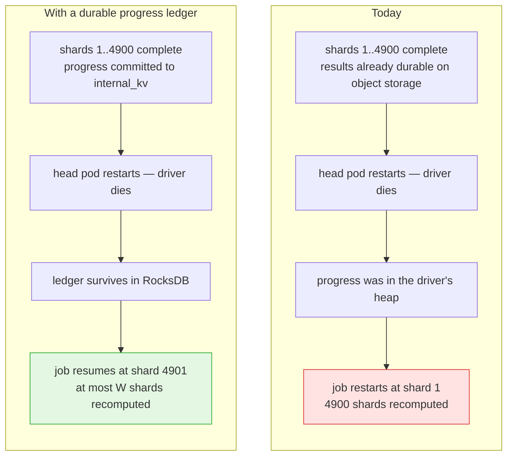
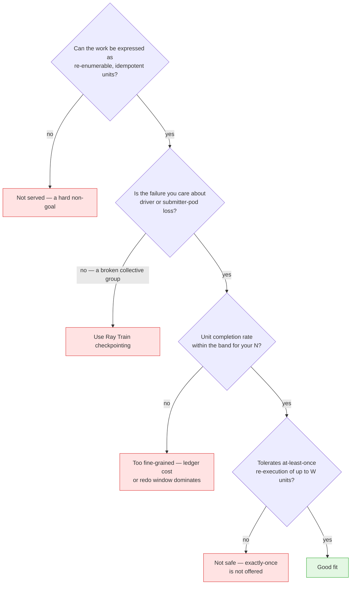
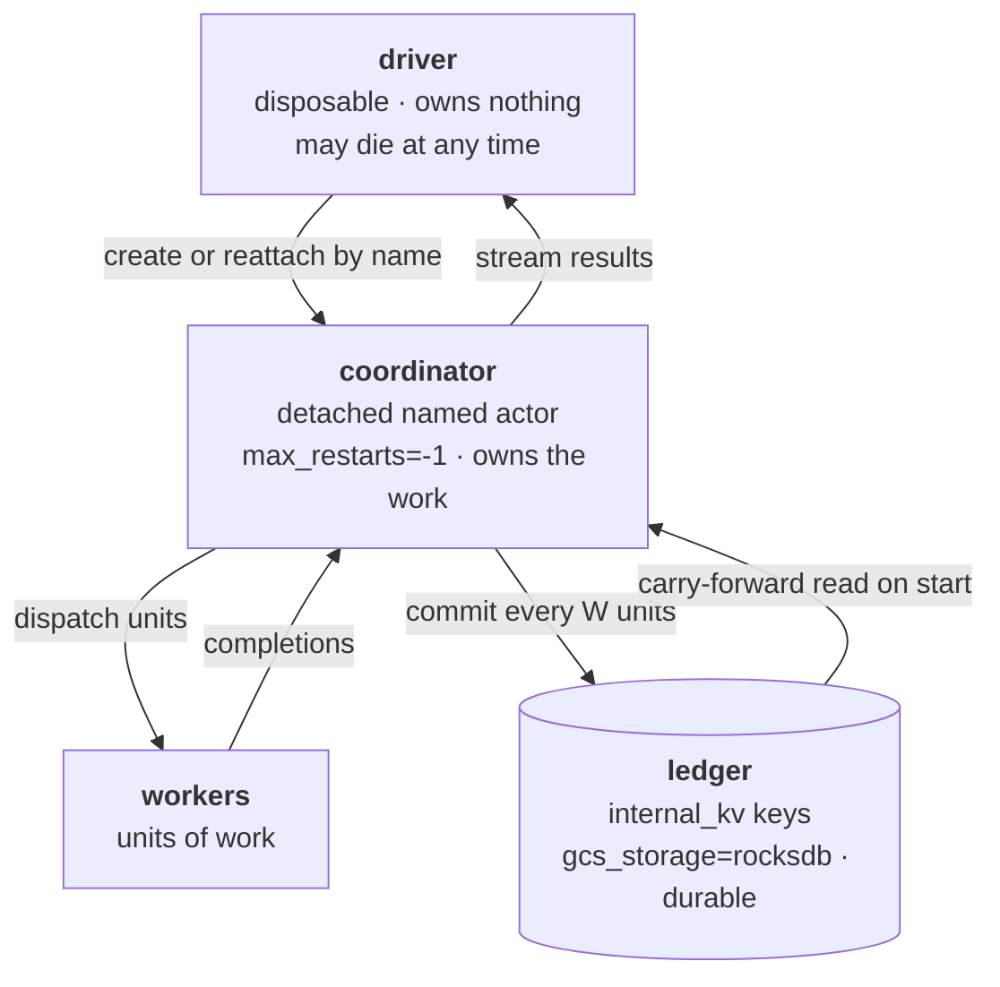
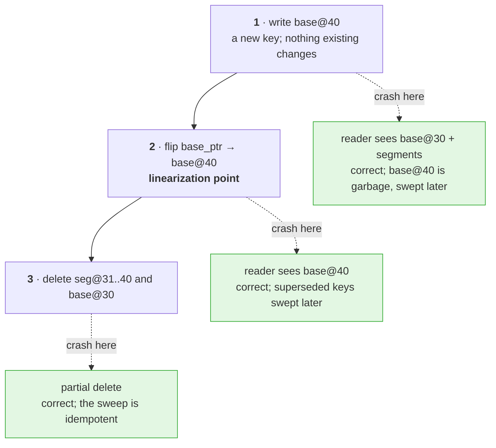
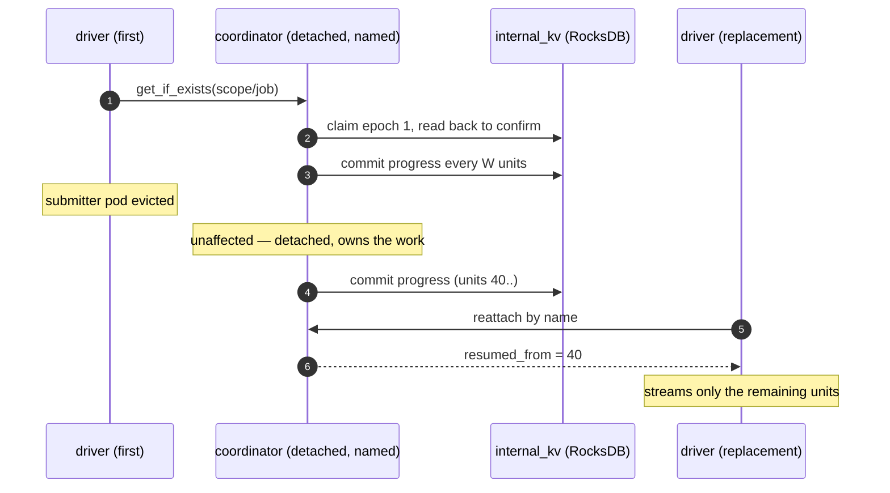
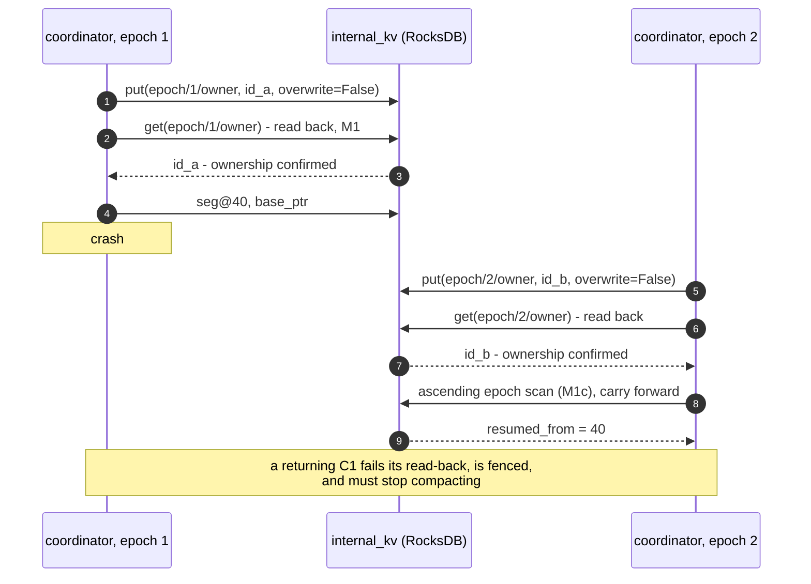
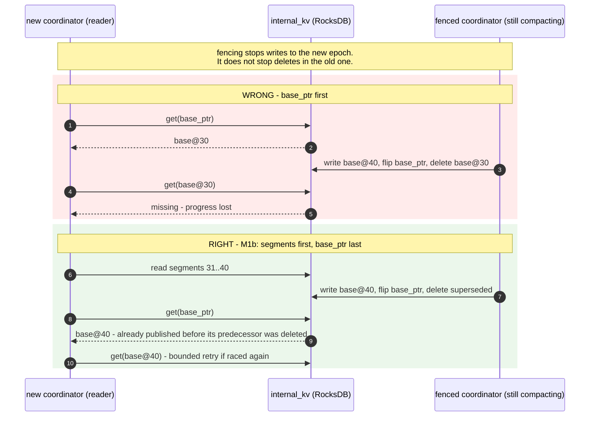
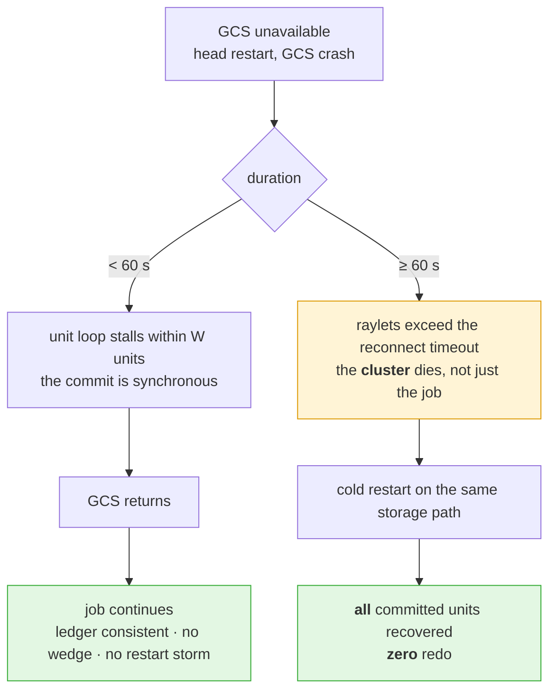

# REP: Driver resume for RayJob via a durable progress ledger

## Summary

A RayJob's driver is a single point of failure with no durable state. When the
submitter pod is evicted, or the driver process dies on a gRPC timeout during a
head restart, the job restarts **from the beginning** — even when every unit of
work it had already completed was successful and its results are still on disk.

This REP proposes a pattern, and a small set of Ray core guarantees to support
it, that lets a RayJob resume from its last committed progress after driver
loss, using **only** the GCS key-value store as durable state. No Redis, no
external database, no additional operational dependency.

It is **follow-on work item 1 of
[REP-64 (Embedded Storage Backend for GCS Fault Tolerance)](https://github.com/ray-project/enhancements/blob/main/reps/2026-02-23-gcs-embedded-storage.md)**,
which named it as needed and out of its own scope:

> **[needed] Driver resilience during head pod restart** — The RayJob submitter
> pod survives head pod restarts physically, but the driver process may crash
> due to gRPC timeouts on pending RPCs. The RayJob controller and driver
> reconnection logic need hardening so the driver can survive GCS downtime
> gracefully and resume orchestration after recovery.

REP-64 framed three pieces as required end to end: *"GCS persistence (this REP),
driver resilience (follow-on), and application checkpointing (workload
responsibility)."* This is the middle piece.

### General Motivation

A RayJob fans out 5,000 shards over several hours on a KubeRay cluster with GCS
fault tolerance enabled. Shard 4,900 completes. The head pod then restarts for
node maintenance.

With REP-64's embedded storage the *cluster* survives this. The **job** does
not: the only record of which shards finished lived in the driver's heap, and
the driver is gone.

The gap is narrow and specific. Ray persists actor, node and job tables across
head restarts. It does not persist **what the driver knew**, because a driver
is by construction an ordinary client process.

### Where this helps, and where it does not

| Helps | Does not help |
|---|---|
| **Long-running sharded batch jobs** — a driver enumerating shards; resume skips the completed ones | **Distributed training (NCCL).** The collective group breaks on head failure and does not reconnect; training resumes from its application checkpoint regardless. Ray Train checkpointing covers this and we add nothing to it |
| **Multi-stage orchestration pipelines**, where each stage is expensive and externally durable | **Fine-grained, high-throughput work.** Measured, not assumed: `N=10³` admits no usable configuration above ~100 units/s; `N=10⁶` tolerates 10⁴/s. Millisecond units should not use this |
| **Spot / preemptible fleets**, where driver loss is routine rather than exceptional | **Arbitrary, uncooperative driver code.** A hard non-goal. This does not checkpoint a Python process; work must be restructured into re-enumerable idempotent units |
| | **Exactly-once semantics.** Not offered. The contract is at-least-once: a crash between execution and commit re-executes at most `W` units |

**Environment and scale**, per the REP checklist:

| | |
|---|---|
| Platform | KubeRay, RayJob, GCS FT with `gcs_storage=rocksdb` (REP-64) |
| Job shape | orchestration driver + fan-out to workers |
| Duration | tens of minutes to days |
| Unit granularity | seconds to minutes per unit; `N` from 10² to 10⁶ |
| Failure being survived | submitter-pod eviction, driver crash, head restart |

### Should this change be within `ray` or outside?

**Inside `ray`** — both the pattern (a small `ray.util` module) and the three
core changes below.

The checklist asks whether this could be layered on top instead. We tested that
rather than argued it: the pattern needs **zero core patches on 2.57+** and runs
on unmodified Ray 2.58.0. That is feasibility, not placement. It belongs in-tree
because:

1. **The traps are the proposal.** Three load-bearing claims were refuted during
   validation and none is visible from a design summary (see *What we got
   wrong*). Out of tree, every team that reimplements this reimplements the
   bugs; in tree, one implementation plus the model checker in CI retires them.
2. **The ledger and the `internal_kv` contract are one contract.** Split, this
   is a dependence on undocumented behaviour of a private API — our accepted
   risk C11. Together, they are tested together and cannot drift apart.
3. **RayJob integration requires it.** Resume state in `RayJob` status, and the
   scope key injected via the downward API by default, cannot be turned on from
   an ecosystem package.

Not asked for: no new daemon, no scheduler change, no new GCS table, no change
to any existing API. If reviewers prefer to phase the risk — land the three core
fixes first, incubate the module for a release — that is acceptable, though the
incubation window is exactly when the subtle bugs get copied.

**The three core changes**, none of which is a new subsystem:

| # | Ask | Why |
|---|---|---|
| 1 | A documented **durability contract for `internal_kv`** under `gcs_storage=rocksdb`, plus **per-namespace quota and TTL** | Any durable use of `internal_kv` today relies on undocumented behaviour. This is REP-64 follow-on item 4 and composes with [#65692](https://github.com/ray-project/ray/issues/65692). Quota matters because a badly-behaved ledger must not be able to grow GCS storage without bound. |
| 2 | Fix [#55996](https://github.com/ray-project/ray/issues/55996) — `DEADLINE_EXCEEDED` is not retried by the GCS client and wedges the caller | This is the difference between "the job pauses during a head restart" and "the job hangs forever". |
| 3 | Fix the `_internal_kv_put` **return-value inversion** | `_internal_kv_put(..., overwrite=False)` returns `True` when the key **already existed** — the opposite of the natural reading, and its docstring says *"Whether the value already exists"*. Every compare-and-set user of `internal_kv` is one inverted boolean away from a silent bug. In our own implementation this produced **livelock, not data corruption** — but only because we read the value back. |

Item 3 is worth emphasising: it is a two-line documentation and naming problem
that sits under a primitive several Ray components already build on.

## Stewardship

### Required Reviewers

- @rueian, @andrewsykim, @MengjinYan — reviewers of REP-64, whose follow-on this
  is
- @edoakes

### Shepherd of the Proposal

- @edoakes (proposed — shepherd of both REP-64 and REP-65, the two REPs this
  composes with)

## Design and Architecture

### Three tiers

The driver holds **no** state worth losing. It creates or reattaches to a
detached named actor and streams results. The coordinator executes units and
commits progress. The ledger is the only durable thing, and it is small.

### Mechanisms

**M1 — epoch fencing.** A starting coordinator claims the next epoch with
`put(overwrite=False)` and then **reads the value back** to confirm it owns it.
State keys are scoped by epoch and immutable once written. The read-back is not
optional: see core ask 3.

**M1b — carry-forward reads segments first, `base_ptr` last**, retrying a
bounded number of times if the base key named by the pointer has vanished.

**M1c — carry-forward scans epochs in ascending order**, taking the highest
readable state.

M1b and M1c exist because the design was **wrong without them**, in two ways
that are the same mistake at different scales. Both are described in "What we
got wrong" below. Together they are about six lines of code.

**M2 — commit coalescing.** Commit every `W` completed units. `W` trades durable
writes against redo. A fixed `W` is proposed; a rate-adaptive `W` was
implemented and rejected on measurements (see below).

**M3 — compaction.** Write `base@m`, flip `base_ptr` (the linearization point),
then delete superseded segments. A startup sweep runs **after** the pointer
flip, never before. Every prefix of this sequence leaves a readable ledger:

**M4 — orchestrator-injected scope key.** The ledger is scoped by an identifier
**supplied from outside the cluster** — under KubeRay, `RayCluster`
`metadata.uid` via the downward API.

M4 also came from a refutation, and it has the sharpest consequence: we could
not find *any* in-cluster identity that works. A head restart and a brand-new
cluster reusing the same persistent volume are, from inside the cluster, **the
same physical event**. Nine candidate identifiers were probed; zero were usable.
`session_name` is inherited from the storage path, so it looks stable exactly
when you need it to change. Without an injected key, a new cluster mounting a
recycled PV will adopt a dead job's ledger.

### Driver loss and reattach

The scope key in the actor name is the orchestrator-injected identifier (M4);
it is what makes "reattach by name" mean *this* job and not a dead one.

### Coordinator loss and epoch fencing

The read-back is not optional. `_internal_kv_put(..., overwrite=False)` returns
`True` when the key **already existed** (core ask 3), so a coordinator that
trusts the return value alone concludes it lost a race it actually won, or the
reverse.

### The delete race, and why read order fixes it

This is refutation 1 below, drawn out because it is the part most likely to be
reimplemented incorrectly.

The rule, stated once and applied at two scales: **read in the order that makes
"I missed X" imply "X's replacement is already published."** M1b applies it
within an epoch, M1c across epochs. Together they are about six lines of code.

## What we got wrong

Three load-bearing claims were **refuted** during validation and repaired. They
are listed because they are what a reimplementation from the summary alone will
get wrong too.

1. **Epoch scoping protects the writer, not the reader.** A fenced-out
   coordinator never writes the new epoch's keys — but it keeps *compacting*,
   and compaction deletes. The original safety argument was framed entirely
   around writes; both bugs were about deletes. → M1b (diagrammed above).
2. **The same bug across epochs.** The startup sweep deletes a superseded epoch
   unconditionally, including one a third coordinator is mid-read of — invisible
   with two coordinators, because the sweeper and the reader are then the same
   process. → M1c.
3. **`session_name` is a storage-path identity, not a cluster identity.** → M4.

## Measurements

Reference implementation on **unmodified Ray 2.58.0**. Full evidence bundle
linked at the end; every figure below names the run that produced it.

**Resume works end to end.** A driver creates the coordinator and exits; the
coordinator continues and commits. A fresh driver reattaches by name and
observes the progress. Kill the coordinator: the new incarnation claims epoch 2,
reports `resumed_from=40`, and executes **zero** redundant units.

**Cost.**

| quantity | value |
|---|---|
| Durable-write overhead | **×2.79** — multiplicative, not additive (an additive model was proposed, tested and refuted) |
| Ledger key count | **flat in `N`** — 12 keys at `N=10` through `N=10⁶`, saturating at ≈`K+4` |
| Recovery | ≤ **33** KV operations |

**Interference with other GCS users.** At the design write rate (26 writes/s,
10 % of the measured same-key ceiling) `internal_kv` p99 for an unrelated
component moved **+3.0 %**, against a measured **9.8 %** noise floor. Nothing
regressed up to **200 writes/s**. The rig demonstrated it *can* see regressions:
an independent positive control (4 MB values) moved p99 by **42×**.

**Failure behaviour.**

| scenario | outcome |
|---|---|
| Driver dies | Coordinator continues; new driver reattaches by name |
| Coordinator killed | One restart, epoch +1, resume with **0** redundant units |
| Coordinator dies *during* a GCS outage | **One** restart, ≤`W` redo, ledger contiguous. No restart storm |

GCS outages split at a hard 60 s boundary — `gcs_rpc_server_reconnect_timeout_s`:

The right-hand branch is the worst case and it is better than the design
assumed: past the ceiling the failure mode is **downtime, not data loss** — the
direct payoff of putting the ledger in RocksDB rather than in memory, and a
concrete argument for pairing this with
[REP-65 (Active-Passive Head)](https://github.com/ray-project/enhancements/pull/65),
which shortens exactly that outage.

**A GCS outage pauses the job, not merely its durability.** We expected work to
continue while commits queued; it does not, because the commit sits on the unit
loop's critical path. An asynchronous writer behind a bounded queue was
implemented and measured: it buys ≈`Q·W` units of continued work and costs a
redo window of exactly `Q·W + 2W`. **We propose the synchronous path** — for
jobs long enough to want this feature, a pause beats redo.

## Compatibility, Deprecation, and Migration Plan

**No compatibility implications for existing users.** Nothing here changes an
existing API, and the pattern is opt-in by construction: a job either restructures
itself behind a coordinator or does not. The new module is additive and imports
nothing that existing code paths touch.

The three core asks are additive:

- The durability contract is **documentation of existing behaviour**, plus new
  quota/TTL configuration that defaults to off.
- #55996 is a bug fix.
- The `_internal_kv_put` return-value fix is the only one with a compatibility
  question. The current behaviour is almost certainly relied upon somewhere.
  Suggested path: document it immediately, add a clearly-named wrapper
  (`_internal_kv_put_if_absent` returning "did I win"), and leave the existing
  return value alone.

## Test Plan and Acceptance Criteria

**Core changes.** Unit tests for the `internal_kv` durability contract under
`gcs_storage=rocksdb` (ack implies fsync); a regression test for #55996 (a KV
call that times out must not wedge its caller); quota/TTL enforcement tests.

**Pattern.** The crash/interleaving model checker in the evidence bundle is
stdlib-only and runs its full sweep in **51 s on one core**, so it is offered as
a CI artifact rather than a one-off. It enumerates crash and lost-ack
interleavings across up to six concurrent coordinator incarnations, asserts
durability, pointer-validity, GC and liveness invariants, and ships with
negative controls — so a regression that disables the checker is caught rather
than reported as a pass.

**Acceptance criteria.** A RayJob that loses its driver mid-run resumes with
zero redundant committed units; a coordinator killed during a GCS outage
restarts exactly once and redoes at most `W`; ledger key count does not grow
with `N`; no measurable p99 regression for other GCS users at the design rate.

## Follow-on Work

1. **RayJob controller integration** — surfacing resume state in `RayJob`
   status, and supplying the scope key via the downward API by default.
2. **Promotion path for the module** — ship as experimental, stabilise the API
   once real jobs have exercised resume in production.
3. **Composition with REP-65** — active/passive head shortens the outage this
   design pauses through; the two together turn a multi-minute stall into a
   sub-second one.
4. **`internal_kv` initialization ordering** — [#47167](https://github.com/ray-project/ray/issues/47167);
   Serve already sidesteps it by constructing an explicit `GcsClient`.

## References

- [REP-64 — Embedded Storage Backend for GCS Fault Tolerance](https://github.com/ray-project/enhancements/blob/main/reps/2026-02-23-gcs-embedded-storage.md) — this REP is its follow-on item 1
- [REP-65 — Ray Active-Passive Head Architecture](https://github.com/ray-project/enhancements/pull/65)
- [#65692](https://github.com/ray-project/ray/issues/65692) — bounded retention for finished driver job metadata
- [#55996](https://github.com/ray-project/ray/issues/55996) — job stuck when `InternalKVPut` times out
- [#47167](https://github.com/ray-project/ray/issues/47167) — `internal_kv` initialization assertion
- [#65037](https://github.com/ray-project/ray/issues/65037) — JobManager recovery not triggered after dashboard agent restart
- **Evidence bundle** — [ray-project/ray#66065](https://github.com/ray-project/ray/pull/66065) (draft, not for merge): the full claim ledger, pre-registered experiment cards and all 35 run directories

## Appendix: implementation requirements that are not optional

1. **Per-incarnation instance ids**, never actor-derived — an actor-derived id
   makes fencing self-defeating, since a restarted actor presents the same id.
2. **No hard node affinity.** `NodeAffinitySchedulingStrategy(soft=False)`
   leaves the coordinator permanently **unschedulable** once its node is gone —
   its name, epoch and ledger all survive, and it still cannot be revived.
   `soft=True`, or no strategy, recovers cleanly.
3. **Deterministic, scope-prefixed child actor names.** If the coordinator owns
   long-lived children, their names must carry attribution
   (`<scope>/<job>/child-<i>`). With opaque names, a crash between creating a
   child and recording it **orphans** the child permanently.
4. **Every coordinator method idempotent under replay.** `max_task_retries=-1`
   replays in-flight tasks on a restarted actor — including administrative ones.

## Appendix: claim ledger and method

Every claim below carried a written refutation condition, committed to git
*before* the run that settled it, and every run carried negative controls that
had to fail as expected. Runs whose controls came out green were discarded:
**5 of 35 runs are retained in the bundle as void or partial**, with their
diagnoses. The numbers are not a demo that was polished until it passed.

Bold = load-bearing.

| id | claim | verdict |
|---|---|---|
| **C1** | The epoch protocol admits exactly one legitimate writer | proven |
| **C6** | Compaction is crash-safe over a non-transactional put/del store | proven |
| **C13** | The coordinator constructor is idempotent against the ledger | proven |
| **C17** | Reordered carry-forward read (M1b) closes the delete race | proven — after **C16 refuted** |
| **C20** | Ascending epoch scan (M1c) closes the cross-epoch race | proven — after **C19 refuted** |
| **C24** | An orchestrator-injected scope key is correct in both directions | proven — after **C12 refuted** |
| **C23** | No in-cluster identity can distinguish restart from replacement | proven |
| **C4** | Detached named coordinator survives driver death and head loss | proven |
| **C25** | Hard node affinity makes the coordinator unschedulable | proven |
| **C5** | State is reconstructible from ledger + cluster introspection | proven |
| **C2** | Coalescing bounds durable writes and redo | proven |
| **C3** | No measurable p99 regression for other components | proven |
| **C28** | A crash during a GCS outage does not cause a restart storm | proven |
| **C29** | Past the outage ceiling, cold restart loses nothing | proven |
| **C8** | Zero Ray core patches needed on 2.57+ | proven |
| C7 | "Work continues, durability pauses" | **refuted** — work pauses too |
| C26 / C27 / C30 / **C31** | Async writer redo bound | refuted ×3, settled at `Q·W + 2W` |
| C32 | Adaptive coalescing beats fixed `W` | **refuted** — it trades, it does not dominate |
| C9 | Resume boundary is intra-cluster | **refuted** — favourably; KubeRay restarts the submitter without replacing the cluster |
| C14 | Value for distributed-training workloads | accepted as negligible |
| C10 | At-least-once semantics acceptable | accepted risk |
| C11 | Dependence on private `internal_kv` API | accepted risk — Serve, Jobs and the dashboard do the same |

Full ledger, pre-registered experiment cards, and all 35 runs are in the
evidence bundle.
